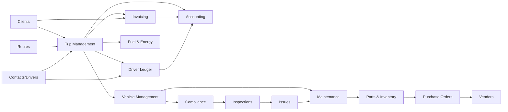

# AxleOps — Product Documentation

> **Product**: AxleOps Fleet & Transport Management Platform
> **Company**: Goodwill Transport Pvt. Ltd. (Demo Tenant)
> **Version**: 1.0 — Interactive Demo Prototype
> **Last Updated**: March 2026
> **Pages**: 73 | **Departments**: 8 | **Roles**: 19 | **Guided Scenarios**: 4 | **Intelligence Modules**: 1 | **Organization Modules**: 3

## Table of Contents

1. [Product Overview](#1-product-overview)
2. [Department-Based Architecture](#2-department-based-architecture)
3. [Role-Based System (RBAC)](#3-role-based-system-rbac)
4. [Navigation & Application Architecture](#4-navigation--application-architecture)
5. [Module-by-Module Deep Dive](#5-module-by-module-deep-dive)
   - 5.1 [Trip Management](#51-trip-management)
   - 5.2 [Vehicle Management](#52-vehicle-management)
   - 5.3 [Driver & Contact Management](#53-driver--contact-management)
   - 5.4 [Client & Billing](#54-client--billing)
   - 5.5 [Route Management](#55-route-management)
   - 5.6 [Inspections](#56-inspections)
   - 5.7 [Issues & Defect Tracking](#57-issues--defect-tracking)
   - 5.8 [Service & Maintenance (MRO)](#58-service--maintenance-mro)
   - 5.9 [Parts & Inventory](#59-parts--inventory)
   - 5.10 [Fuel & Energy](#510-fuel--energy)
   - 5.11 [Accounting & Ledger System](#511-accounting--ledger-system)
   - 5.12 [Reports & Analytics](#512-reports--analytics)
   - 5.13 [Settings & Administration](#513-settings--administration)
   - 5.14 [Trip-Level Alerts System](#514-trip-level-alerts-system)
   - 5.15 [Multi-Branch Management](#515-multi-branch-management)
   - 5.16 [Franchise & Partner Network](#516-franchise--partner-network)
   - 5.17 [Subcontractor & Broker Management](#517-subcontractor--broker-management)
   - 5.18 [Vehicle Type Management](#518-vehicle-type-management)
6. [Trip Lifecycle (End-to-End Flow)](#6-trip-lifecycle-end-to-end-flow)
7. [Accounting System (Tally-Level Detail)](#7-accounting-system-tally-level-detail)
8. [Cross-Module Integrations](#8-cross-module-integrations)
9. [Reports & Analytics](#9-reports--analytics)
10. [Business Logic & Rules](#10-business-logic--rules)
11. [Permissions & Data Scoping](#11-permissions--data-scoping)
12. [Demo Mode Design](#12-demo-mode-design)
13. [Key Strengths](#13-key-strengths)
14. [Gaps & Missing Features](#14-gaps--missing-features)
15. [Future Roadmap](#15-future-roadmap)

---

## 1. Product Overview

### Vision

AxleOps is an **end-to-end fleet and transport operations platform** purpose-built for Indian trucking, logistics, and fleet operators. It unifies trip management, vehicle lifecycle, maintenance, accounting, compliance, and CRM into a single system — replacing the fragmented combination of Tally, Excel spreadsheets, WhatsApp coordination, and paper-based tracking that most transport companies use today.

### Target Users

| User Segment | Size | Pain Points |
|---|---|---|
| **Fleet Owners / Proprietors** | 10–200 vehicles | No visibility into per-trip profitability, cash leakage, driver advances |
| **Transport Operators** | 50–500 vehicles | Dispatch inefficiency, compliance gaps, manual accounting |
| **3PL / Contract Logistics** | 100–1000+ vehicles | Multi-client billing complexity, route optimization, SLA tracking |
| **Last-Mile / E-commerce Fleets** | 200+ vehicles | High volume trip management, fuel fraud, driver performance |

### Core Problem Being Solved

Indian transport companies lose **15-25% of potential profit** to:
- Untracked trip expenses (fuel pilferage, inflated tolls, unreceipted cash)
- Manual invoicing delays (30-60 day DSO due to paper-based billing)
- Reactive maintenance (breakdown-driven, not preventive)
- Zero per-trip P&L visibility (owners discover losses months later)
- Compliance failures (expired insurance, permits, licenses causing impounds)

### Key Differentiators

1. **Trip-Centric P&L Engine** — Every trip has real-time revenue vs. expense tracking with margin calculation
2. **Tally-Grade Accounting** — Full double-entry ledger with Chart of Accounts, Vouchers, P&L, Balance Sheet — built for transport
3. **Department-Native RBAC** — 8 departments, 19 roles, each with purpose-built dashboards (not generic admin panels)
4. **Compliance-First Design** — Insurance/permit/license expiry blocks vehicle dispatch automatically
5. **Guided Scenario Walkthroughs** — Interactive cross-department story flows for demos and training


---

## 2. Department-Based Architecture

AxleOps is organized around **8 departments**, each owning specific data domains and workflows.

### 2.1 Executive

| Property | Detail |
|---|---|
| **Purpose** | Strategic decisions & business growth |
| **Icon** | 👑 Crown |
| **Color** | `#8B5CF6` (Purple) |
| **Roles** | Owner / Director, Branch Manager |
| **Owned Data** | Company-wide KPIs, profitability metrics, growth signals |
| **Key Workflows** | Approve large expenses, review P&L, monitor fleet ROI, approve purchase orders |

### 2.2 Operations

| Property | Detail |
|---|---|
| **Purpose** | Trip execution & fleet deployment |
| **Icon** | 🚛 Truck |
| **Color** | `#059669` (Emerald) |
| **Roles** | Fleet Manager, Operations Executive, Driver |
| **Owned Data** | Trips, vehicle assignments, routes, live tracking, fuel entries |
| **Key Workflows** | Create trips, assign vehicles/drivers, monitor transit, handle breakdowns, record expenses |

### 2.3 Finance & Accounts

| Property | Detail |
|---|---|
| **Purpose** | Billing, accounting & cash management |
| **Icon** | 💰 Money |
| **Color** | `#B91C1C` (Red) |
| **Roles** | Finance Controller, Accounts Executive |
| **Owned Data** | Invoices, vouchers, ledgers, P&L, balance sheet, client receivables, driver settlements |
| **Key Workflows** | Post vouchers, generate invoices, reconcile bank, collect receivables, month-end closing |

### 2.4 Maintenance & Workshop

| Property | Detail |
|---|---|
| **Purpose** | Vehicle upkeep & repair management |
| **Icon** | 🔧 Tools |
| **Color** | `#D97706` (Amber) |
| **Roles** | Workshop Manager, Mechanic |
| **Owned Data** | Work orders, service history, service tasks, service programs |
| **Key Workflows** | Create work orders, assign mechanics, track repair progress, order parts, preventive maintenance |

### 2.5 Inventory & Procurement

| Property | Detail |
|---|---|
| **Purpose** | Parts stock control & vendor management |
| **Icon** | 📦 Boxes |
| **Color** | `#0891B2` (Cyan) |
| **Roles** | Inventory Manager |
| **Owned Data** | Parts inventory, purchase orders, stock levels, vendor relationships |
| **Key Workflows** | Monitor stock levels, create purchase orders, issue parts to work orders, vendor evaluation |

### 2.6 Sales & CRM

| Property | Detail |
|---|---|
| **Purpose** | Client acquisition & relationship management |
| **Icon** | 🤝 Handshake |
| **Color** | `#2563EB` (Blue) |
| **Roles** | Sales / BD, Account Manager |
| **Owned Data** | Client profiles, contracts, rate cards, sales pipeline |
| **Key Workflows** | Onboard clients, negotiate rates, manage contracts, SLA monitoring, upsell services |

### 2.7 Compliance & Governance

| Property | Detail |
|---|---|
| **Purpose** | Regulatory tracking & audit trails |
| **Icon** | 🛡️ Shield |
| **Color** | `#7C3AED` (Violet) |
| **Roles** | Compliance Manager, Auditor |
| **Owned Data** | Vehicle compliance records, inspection schedules, permit/insurance tracking, audit logs |
| **Key Workflows** | Monitor expiring documents, flag non-compliant vehicles, conduct audits, verify financial trails |

### 2.8 System Administration

| Property | Detail |
|---|---|
| **Purpose** | System config, users & integrations |
| **Icon** | ⚙️ Server |
| **Color** | `#374151` (Gray) |
| **Roles** | Super Admin |
| **Owned Data** | Users, roles, company settings, integrations, system configuration |
| **Key Workflows** | Manage users, configure roles, set alert thresholds, manage integrations |

---

## 3. Role-Based System (RBAC)

### 3.1 Complete Role Registry

| # | Role | Department | User (Demo) | KPIs |
|---|---|---|---|---|
| 1 | **Owner / Director** | Executive | Priya Sharma | Revenue, Net Profit, Profit Margin, Fleet Utilization, Outstanding Receivables, Cost/KM |
| 2 | **Fleet Manager** | Operations | Vikram Singh | Vehicle Utilization, On-Time Delivery, Trip Count, Idle Vehicles |
| 3 | **Operations Executive** | Operations | Rajesh Kumar | Active Trips, Delayed Trips, Driver Availability, Pending Dispatches |
| 4 | **Operations Executive** | Operations | Rajesh Kumar | Active Trips, On-Time %, Fuel Logged, Issues Reported |
| 5 | **Driver** | Operations | Ramesh Yadav | Active Trip, Km Today, Fuel Entered, PODs Pending |
| 6 | **Finance Controller** | Finance | Arun Nair | Monthly Revenue, Outstanding, Cash Position, P&L Variance |
| 7 | **Accounts Executive** | Finance | Deepak Jain | Pending Vouchers, Unreconciled, Today's Entries, Expense Claims |

| 9 | **Workshop Manager** | Maintenance | Tarun Mishra | Open Work Orders, Avg Repair Time, Parts Stock, Overdue Services |
| 10 | **Mechanic** | Maintenance | Ravi Shankar | Assigned WOs, Completed Today, Avg Repair Time, Parts Requested |
| 11 | **Inventory Manager** | Inventory | Govind Thakur | Low Stock Items, Pending POs, Monthly Consumption, Stock Value |
| 12 | **Compliance Manager** | Compliance | Neha Kapoor | Expiring <30d, Overdue Docs, Fleet Readiness, Penalty Risk |
| 13 | **Auditor** | Compliance | Sanjay Gupta | Exception Flags, Trails Verified, Open Investigations, Last Audit |
| 14 | **Sales / BD** | Sales | Arjun Reddy | Pipeline Value, New Clients MTD, Conversion Rate, Revenue Target |
| 15 | **Account Manager** | Sales | Shruti Menon | Client Health Score, SLA Compliance, Revenue per Client, Churn Risk |
| 16 | **Super Admin** | Admin | Amit Mehta | Active Users, System Health, Data Integrity, Audit Logs |
| 17 | **Billing & Accounts** | Finance | Meera Joshi | *(Legacy role — backward compatibility)* |
| 18 | **Branch Manager** | Executive | Anil Kapoor | Branch Revenue, Vehicle Utilization, Trip Count, Branch Profit |
| 19 | **Franchise Partner** | Sales | Patel Roadways | Partner Revenue, Trips MTD, Settlement Pending, Partner Rating |

### 3.2 Role Hierarchy

```
Owner / Director (Executive)
├── Branch Manager (per-branch authority)
├── Finance Controller
│   ├── Accounts Executive

├── Fleet Manager
│   ├── Operations Executive
│   ├── Operations Executive
│   └── Driver
├── Workshop Manager
│   └── Mechanic
├── Inventory Manager
├── Compliance Manager
│   └── Auditor
├── Sales / BD
│   ├── Account Manager
│   └── Franchise Partner (external, scoped access)
└── Super Admin (System)
```

### 3.3 Cross-Role Interactions

| Interaction | From Role | To Role | Trigger |
|---|---|---|---|
| Trip Expense Approval | Operations Executive | Owner | Expense exceeds threshold |
| Work Order Assignment | Workshop Manager | Mechanic | Vehicle needs repair |
| Parts Request | Mechanic | Inventory Manager | WO requires parts |
| Invoice Generation | Accounts Executive | Finance Controller | Trip completed + billed |
| Compliance Block | Compliance Manager | Fleet Manager | Vehicle document expired |
| Client Rate Negotiation | Sales / BD | Finance Controller | New contract pricing |
| Driver Advance | Driver | Accounts Executive | Trip requires cash advance |

### 3.4 Dashboard-per-Role Mapping

Each role gets a **dedicated dashboard page** with role-specific KPIs, alerts, and actions:

| Role | Dashboard Page | Key Sections |
|---|---|---|
| Owner | `dashboard-owner.html` | Pending Actions (3 approvals), Critical Alerts (4), Growth Signals, 6 KPI cards (Revenue/Profit/Margin/Utilization/Receivables/CostPerKM), Revenue & Profit Trend chart, Expense Breakdown donut, Client Revenue table, Route Profitability table, Vehicle-wise Bottom 5, Quick Actions |
| Fleet Manager | `dashboard-fleet-manager.html` | Fleet status, trip monitoring, vehicle utilization, driver availability |

| Operator | `dashboard-operator.html` | Trip list, live tracking, issue reporting |
| Driver | `dashboard-driver.html` | Active trip card, fuel log, expenses, POD upload |
| Finance Controller | `dashboard-finance.html` | P&L overview, cash position, receivables aging |
| Accounts Executive | `dashboard-accounts-exec.html` | Pending vouchers, daily entries, unreconciled items |

| Workshop Manager | `dashboard-shop-manager.html` | Open WOs, repair queue, parts availability |
| Mechanic | `dashboard-mechanic.html` | Assigned work orders, task list, time logging |
| Inventory Manager | `dashboard-inventory.html` | Low stock alerts, pending POs, consumption trends |
| Compliance Manager | `dashboard-compliance.html` | Expiring documents, fleet readiness score, risk flags |
| Auditor | `dashboard-auditor.html` | Exception Flags (Expense 7, Ledger Gaps 4, Missing Receipts 9, Verified Trails 142/162), KPIs (Total Exceptions 20, Open Investigations 5, Last Full Audit Feb 28, Verification Rate 88%), Exception Log table (ID, Category, Description, Amount, Risk level), Financial Health Check (Revenue Recognition 98%, Bank Reconciliation 94%, Expense Documentation 82%, Fuel vs GPS Match 78%, Cash Documentation 62%, Trip-to-Invoice 96%) — **READ ONLY** mode |
| Sales / BD | `dashboard-sales.html` | Pipeline, new clients, conversion metrics |
| Account Manager | `dashboard-account-mgr.html` | Client health, SLA compliance, revenue tracking |
| Super Admin | `dashboard-admin.html` | System health, user activity, data integrity, audit logs |

---

## 4. Navigation & Application Architecture

### 4.1 Application Shell

The app uses a **single-page architecture** with:
- **Persistent sidebar** (left, ~240px) — role-specific navigation
- **Header bar** (top) — role switcher, search, notifications, user profile
- **Content area** (center) — dynamically loaded page fragments
- **Demo toolbar** (bottom) — department quick-switcher, scenario launcher, product map

### 4.2 Role-Specific Sidebar Menus

Each role sees a **different sidebar navigation** tailored to their responsibilities. Example:

**Owner / Director sidebar:**
```
├── Dashboard
├── Trip Management ▸
│   ├── All Trips
│   ├── Create Trip
│   └── Routes
├── Vehicles ▸
│   ├── Vehicle List
│   └── Vehicle Assignments
├── Drivers & Contacts ▸
│   ├── All Contacts
│   └── Driver Ledger
├── Clients & Billing ▸
│   ├── Client List
│   └── Invoices
├── Fuel & Energy
├── Trip Alerts
├── Financial Reports ▸
│   ├── Profit & Loss
│   ├── Balance Sheet
│   ├── Cash Flow
│   └── Trip Profitability
├── Organization ▸
│   ├── Branches
│   ├── Franchise & Partners
│   └── Subcontractors
├── Reports
└── Settings
```

**Workshop Manager sidebar:**
```
├── Dashboard
├── Service ▸
│   ├── Work Orders
│   ├── Service History
│   ├── Service Tasks
│   └── Service Programs
├── Vehicles ▸
│   ├── Vehicle List
│   └── Meter History
├── Inspections ▸
│   └── Inspection History
├── Issues
├── Reminders
├── Parts & Inventory ▸
│   ├── Parts List
│   └── Purchase Orders
├── Vendors
└── Shop Directory
```

### 4.3 Page Hierarchy (All 73 Pages)

```
├── Dashboards (19 pages)
│   ├── dashboard.html (generic)
│   ├── dashboard-owner.html
│   ├── dashboard-fleet-manager.html
│   ├── dashboard-branch-manager.html
│   ├── dashboard-operator.html
│   ├── dashboard-driver.html
│   ├── dashboard-finance.html
│   ├── dashboard-accounts.html
│   ├── dashboard-accounts-exec.html
│   ├── dashboard-shop-manager.html
│   ├── dashboard-mechanic.html
│   ├── dashboard-inventory.html
│   ├── dashboard-compliance.html
│   ├── dashboard-auditor.html
│   ├── dashboard-sales.html
│   ├── dashboard-account-mgr.html
│   └── dashboard-admin.html
├── Trip Management (4 pages)
│   ├── trips.html (list)
│   ├── trip-detail.html
│   ├── trip-create.html
│   └── trip-profitability.html
├── Vehicles (7 pages)
│   ├── vehicle-list.html
│   ├── vehicle-detail.html
│   ├── vehicle-types.html
│   ├── vehicle-compliance.html
│   ├── vehicle-assignments.html
│   ├── meter-history.html
│   └── expense-history.html
├── Contacts & Drivers (3 pages)
│   ├── contacts.html
│   ├── contact-detail.html
│   └── driver-ledger.html
├── Clients & Billing (3 pages)
│   ├── clients.html
│   ├── client-detail.html
│   └── invoices.html
├── Routes (2 pages)
│   ├── routes.html
│   └── route-detail.html
├── Inspections (2 pages)
│   ├── inspections.html
│   └── inspection-detail.html
├── Issues (1 page)
│   └── issues.html
├── Reminders (1 page)
│   └── reminders.html
├── Service & Maintenance (7 pages)
│   ├── service-history.html
│   ├── work-orders.html
│   ├── work-order-new.html (detail)
│   ├── work-order-create.html
│   ├── service-tasks.html
│   ├── service-programs.html
│   └── shop-directory.html
├── Parts & Inventory (3 pages)
│   ├── parts-list.html
│   ├── part-detail.html
│   └── purchase-orders.html
├── Fuel & Energy (2 pages)
│   ├── fuel-history.html
│   └── charging-history.html
├── Accounting (6 pages)
│   ├── chart-of-accounts.html
│   ├── voucher-entry.html
│   ├── day-book.html
│   ├── profit-loss.html
│   ├── balance-sheet.html
│   └── cash-flow.html
├── Supporting Pages (9 pages)
│   ├── equipment.html
│   ├── vendors.html
│   ├── places.html
│   ├── documents.html
│   ├── reports.html
│   ├── report-detail.html
│   ├── settings.html
│   ├── user-management.html
│   └── product-map.html
├── Intelligence (1 page)
│   └── trip-alerts.html
├── Organization (3 pages)
│   ├── branches.html
│   ├── partners.html
│   └── subcontractors.html
```

### 4.4 Breadcrumb System

Every page has a context-aware breadcrumb. Examples:
- `Trip Management › Trip Detail (TRP-2024-0142)`
- `Service › Work Orders › New Work Order`
- `Parts & Inventory › Part Detail`
- `Vehicles › Vehicle Detail › Compliance`

### 4.5 Tab Structures

Detail pages use tabs for deep organization:

| Page | Tabs |
|---|---|
| **Trip Detail** | Trip Overview, Exceptions, Financials & Accounting, Connected Data, Milestones (5/10) |
| **Vehicle Detail** | Overview, Specs, Financial, Telematics (BETA), Fuel History, Service History, Inspection History, Work Orders, Service Reminders, Renewal Reminders, Issues, Meter History, Compliance |
| **Contact Detail** | Overview, Licenses & Certifications, Training Records, Performance Reviews, Communication Log, Assignment History |
| **Vehicle Compliance** | Registration & Insurance, Maintenance History, Inspection Records, Recalls & Campaigns |
| **Voucher Entry** | All Vouchers, Payment, Receipt, Journal, Sales, Purchase, Contra |
| **User Management** | All Users, Roles & Permissions, Activity Log |

### 4.6 Modal Interactions

| Modal | Trigger | Fields |
|---|---|---|
| **New Ledger** | "New Ledger" button on Chart of Accounts | Ledger Name, Under Group (Assets/Liabilities/Income/Expenses), Ledger Type (Bank/Cash/Party/Expense/Income/Tax/Fixed Asset), Opening Balance, Balance Type (Dr/Cr) |
| **New Voucher** | "New Voucher" button on Voucher Entry | Voucher Type, Date, Debit Ledger, Credit Ledger, Amount, Narration, Tags (Trip ID, Vehicle, Driver) |
| **New User** | "Add User" button on User Management | First Name, Last Name, Email, Phone, Role (dropdown), Title |
| **Add Labor** | From Work Order Create | Technician, Labor Hours (quick-select buttons), Hourly Rate, Service Task, Notes |

---

## 5. Module-by-Module Deep Dive

### 5.1 Trip Management

**Purpose**: The revenue engine of AxleOps. Every trip is a profit center — this module tracks the full lifecycle from client order to payment collection.

#### Screens

**5.1.1 Trip List (`trips.html`)**

| Element | Detail |
|---|---|
| **KPI Cards (7)** | Active Trips (14), Completed MTD (87), Revenue MTD (₹18,45,200), Avg Profit/Trip (₹4,820), On-Time Delivery (92%), **Active Exceptions (3)** — with red highlight, **Cancellation Rate (2.4%)** |
| **Filters (6 Primary + Advanced)** | Client ▾, Vehicle Type ▾, **Branch ▾** (highlighted via teal border), Status ▾, Period ▾, Search box |
| **Advanced Filters** | Route ▾, Driver ▾, **Exception Type ▾** (dependent on status — only visible when Exception status selected), **Profit Range** (min/max input) |
| **Table Columns** | Trip ID, Client, **Branch**, Route (with **Ad-Hoc badge** or **Contract 📄 icon**), Vehicle, Driver, Start Date, Status (**compound status**: e.g. "In Transit" + "Exception" sub-badge), **Exc.** (exception count badge), **Profit** (color-coded: green ≥15%, yellow 5-15%, red <5%), Revenue, EWB |
| **EWB Column States** | 🟢 `5d` (Active, days remaining), ⚠ `6h` (Expiring soon), 🔴 `Exp!` (Expired), ⬜ `Done` (Completed), 🚫 `Cxl` (Cancelled with trip) |
| **New Status Types** | `Exception` (orange badge — e.g. "In Transit" with "Exception" sub-badge), `Cancelled` (gray badge) |
| **Actions** | Create Trip, Export |
| **Cross-links** | Trip ID → Trip Detail, Client → Client Detail, Vehicle → Vehicle Detail |

**5.1.2 Trip Detail (`trip-detail.html`)**

**Header Section**:
- Trip ID (TRP-2024-0143), Client badge (Reliance Industries), Status badge (In Transit)
- **Active Exception alert**: Red pulse badge "⚠ ACTIVE EXCEPTION" with details ("Mechanical Breakdown — Engine Overheating, Near Udaipur")
- **EWB validity pill**: "EWB 5d ✓" green badge in header
- KPI Cards (6): Revenue (₹48,500), Total Expenses (₹30,950), Net Profit (₹17,550), **Exception Costs (₹7,700)** — red highlight, **Adjusted Margin (15.4%)** — showing impact on profit floor, Cost/KM (₹22.43)

| Tab | Sections |
|---|---|
| **Trip Overview** | **Decision Intelligence Alert** (red banner: "⚠ Mechanical Breakdown — Engine Overheating near Udaipur, KM 640" with decision options and notifications sent), **Milestone Progress Stepper** (visual 10-step horizontal stepper showing "Step 6 of 10 — En-Route (Paused)" with green completed dots, blue current dot, gray remaining), Trip Information (ID, Client, Route with **Route Contract RC-2024-0017** details — ₹34.15/km, 26hr SLA, 18% min margin, 20 trips/mo commitment, **Branch** Mumbai HQ, Distance, Load Type, **SLA Deadline** with countdown), Assignment (Vehicle with **compliance warning** "⚠ Insurance Expiring in 18 days", Driver details), E-Way Bill section (status, validity, number) |
| **Exceptions** *(NEW)* | **Active Exception Card** (Type: Mechanical Breakdown — Engine Overheating, Severity: Critical, Location: Near Udaipur KM 640, Reported: timestamp, Vehicle Status: Stopped, Cargo Status: Secure, Downtime: 2h 15m counting), **Resolution Options** (3 cards: Roadside Repair — ₹8,500 est., Vehicle Swap — 4-6h delay, Subcontractor Handoff — ₹15,000 + margin erosion), **Financial Impact** breakdown (Towing ₹5,200, Idle Driver Wages ₹2,500, SLA Penalty Risk ₹3,000, Estimated Repair ₹8,500 — Total exception cost ₹19,200), **Cargo Transfer Checklist** (seal verification, weight confirmation, photo evidence, EWB Part B update) |
| **Financials & Accounting** | **Profitability Analysis** (Revenue source: Contract RC-2024-0017, Rate basis: ₹34.15/km × 1,380 km, Gross Revenue ₹47,127, Expenses ₹30,950, Original Profit ₹16,177, **Exception Costs ₹7,700**, **Adjusted Profit ₹8,477**, **Adjusted Margin 18.0%** — with warning if below contract floor), **Accounting Mapping** (Revenue Ledger: Trip Revenue – FTL, Expense Ledger: Trip Direct Expenses, Vouchers auto-generated: 5 entries — Revenue, Fuel, Driver, Towing, Idle Wages), **Expense Breakdown table** (Diesel ₹22,400 ✓, Toll ₹4,850 ✓ FASTag, Driver Allowance ₹2,500 ✓, Driver Food ₹1,200 ⏳ Pending, **Towing ₹5,200** 🔴 Exception, **Idle Wages ₹2,500** 🔴 Exception — exception expenses color-coded red) |
| **Connected Data** | Invoice link (INV-2024-0089, Pending Payment), Accounting Vouchers link (5 Journal Entries — Revenue, Fuel, Driver, Towing, Idle Wages), **Route Contract RC-2024-0017** (Reliance × Mumbai→Delhi, ₹34.15/km, 26hr SLA — Active Contract, green border), **Work Order WO-2024-0234 (Auto-Created)** (MH04AB1234 → Ahmedabad Workshop, Engine Overheating — Open, red border), Vehicle Compliance Log link (Insurance Flag Raised), **E-Way Bill section** (EWB Number 4812-7390-2156, Generated/Valid From/Valid Until dates, validity basis CEIL(1380÷200)=7 days, Document Type, HSN Code 9965, Consignment Value ₹8,50,000, Transport Mode Road, Transporter ID/LR Number, Current Vehicle Part B with "No vehicle changes" status, Supplier/Recipient GSTINs, Dispatch/Delivery PINs, **Part B Update Required alert** when vehicle under exception, Actions: View EWB PDF / Extend Validity / Update Vehicle Part B / Cancel EWB, **GSP API Audit Trail** with HTTP status codes and response times) |
| **Milestones (5/10)** | **Milestone Summary Bar** (5/10 completed, 1 in progress paused, 4 remaining — progress bar at 55%, current step: En-Route Checkpoints, status: Paused — Exception Active), **Vertical Timeline with Expandable Cards**: ① Trip Accepted ✓ (Driver, timestamp, GPS), ② Vehicle Inspection Pre-Trip ✓ (12 items passed, 4 photos, fuel 280L), ③ Loading Confirmed ✓ (JNPT, booked 14MT vs actual 13.8MT within 5%, seal SL-88421, supervisor contact, 3 cargo photos, weighbridge slip), ④ E-Way Bill Generated ✓ (EWB#, auto via ClearTax GSP 200ms), ⑤ Trip Started ✓ (departure GPS/odometer, SLA clock started), ⑥ **En-Route Checkpoints IN PROGRESS/PAUSED** (nested sub-events: Fuel Entry ₹10,800/120L, Toll ₹1,250 FASTag, Checkpoint Vadodara GPS auto-logged, Toll ₹850, Driver Meal ₹350 Pending Approval, **⚠ Exception — Mechanical Breakdown ACTIVE** (red card, KM 640, downtime counting, costs accruing ₹7,700), Running Expense Total ₹21,050/₹30,950 at 68% of budget), ⑦ Arrived at Destination — NOT STARTED, ⑧ Unloading Confirmed — NOT STARTED, ⑨ POD Captured — NOT STARTED (mandatory, blocks completion), ⑩ Trip Completed — NOT STARTED |

**5.1.3 Trip Create (`trip-create.html`)**

Multi-step guided form with two-column layout (form steps left, financial preview right):

**Step 1: Client & Branch**
| Field | Detail |
|---|---|
| Client * | Dropdown (8 clients) — triggers route filtering |
| Branch | Dropdown (Mumbai HQ, Delhi NCR, Ahmedabad, Pune, Chennai, Global) |

**Step 2: Route Selection** (filtered by selected client)
| Field | Detail |
|---|---|
| Route * | Dropdown showing only routes for selected client, with distance and vehicle type. Contracted routes show 📄 icon with contract details |
| Route Contract Details | Auto-populated panel: Contract ID, Rate (₹/km or ₹/trip), SLA hours, Billing Type, Min Margin %, Volume commitment |
| Ad-Hoc Route | "+ Create Ad-Hoc Route" button opens modal for one-time routes with: Vehicle Type, Origin/Destination, Distance, Duration, Toll/Diesel estimates, option to create a Route Contract |

**Step 3: Trip Parameters**
| Field | Detail |
|---|---|
| Trip Type | FTL / PTL / Container / ODC |
| Billing Type | Per KM / Per Trip / Per Tonne / Per Day (auto from contract) |
| Rate | Auto-populated from route contract — read-only if contracted |
| Cargo Weight & Description | Free text |
| LR Number | Lorry Receipt number |

**Step 4: Consignment Details (E-Way Bill)**
| Field | Detail |
|---|---|
| HSN Code * | With classification description (e.g. "9965 — GTA Services") |
| Consignment Value * | Triggers EWB validity calculation if > ₹50,000 |
| Document Type | Tax Invoice / Delivery Challan / Bill of Supply |
| Supplier GSTIN | Auto-filled from company settings (read-only) |
| Recipient GSTIN | Auto-filled from selected client (read-only) |
| Dispatch Pincode | Auto-filled from route origin (read-only) |
| Delivery Pincode | Auto-filled from route destination (read-only) |
| EWB Validity Preview | Auto-calculated: CEIL(distance ÷ 200) days |

**Step 5: Schedule**
| Field | Detail |
|---|---|
| Scheduled Start * | Date + Time picker |
| Expected Delivery | Auto-calculated from SLA hours on route contract |

**Step 6: Vehicle & Driver Assignment**
| Field | Detail |
|---|---|
| Vehicle * | Filtered by vehicle type matching route, filtered by branch. Shows registration, type, and status. **Blocked** vehicles (expired compliance) shown with red ⊘ icon and reason |
| Driver * | Dropdown with license type and availability status |

**Step 7: Financial Preview** (right column — always visible)
| Element | Detail |
|---|---|
| Est. Revenue | Calculated from rate × distance (or fixed rate) |
| Est. Expenses | Auto-estimated: Diesel (from route), Toll (from route), Driver Allowance, Loading/Unloading, Misc |
| Est. Profit | Revenue − Expenses with margin % |
| **Margin Floor Check** | Warning if estimated margin < contract minimum margin (e.g. "⚠ Below 18% contract floor") |

**Ad-Hoc Route Creation Modal**:
- Vehicle Type selector, Origin/Destination cities, Distance, Duration, Toll estimate, Diesel estimate
- Checkbox: "Create Route Contract for this route" (expands billing/rate/SLA fields)
- Uniqueness validation check

**Key Intelligence Features**:
- Route and vehicle selections are **dynamically filtered** based on client and route data
- Route Contract details auto-populate rate, SLA, billing type, and margin floor
- Compliance block prevents dispatching vehicles with expired insurance (shown as disabled with red icon)
- **E-Way Bill fields** auto-populated from route (pincodes) and client (GSTIN) data
- Financial preview updates in real-time as form fields change
- **Margin floor breach warning** when estimated profit falls below contract minimum

**5.1.4 Trip Profitability (`trip-profitability.html`)**
Analytical view showing per-trip P&L across the fleet with drill-down into cost components.

#### User Flows

```
Create Trip Flow:
1. Select Client → Rate auto-populates from contract
2. Select Route → Distance populates, expenses auto-estimate
3. Assign Vehicle → Compliance check runs (block if expired docs)
4. Assign Driver → License and availability verified
5. Review P&L estimate → Margin % calculated
6. Create Trip → Status: Scheduled

Trip Execution Flow:
1. Trip starts → Status: In Transit
2. Driver logs fuel (Fuel Entry page)
3. Driver records tolls, food, misc expenses
4. Driver uploads POD (Proof of Delivery)
5. Complete Trip → Status: Completed
6. Final P&L calculated → Profit/Loss determined

Post-Trip Flow:
1. Accounts generates Invoice → Links to Trip
2. Vouchers auto-posted (Revenue, Fuel Expense, Driver Advance)
3. Finance Controller follows up → Payment received
4. Driver settles advance → Balance reconciled
```

#### Data Model

```
Trip
├── Client (FK → Client)
├── Route (FK → Route)
├── Route Contract (FK → RouteContract, nullable — null for spot/ad-hoc)
├── Vehicle (FK → Vehicle)
├── Driver (FK → Contact)
├── Revenue (calculated: rate × distance or fixed)
├── Expenses[] (Diesel, Toll, Driver Allowance, Food, Loading, Misc)
├── Net Profit (Revenue - Total Expenses)
├── Invoice (FK → Invoice)
├── Vouchers[] (FK → Voucher)
├── Status (Scheduled → In Transit → Completed/Delayed)
├── Timeline (Scheduled Start, Actual Start, ETA, Actual Arrival)
├── branch_id (FK → Branch, nullable)
├── subcontractor_id (FK → Subcontractor, nullable)
├── lr_number (String, nullable — Lorry Receipt / Transport Doc)
├── hsn_code (String — Goods classification for EWB)
├── consignment_value (Decimal — Declared goods value for EWB)
├── ewb_record (FK → EWayBillRecord, nullable)
└── Connected Entities (Invoice, Vouchers, Compliance Log, E-Way Bill)
```

**E-Way Bill Record (EWayBillRecord)**
```
EWayBillRecord
├── ewb_number (String, unique — e.g. "4812-7390-2156")
├── trip_id (FK → Trip)
├── status (Generated → Active → Expired/Cancelled)
├── generated_at (timestamp)
├── valid_from (timestamp)
├── valid_until (timestamp)
├── validity_days (Integer — CEIL(distance_km / 200))
├── hsn_code (String)
├── consignment_value (Decimal)
├── document_type (Tax Invoice / Delivery Challan / Bill of Supply)
├── document_number (String — e.g. "INV-2024-8901")
├── lr_number (String, nullable)
├── transport_mode (Road / Rail / Air / Ship)
├── transporter_id (String — Company GSTIN)
├── vehicle_number (String — current Part B vehicle)
├── vehicle_history[] (Array of {vehicle, updated_at, reason})
├── supplier_gstin (String)
├── recipient_gstin (String)
├── dispatch_pincode (String, 6 digits)
├── delivery_pincode (String, 6 digits)
├── gsp_provider (String — e.g. "ClearTax")
├── api_audit[] (Array of {action, status_code, timestamp, duration})
├── extended_count (Integer, default 0)
├── cancelled_at (timestamp, nullable)
└── cancelled_reason (String, nullable)
```

**Trip Milestone (TripMilestone)** — Structured execution workflow entity
```
TripMilestone
├── milestone_id (UUID)
├── trip_id (FK → Trip)
├── milestone_type (Enum: ACCEPTED, PRE_INSPECTION, LOADING_CONFIRMED,
│                   EWB_GENERATED, TRIP_STARTED, CHECKPOINT,
│                   ARRIVED_DESTINATION, UNLOADING_CONFIRMED,
│                   POD_CAPTURED, TRIP_COMPLETED)
├── sequence_number (Integer, 1–10)
├── status (Enum: NOT_STARTED, IN_PROGRESS, COMPLETED, SKIPPED, BLOCKED)
├── started_at (Timestamp, nullable)
├── completed_at (Timestamp, nullable)
├── completed_by (FK → User)
├── location_gps (Point, nullable)
├── location_text (String, nullable)
├── odometer_reading (Decimal, nullable)
├── data_payload (JSON — milestone-specific captured data)
├── evidence_files (File[] — photos, documents, receipts)
├── notes (Text, nullable)
├── is_mandatory (Boolean)
└── blocked_reason (String, nullable)
```
For en-route checkpoints (Milestone 6), multiple records exist with `milestone_type = CHECKPOINT` and varying `data_payload` (fuel entry, toll, halt, expense, incident).

**Proof of Delivery (POD)** — Dedicated entity for the most critical trip document
```
POD
├── pod_id (UUID)
├── trip_id (FK → Trip)
├── pod_type (Enum: PHYSICAL_SIGNED, DIGITAL_SIGNATURE, OTP_CONFIRMED, REFUSED)
├── consignee_name (String, required)
├── consignee_designation (String, nullable)
├── consignee_phone (String, nullable)
├── signature_image (File, nullable — digital signature capture)
├── pod_document_photo (File[] — photos of the signed physical POD)
├── pod_number (String, nullable — pre-printed POD slip number from client)
├── delivery_remarks (Text, nullable — consignee's notes)
├── received_quantity (Decimal — what the consignee acknowledges receiving)
├── received_condition (Enum: GOOD, DAMAGED, PARTIAL_DAMAGE)
├── damage_notes (Text, nullable)
├── damage_photos (File[], nullable)
├── refused_reason (Text, nullable — if POD refused)
├── captured_at (Timestamp)
├── captured_by (FK → Contact — the driver)
├── gps_location (Point)
├── is_verified (Boolean — operations has verified the POD)
├── verified_by (FK → User, nullable)
└── verified_at (Timestamp, nullable)
```

#### Trip Execution Workflow (10-Milestone Lifecycle)

Every trip follows a structured execution workflow with 10 ordered milestones:

| # | Milestone | Responsible | Key Data | Mandatory |
|---|-----------|------------|----------|-----------|
| 1 | **Trip Accepted** | Driver (mobile) / Dispatcher | Acknowledgment timestamp, GPS | Yes |
| 2 | **Vehicle Inspection (Pre-Trip)** | Driver (mobile) | DVIR checklist, 4+ photos, odometer, fuel level | Yes |
| 3 | **Loading Confirmed** | Driver (mobile) | Arrival GPS, actual weight, cargo photos, seal #, supervisor | Yes |
| 4 | **E-Way Bill Generated** | System (auto) / Dispatcher | EWB number, validity, PDF | Yes (if value > ₹50,000) |
| 5 | **Trip Started (Departed)** | Driver (mobile) | Departure timestamp, GPS, odometer | Yes |
| 6 | **En-Route Checkpoints** | Driver / System (GPS) | Fuel, tolls, halts, meals, incidents | Repeatable |
| 7 | **Arrived at Destination** | Driver (mobile) | Arrival GPS, odometer, actual distance | Yes |
| 8 | **Unloading Confirmed** | Driver (mobile) | Delivered weight, cargo condition, rejection notes | Yes |
| 9 | **POD Captured** | Driver (mobile) | Consignee name, signature, POD photo, delivery remarks | Yes (blocks completion) |
| 10 | **Trip Completed** | System (auto) | Final P&L, accounting vouchers, invoice queue | Yes |

**Business Rules**:
- Trip cannot start (M5) until driver accepts (M1) and pre-trip inspection passes (M2)
- Trip cannot depart loading point until EWB is generated (M4) for consignments > ₹50,000
- Trip cannot complete without POD (M9) — if refused, Account Manager notified, trip enters dispute state
- Loading weight discrepancy > 5% → Account Manager review
- Unloading weight < loaded weight → shrinkage alert
- Each milestone captures GPS (warning if disabled, not a hard block)
- All milestone timestamps are immutable — no backdating
- Exceptions interrupt the milestone sequence; trip resumes at the interrupted milestone after resolution

**UI Implementation**:
- **Trip Detail → Overview tab**: Horizontal progress stepper showing all 10 milestones with status (✓ completed, ● in progress, ○ not started, ⊘ blocked)
- **Trip Detail → Milestones tab**: Vertical timeline with expandable cards per milestone showing captured data, evidence thumbnails, timestamps, GPS coordinates
- **En-Route Checkpoints (M6)**: Nested sub-events (fuel, tolls, halts, expenses, incidents) with running expense total vs. budget
- **Exception interruptions** appear as inserted red event cards within the milestone timeline

---

### 5.2 Vehicle Management

**Purpose**: Complete vehicle lifecycle management — from acquisition through daily operations to compliance tracking.

#### Screens

**Vehicle List** — 47 vehicles with status filtering (Active/In Shop/Out of Service), columns: Name, Status, Year/Make/Model, Vehicle Type, License Plate, Group, Meter, Operator.

**Vehicle Detail** — Richest page in the app with 13+ tabs:
- **Overview**: 20+ detail fields, linked equipment, last known location (map widget), open issues, service reminders, incomplete work orders, cost of ownership chart, utilization chart
- **Compliance**: Registration, insurance policy, inspection records, NHTSA recalls with action buttons

**Vehicle Compliance** — Deep regulatory tracking with registration, insurance, inspections, recalls & safety campaigns.

**Vehicle Assignments** — Maps operators to vehicles with temporal tracking (start/end dates).

**Meter History** — Fleet-wide odometer log with source tracking (Fuel Entry/GPS/Manual/Telematics).

**Expense History** — All non-service expenses per vehicle with KPIs (Total ₹35,54,890, This Month ₹4,24,960, Avg Per Vehicle ₹75,613).

---

### 5.3 Driver & Contact Management

**Purpose**: People management, driver profiles, HR compliance, and financial tracking.

#### Screens

**Contact List** — 18 contacts, tabbed (All/Team Members/Vendor Contacts), fields: Name, Email, Phone, Role, Group, Assigned Vehicle.

**Contact Detail (Driver Profile)** — Rich HR-adjacent profile:
- Licenses & Certifications (CDL, HAZMAT, Tanker, Forklift)
- Training Records (Defensive Driving, ELD Compliance)
- Performance Reviews (quarterly, with multi-dimensional scoring: Safety, On-Time, Fuel Efficiency, Vehicle Care)
- Communication Log (auto-verified DMV checks, certification reminders)

**Driver Ledger** — Financial tracking per driver:
- KPIs: Total Advances ₹1,85,000, Settlements ₹1,42,000, Pending ₹43,000, Avg Cash/Trip ₹4,200
- Transaction table: Date, Driver, Trip, Type (Advance/Settlement/Salary), Description, Debit, Credit, Balance, Status
- Tabs: All Transactions, Advances, Settlements, Pending

---

### 5.4 Client & Billing

**Purpose**: Client relationship management and invoicing.

**Clients List** — 24 clients with KPIs (Active Contracts: 18, Revenue MTD: ₹18,45,200, Outstanding: ₹4,32,800).
- Table columns: Client Name, Industry, Contract Type (Per KM/Per Trip/Per Tonne), Rate, Total Trips, Revenue MTD, Outstanding, Status
- Industries: Petrochemicals, Steel & Metals, FMCG, Infrastructure, 3PL, Chemicals

**Client Detail** — Full client profile with contract history, rate cards, trip history, revenue analytics.
- **Trade Name** field (used as EWB trade name for e-way bill generation)
- **GSTIN** field enhanced with verification status and "E-Way Bill Ready" badge
- Cross-referenced as Recipient GSTIN in all e-way bill generations

**Invoices** — GST-compliant invoicing:
- KPIs: Total Invoiced ₹18,45,200, Paid ₹14,12,400, Pending ₹2,87,800, Overdue ₹1,45,000
- Status tabs: All, Draft, Pending, Paid, Overdue
- Columns: Invoice #, Client, Period, Trips, Amount, GST (18%), Total, Due Date, Status
- Actions: Create Invoice, Export

---

### 5.5 Route Management

**Purpose**: Define operational transport corridors with client-scoped, vehicle-type-scoped routing. Routes are the operational entity; Route Contracts are the separate financial layer.

**Core Architecture**:
> **Route = Client + Vehicle Type + Origin → Destination.** Each route is uniquely scoped to a specific client and vehicle type. "Mumbai → Delhi" for Reliance (Multi-Axle) and "Mumbai → Delhi" for Tata Steel (Container 40ft) are **different routes** with different toll costs, diesel estimates, and risk profiles.

**Uniqueness Constraint**: `client_id + vehicle_type + origin_city + destination_city`

#### 5.5.1 Routes List (`routes.html`)

| Element | Detail |
|---|---|
| **KPI Cards (5)** | Total Routes (38 — 28 Standard, 10 Ad-Hoc), Clients with Routes (8 across 5 vehicle types), Active Routes (24 — with trips in last 30 days), Avg Distance (780 km), **Active Route Contracts (42)** across 8 clients |
| **Architecture Info Banner** | Explainer: Route = Client + Vehicle Type + Origin → Destination |
| **Filters** | Search, Client ▾ (with user-tie icon), Vehicle Type ▾ (with truck icon), Route Type ▾, **Branch ▾** (teal highlight), "Show Ad-Hoc" checkbox |
| **Table Columns** | **Client** (linked → Client Detail), Route (linked → Route Detail, with via highway and state badges e.g. "MH → DL", origin/destination locations), **Vehicle Type** (color-coded pills — Multi-Axle/Container/LCV/3-Axle/Tanker/ODC), Distance, Est. Time, Toll Est. (vehicle-type-specific), Diesel (L), Trips (MTD), **Contracts** (count badge, clickable), **Branch** (Global/Mumbai/Delhi/Pune — color-coded) |
| **Ad-Hoc Routes** | Highlighted with purple background, "AD-HOC" badge, promotion indicator (e.g. "3 trips — Promote?") |
| **Vehicle Type Toll Comparison** | 4-column visual: 2-Axle ₹4,850 / Multi-Axle ₹8,400 / Container 40ft ₹12,200 / ODC ₹14,800+ — explains why vehicle type affects costs |

**Demo Routes (12 shown)**:

| Client | Route | Vehicle Type | Distance | Toll | Contracts | Branch |
|---|---|---|---|---|---|---|
| Reliance Industries | Mumbai → Delhi (JNPT) | Multi-Axle | 1,380 km | ₹8,400 | 2 | Global |
| Tata Steel | Mumbai → Delhi (Kalamboli) | Container 40ft | 1,420 km | ₹12,200 | 1 | Global |
| Reliance Industries | Mumbai → Delhi | 2-Axle | 1,380 km | ₹4,850 | 1 | Mumbai |
| Hindustan Unilever | Mumbai → Pune | LCV | 150 km | ₹420 | 2 | Mumbai |
| ITC Limited | Delhi → Jaipur | 3-Axle | 280 km | ₹2,100 | 1 | Delhi |
| Reliance Industries | Mumbai → Ahmedabad | Tanker | 530 km | ₹3,200 | 1 | Global |
| Adani Ports | Mumbai → Chennai | Multi-Axle | 1,340 km | ₹7,800 | 1 | Global |
| Tata Steel | Pune → Bangalore | Multi-Axle | 840 km | ₹5,600 | 1 | Pune |
| Mahindra Logistics | Delhi → Lucknow | LCV | 550 km | ₹1,200 | 0 | Delhi |
| Asian Paints | Mumbai → Kolkata | Container 20ft | 2,030 km | ₹9,200 | 0 | Global | AD-HOC |
| Larsen & Toubro | Mumbai → Chennai | ODC | 1,340 km | ₹14,800 | 1 | Global |
| Reliance Industries | Delhi → Jaipur | Container 20ft | 280 km | ₹1,800 | 0 | Delhi | AD-HOC |

**Add Route Modal** — Client-scoped, vehicle-type-required:
- **Required fields**: Client, Vehicle Type, Origin City (auto-fills state), Destination City (auto-fills state), Route Name (auto-generated from Origin → Destination), Distance
- **Operational fields**: Est. Duration, Toll Estimate, Diesel Estimate, Via Highway, Origin/Destination exact locations (plant/warehouse addresses)
- **Mapping Stops / Pit Stops**: Google Maps search + pick from map, stop type selector (Rest Stop, Fuel Station, Food Stop, Toll Plaza, Checkpoint, Loading/Unloading Point, Custom), with GPS coordinates, distance/time from origin, arrival alert toggle, driver app visibility toggle. Pre-populated with 3 demo stops (Indian Oil Vadodara, Highway Dhaba Udaipur, HP Jaipur Bypass)
- **Loading/Unloading Instructions**: Client-specific text fields
- **Owning Branch**: Global or specific branch
- **Uniqueness Validation**: "No existing route for [Client] + [Vehicle Type] + [Origin] → [Destination]"
- **Info note**: Route Contracts (billing, SLA, demurrage, payment terms) added separately from Route Detail page

#### 5.5.2 Route Detail (`route-detail.html`)

**Header**: Client badge (Reliance Industries), Route name (Mumbai → Delhi JNPT), via highway + distance, Vehicle Type badge (Multi-Axle Truck), Route Type (STANDARD), Branch Scope (Global)

| Element | Detail |
|---|---|
| **KPI Cards (6)** | Total Trips (87), Revenue YTD (₹42,19,500), Avg Profit (₹11,200), Avg Transit Time (24 hrs), On-Time Rate (88%), **Active Contracts (2)** |
| **Route Operational Data** | Client (linked), Vehicle Type (badge), Origin/Destination City+State, Origin/Destination exact locations, **Origin Pincode** (400707 — EWB Dispatch PIN), **Destination Pincode** (281006 — EWB Delivery PIN), Distance, Est. Duration, Via Highway, **Toll Estimate** (₹8,400 — Multi-Axle rate, 14 toll plazas, FASTag), **Diesel Estimate** (300L — based on 3.2 kmpl avg), Avg KMPL (from 87 trips), Key Stops (Vadodara, Udaipur, Jaipur, Gurgaon), Route Type, Branch Scope, Usage Count, Status |
| **Client-Specific Instructions** | Loading Instructions (Gate 3 RFID, Bay slot times, permit requirements, max loading time, weighbridge), Unloading Instructions (Bay 4, weighbridge, night restrictions, safety induction, POD supervisor) |
| **Route Map** | Visual placeholder with origin/destination markers and route line |
| **Vehicle Type Context** | NHAI Category (Multi-Axle MAV), Toll per Plaza avg (₹600), Avg Loaded Weight (25-35 MT), Avg Diesel KMPL (3.2), Current Diesel Price (₹89.60/L), comparison note (2-Axle ₹4,850 vs Multi-Axle ₹8,400 vs Container ₹12,200) |
| **Expense Benchmarks** (per trip) | Diesel 300L, Toll ₹8,400, Driver Allowance ₹2,500, Loading/Unloading ₹1,500, Miscellaneous ₹1,200 — **Total Expected ₹40,400** |
| **Top Drivers on Route** | Table: Driver (avatar), Trips count, Avg Profit, On-Time % |

**Route Contracts Section** — Separate financial entity:

> Route contracts hold **only financial data**: billing type, rate, SLA, demurrage, payment terms, GST. Operational data (toll, diesel, distance, instructions) lives on the Route itself. A single route can have multiple contracts over time.

| Contract ID | Billing | Rate | SLA | Min Margin | Volume | Achieved | Demurrage | Payment | GST | Effective | Status |
|---|---|---|---|---|---|---|---|---|---|---|---|
| RC-2024-0017 | Per KM | ₹34.15/km | 26 hrs | 18% | 20 trips/mo | 14 (70%) | ₹500/hr after 4 free hrs | 30 days | 18% | Jan 2024 — Open (Auto-renew) | Active |
| RC-2025-0003 | Per Trip | ₹52,000/trip | 24 hrs | 20% | — | No commitment | ₹750/hr after 6 free hrs | 15 days | 18% | Apr 2025 — Mar 2026 ⚠ | Expiring |

**What Route Contract Does NOT Hold** (visual callout): ~~Distance~~ ~~Toll Estimate~~ ~~Diesel Estimate~~ ~~Loading/Unloading Points~~ ~~Highway Info~~ ~~Key Stops~~ — these are operational concerns on the Route.

**FK Chain Visualization**: `Trip TRP-2024-0143 → Route Contract RC-2024-0017 → Route RTE-0012 → Reliance Industries`

> Trip stores `route_contract_id` (nullable — null for spot) and `route_id` (always set). From these two FKs, the system resolves client, vehicle type, rate, SLA, distance, tolls, everything.

**New Contract Modal** — Fields: Route Context (read-only), Billing Type (Per KM/Per Trip/Per Tonne/Per Day), Rate, SLA Hours, Min Margin Floor %, Volume Commitment (trips/month), Effective From/To, Demurrage Rate (₹/hr), Free Detention Hours, Payment Terms (days), GST Rate (default 18%, override for SEZ/exempt), Options (auto-renew, draft mode), Cancellation Terms (JSON)

#### Data Model

```
Route
├── route_id (UUID)
├── client_id (FK → Client, required)
├── vehicle_type_id (FK → VehicleType, required)
├── name (auto-generated: "Origin → Destination")
├── origin_city (String)
├── origin_state (String, auto-filled)
├── origin_location (String, exact address)
├── origin_pincode (String, 6 digits — EWB Dispatch PIN)
├── destination_city (String)
├── destination_state (String, auto-filled)
├── destination_location (String, exact address)
├── destination_pincode (String, 6 digits — EWB Delivery PIN)
├── distance_km (Decimal)
├── est_duration_hrs (String, e.g. "22–26")
├── via_highway (String)
├── toll_estimate (Decimal — vehicle-type-specific)
├── diesel_estimate_litres (Decimal — from KMPL)
├── avg_kmpl (Decimal, historical)
├── route_type (standard | ad_hoc)
├── branch_id (FK → Branch, nullable — null = Global)
├── loading_instructions (Text)
├── unloading_instructions (Text)
├── stops[] (Array of {name, type, lat, lng, distance_from_origin, arrival_alert, driver_app_visible})
├── status (active | inactive)
└── UNIQUE(client_id, vehicle_type_id, origin_city, destination_city)

RouteContract
├── contract_id (String, e.g. "RC-2024-0017")
├── route_id (FK → Route)
├── billing_type (per_km | per_trip | per_tonne | per_day)
├── rate (Decimal)
├── sla_hours (Integer)
├── min_margin_pct (Decimal)
├── volume_commitment (Integer, trips/month, nullable)
├── demurrage_rate (Decimal, ₹/hr)
├── free_detention_hours (Integer)
├── payment_terms_days (Integer)
├── gst_rate (Decimal, default 18)
├── effective_from (Date)
├── effective_to (Date, nullable — null = open-ended)
├── auto_renew (Boolean)
├── cancellation_terms (JSON)
├── status (active | expiring | expired | draft | suspended)
└── created_at (Timestamp)
```

---

### 5.6 Inspections

**Purpose**: DVIR (Driver Vehicle Inspection Report) workflows and compliance.

**Inspection History** — Tabs: Submissions (24), Schedules (6), Failed Items.
- Inspection types: Pre-Trip, DOT Annual, Monthly Safety, EV Battery Check

**Inspection Detail** — Full DVIR with checklist sections (Interior, Exterior, Meter), GPS compliance check (80% same-GPS warning), signature capture, Create Issue action from failed items.

---

### 5.7 Issues & Defect Tracking

**Purpose**: Vehicle defect and problem tracking linked to inspections and work orders.
- Status: All, Open, Resolved
- Priority: High (red), Medium (yellow), Low (green)
- Sample issues: Engine warning light, cracked windshield, brake squeal, AC failure

---

### 5.8 Service & Maintenance (MRO)

**Purpose**: Full maintenance lifecycle — the most feature-rich module.

**Service History** — Historical log of all completed service events.

**Work Orders List** — Status tabs (All/Open/Pending/Completed/Pending-Warranty), with repair priority (Emergency/High/Normal).

**Work Order Detail** — Full operational detail with service tasks table, activity log, parts used, comments & attachments.

**Work Order Create** — Most complex form: vehicle selector, assignments, labels, vendor, invoice/PO numbers, issues linking, line items (service tasks/labor/parts), cost summary with tax calculation, photo/document uploads, Add Labor modal.

**Service Tasks** — Catalog of 10 reusable task definitions (Oil Change, Tire Rotation, Brake Inspection, etc.).

**Service Programs** — Bundled preventive maintenance schedules (Standard Maintenance every 5,000 mi, DOT Compliance annually, EV Battery Program).

**Shop Directory** — Approved service provider catalog with ratings.

---

### 5.9 Parts & Inventory

Parts List (156 parts, Low Stock: 8, Out of Stock: 2, Value: ₹28,39,430), Part Detail with usage history, Purchase Orders (Open/Pending/Received/Closed).

---

### 5.10 Fuel & Energy

**Fuel History** — Traditional fuel tracking (MTD: ₹3,49,870, 1,124 litres, Avg ₹105/litre, Fleet Avg: 18.4 kmpl).

**Charging History** — EV-specific tracking (MTD: ₹12,960, 892 kWh, Avg ₹14.53/kWh, 6.1 km/kWh efficiency).

---

### 5.11 Accounting & Ledger System

*See Section 7 for Tally-level detail.*

---

### 5.12 Reports & Analytics

*See Section 9 for complete breakdown.*

---

### 5.13 Settings & Administration

**Settings** — Left sidebar with 7 categories:
1. **Company** — Name (Goodwill Transport Pvt. Ltd.), GSTIN, PAN, Address, Phone, Email
2. **Users & Roles** → Links to User Management
3. **Notifications** — Alert configuration
4. **Invoice Settings** — Template customization
5. **Fuel Settings** — Fuel type defaults
6. **Custom Fields** — Extensible data model
7. **Integrations** — Third-party connections
8. **Security** — Auth and access policies
9. **E-Way Bill** — GSP integration configuration (see below)

**E-Way Bill Integration Panel** (Settings → E-Way Bill):
- **GSP Provider**: ClearTax, Masters India, Logitax, Cygnet, EZY Compliance, or Custom NIC
- **API Credentials**: API Key, API Secret (masked fields)
- **Company GSTIN**: Auto-populated from Company settings (read-only)
- **Transporter ID**: Same as GSTIN for own-fleet; configurable for subcontracted trips
- **Auto-Generate Settings**: Auto-generate on trip start (if value > ₹50,000), Auto-update Part B on vehicle reassignment, Auto-cancel EWB on trip cancellation (within 24hrs)
- **Default Transport Mode**: Road (Mode 1), Rail, Air, Ship
- **Compliance Rules (2025)**: Document date within 180 days, Extension limited to 360 days, Cancellation within 24 hours only, Blocked GSTIN detection, EWB expiry alert at 8 hours before expiration
- **2025 Mandate Alert**: 2FA is mandatory for all e-invoice and e-way bill generation from April 1, 2025
- **Test Connection**: Verifies GSP API connectivity with token validation

**Regional Settings**: Currency (₹ INR), Distance (km), Fuel (Litres), Date Format (DD/MM/YYYY), GST Rate (18%), Timezone (IST).

**Alert Thresholds**: Low Fuel Efficiency (3.5 kmpl), Vehicle Idle Days (3), Trip Expense Overrun (15%), Payment Overdue (30 days).

**User Management** — 12 users, 6 roles, tabs (All Users/Roles & Permissions/Activity Log), Add User modal, Role Hierarchy visualization.

---

### 5.14 Trip-Level Alerts System

**Purpose**: Real-time intelligence engine that monitors every trip for financial leakage, operational delays, driver behavior anomalies, and compliance risks — enabling proactive intervention before losses occur.

**Menu Group**: Intelligence (🧠)
**Access**: Owner, Fleet Manager, Finance Controller, Admin

#### Alert Categories

| Category | Alert Types | Severity | Mode |
|---|---|---|---|
| **💰 Financial** | Expense overrun (>15%), Loss-making trip, Fuel cost anomaly (>20% above avg) | Critical / Warning | Real-time |
| **🚛 Operational** | Trip delay (>2 hrs), Route deviation (>20 km), Idle vehicle during trip (>4 hrs) | Critical / Warning | Real-time |
| **👤 Driver Behavior** | Excess fuel consumption (>25% above avg), Frequent cash withdrawals (>3/day), Missing receipts (>₹2,000) | Warning | Batch (6h) |
| **🛡️ Compliance** | Insurance expired during trip, Permit expiry warning (7 days), License validity check (pre-dispatch) | Critical / Warning | Real-time |

#### Screen Layout

| Element | Detail |
|---|---|
| **KPI Cards (6)** | Critical (4), Warning (12), Info (23), Resolved Today (8), Avg Response Time (14 min), Loss Prevented MTD (₹2,84,000) |
| **Category Tabs** | All Alerts (39), Financial (8), Operational (14), Driver Behavior (9), Compliance (8) |
| **Critical Panel** | Red-bordered card showing 4 active critical alerts with Dismiss/Investigate actions |
| **Alert Table** | Columns: Severity Icon, Alert Description, Trip ID, Category, Severity Badge, Triggered Time, Notify Recipients, Status, Actions |
| **Engine Rules** | 4-card grid showing active threshold configurations per category |
| **Config Modal** | Threshold editing with notification recipient checkboxes |

#### Alert Flow

```
Trip Event (expense logged, GPS update, compliance check)
  → Alert Engine evaluates against threshold rules
  → IF threshold breached:
      → Create alert record (alert_id, trip_id, type, severity)
      → Notify: Fleet Manager, Owner, Accounts (configurable)
      → Show in Trip Detail → Alerts panel
      → Show on Dashboard → Alerts widget
      → Show in Notification Center
  → User acknowledges/investigates/dismisses
  → Resolved_at timestamp logged
```

#### Data Model

```
Alert
├── alert_id (UUID)
├── trip_id (FK → Trip)
├── vehicle_id (FK → Vehicle)
├── driver_id (FK → Contact)
├── type (financial | operational | driver_behavior | compliance)
├── sub_type (expense_overrun | loss_trip | fuel_anomaly | delay | route_deviation | idle | ...)
├── severity (info | warning | critical)
├── title (string)
├── description (string)
├── threshold_value (number)
├── actual_value (number)
├── triggered_at (timestamp)
├── acknowledged_at (timestamp, nullable)
├── resolved_at (timestamp, nullable)
├── resolved_by (FK → User, nullable)
├── notify_roles[] (fleet_manager, owner, accounts, operator)
└── status (open | acknowledged | resolved | dismissed)
```

---

### 5.15 Multi-Branch Management

**Purpose**: Support transport companies operating across multiple depots, cities, and regions with branch-level data segmentation, reporting, and access control.

**Menu Group**: Organization (🏢)
**Access**: Owner, Admin

#### Screen Layout

| Element | Detail |
|---|---|
| **Branch Selector** | Header-level dropdown to filter all data by branch |
| **KPI Cards (5)** | Total Branches (5), Total Vehicles (47), Total Drivers (38), Revenue MTD (₹48,62,400), Net Profit MTD (₹6,84,200) |
| **Branch Cards** | 3-column grid with branch details: Manager, Vehicles, Drivers, Revenue, Profit, Utilization |
| **P&L Comparison** | Table: Branch, City, Revenue, Expenses, Profit, Margin %, Vehicles, Utilization bar, Status |
| **Add Branch Modal** | Fields: Name, City, State, Manager, Address |

#### Branch Data (Demo)

| Branch | City | Vehicles | Drivers | Revenue MTD | Margin | Utilization |
|---|---|---|---|---|---|---|
| Mumbai HQ (Primary) | Mumbai | 18 | 15 | ₹18,45,200 | 15.4% | 82% |
| Delhi NCR | Gurgaon | 12 | 10 | ₹14,28,000 | 14.9% | 75% |
| Ahmedabad | Ahmedabad | 8 | 6 | ₹8,64,000 | 13.0% | 68% |
| Pune | Pune | 5 | 4 | ₹4,85,200 | 12.9% | 62% |
| Chennai | Chennai | 4 | 3 | ₹2,40,000 | 5.5% | 45% |

#### Data Segmentation Model

```
Branch
├── branch_id (UUID)
├── name (string)
├── city (string)
├── state (string)
├── manager (FK → User)
├── address (text)
├── status (active | inactive)
├── is_primary (boolean)
├── Vehicles[] (FK → Vehicle, branch_id)
├── Drivers[] (FK → Contact, branch_id)
├── Trips[] (FK → Trip, branch_id)
└── created_at (timestamp)
```

#### Role Scoping

| Role | Access |
|---|---|
| Owner / Director | All branches — cross-branch comparison |
| Branch Manager | Own branch data only |
| Admin | All branches + config |
| Others | Scoped to assigned branch |

---

### 5.16 Franchise & Partner Network

**Purpose**: Enable external transport partners to operate under the platform, managing revenue sharing, commission tracking, data isolation, and settlement workflows.

**Menu Group**: Organization (🏢)
**Access**: Owner, Admin

#### Screen Layout

| Element | Detail |
|---|---|
| **KPI Cards (5)** | Active Partners (8), Partner Revenue MTD (₹12,46,000), Platform Commission (₹1,87,000), Pending Settlements (₹3,42,000), Avg Partner Rating (4.2★) |
| **Tabs** | All Partners, Franchise, Commission Partners, Settlements |
| **Partner Cards** | 2-column grid with partner details: ID, Revenue Share %, Revenue, Commission, Vehicles, Trips, Region, Rating |
| **Settlement History** | Table: Settlement #, Partner, Period, Gross Revenue, Partner Share, Platform Commission, Status |
| **Add Partner Modal** | Fields: Company Name, Partner Type, Commission %, Region, Contact Person |

#### Revenue Models

| Model | Structure | Example |
|---|---|---|
| **Franchise** | Revenue share (85/15 split) | Partner keeps 85%, platform gets 15% |
| **Commission** | Fixed % per trip | 12% commission on each trip |
| **Revenue Share** | Variable % based on volume | Tiered: 15% → 12% → 10% at volume milestones |

#### Data Isolation

```
Partner Login → Sees ONLY:
  - Own trips, vehicles, drivers
  - Own revenue & settlement reports
  - Own performance metrics

HQ Login → Sees ALL:
  - All partner data aggregated
  - Cross-partner comparison
  - Commission reconciliation
  - Settlement approvals
```

#### Settlement Flow

```
1. Settlement period closes (bi-monthly)
2. System calculates: Gross Revenue → Partner Share → Platform Commission
3. Finance reviews and approves settlement
4. Payment processed → Status: Settled
5. Accounting voucher auto-posted (Dr. Partner Payable → Cr. Bank)
```

---

### 5.17 Subcontractor & Broker Management

**Purpose**: Manage outsourced trips assigned to third-party transporters (subcontractors) and load-matching agents (brokers), tracking execution quality, costs, and margin on outsourced work.

**Menu Group**: Organization (🏢)
**Access**: Owner, Fleet Manager, Admin

#### Screen Layout

| Element | Detail |
|---|---|
| **KPI Cards (6)** | Active Subcontractors (12), Active Brokers (5), Outsourced Trips MTD (28), Subcon Revenue (₹8,42,000), Subcon Cost (₹6,84,000), Margin on Outsourced (18.8%) |
| **Tabs** | All, Subcontractors, Brokers, Outsourced Trips, Performance |
| **Outsourced Trips** | Table: Trip, Client, Route, Subcontractor, Broker, Client Rate, Subcon Cost, Margin, Status |
| **Directory** | Table: Name, Type, Region, Vehicles, Trips, Avg Cost, On-Time %, Quality %, Rating, Status |
| **Risk Tracker** | 3-card grid: Delays (with specific vendor), Quality Issues, Payment Disputes |
| **Add Subcon Modal** | Fields: Company Name, Type (Subcontractor/Broker), Region, Contact, Phone, Fleet Size |

#### Financial Flow

```
Client pays us:     ₹1,12,000 (Client Rate)
We pay subcon:      ₹88,000 (Subcon Cost)
Broker fee:         ₹5,000 (if applicable)
────────────────────────────
Margin:             ₹19,000 (17.0%)
```

#### Subcontractor Data (Demo)

| Subcontractor | Type | Region | Vehicles | Rating | On-Time |
|---|---|---|---|---|---|
| Patel Roadways | Subcontractor | Maharashtra | 12 | 4.5★ | 94% |
| Singh Transport | Subcontractor | Delhi NCR | 8 | 4.2★ | 86% |
| Reddy Logistics | Subcontractor | South India | 15 | 3.6★ | 72% |
| Mohan Broker | Broker | Pan India | — | 4.0★ | 90% |
| Gupta Associates | Broker | East India | — | 3.8★ | 82% |

#### Risk Tracking

- **Delays**: Tracked per vendor with avg delay hours
- **Quality Issues**: Damaged cargo, wrong vehicle, incomplete documentation
- **Payment Disputes**: Rate disagreements, extra charge claims
- **Auto-scoring**: Performance score auto-adjusts based on above metrics

#### Integration with Existing System

| Module | Integration |
|---|---|
| **Trip** | Outsourced trips tagged with subcontractor_id; appear in trip list with "Outsourced" badge |
| **Accounting** | Auto-vouchers: Dr. Subcon Expense → Cr. Subcon Payable; Dr. Subcon Payable → Cr. Bank |
| **Clients** | Client sees same SLA regardless of own-fleet vs subcontracted |
| **Vehicles** | Subcon vehicles not in own fleet inventory — tracked separately |
| **Reports** | Own-fleet vs Outsourced margin comparison report |

---

### 5.18 Vehicle Type Management

**Purpose**: Core entity configuration for the Indian commercial vehicle classification system. Vehicle Type carries NHAI toll category, payload capacity, axle count, fuel efficiency, body type, and license requirements. It is a foundational entity: Routes require it (determining toll & diesel costs), and Vehicles belong to it (enabling precise filtering on trip creation and cost estimation).

**Menu**: Settings → Vehicle Types
**Access**: Owner, Admin, Fleet Manager

#### Screen Layout

| Element | Detail |
|---|---|
| **Architecture Banner** | Explains Vehicle Type as a core entity with cascading FK relationships: Route → requires Vehicle Type, Vehicle → belongs to Vehicle Type, Toll & Diesel → auto-calculated from Vehicle Type |
| **KPI Cards (5)** | Total Types (9 — 8 Active, 1 Retired), Vehicles Mapped (47), Routes Using Types (38), NHAI Categories (5 — LCV to HCM/EME), Special Permits (2 — ODC + Tanker Hazmat) |
| **Indian CV Classification Reference** | 4-column visual: SCV/LCV (<7.5T), ICV (8–16.2T), HCV Rigid/Tipper (>16.2T), Tractor-Trailer/MAV (up to 55T) |
| **NHAI Toll Categories** | 5-column visual: LCV (≤7.5T), Bus/Truck 2-Axle (7.5–16T), 3-Axle Commercial (16–28T), 4-6 Axle Multi-Axle (28–49T), HCM/EME Oversized (>49T/ODC) |
| **Filters** | Search, NHAI Category ▾, CV Class ▾, Body Type ▾, Fuel Type ▾, "Show Retired" checkbox |

**Vehicle Types Table** (9 types):

| Name | Code | CV Class | NHAI Category | Axles | GVW (T) | Payload (T) | Body Type | Fuel | Avg KMPL | License | Permits | Vehicles | Routes | Status |
|---|---|---|---|---|---|---|---|---|---|---|---|---|---|---|
| SCV — Mini Truck | `SCV` | SCV | LCV | 2 | <3.5 | 1–2 | Open/Pickup | Diesel | 14–18 | LMV | — | 5 | 2 | Active |
| LCV — Light Truck | `LCV` | LCV | LCV | 2 | 3.5–7.5 | 2–5 | Open/Container | Diesel | 10–14 | LMV | — | 8 | 5 | Active |
| ICV — Intermediate | `ICV` | ICV | Bus/Truck 2-Axle | 2 | 8–16.2 | 5–10 | Closed Container | Diesel | 5–7 | HMV | — | 7 | 6 | Active |
| HCV Rigid 2-Axle | `HCV_2XL` | HCV | Bus/Truck 2-Axle | 2 | 16.2–25 | 10–16 | Open/Flatbed | Diesel | 4–6 | HMV | — | 5 | 4 | Active |
| HCV Rigid 3-Axle | `HCV_3XL` | HCV | 3-Axle Comm. | 3 | 25–31 | 16–21 | Open/Container | Diesel | 3.5–5 | HMV | — | 4 | 4 | Active |
| Tipper/Dumper | `TIP` | HCV | 3-Axle Comm. | 3 | 25–31 | 16–20 | Tipper (Hydraulic) | Diesel | 3–4.5 | HMV | — | 3 | 2 | Active |
| Tractor-Trailer | `TT` | HCV | 4-6 Axle Multi-Axle | 4–6 | 37–49 | 25–35 | Flatbed/Container | Diesel | 3–4.5 | HMV | — | 6 | 6 | Active |
| Multi-Axle (MAV) | `MAV` | HCV | 4-6 Axle Multi-Axle | 5–7 | 40–55 | 28–40 | Flatbed/Low Bed | Diesel | 2.5–3.5 | HMV | ODC (may require) | 5 | 5 | Active |
| Tanker (Liquid) | `TNK` | HCV | 3-Axle Comm. | 3 | 28 | 24 KL | Tanker | Diesel | 3.5–5 | HMV | Hazmat | 0 | 0 | **Retired** |

**FK Chain**: `Trip → Route Contract → Route → Client` with `Vehicle Type` as the shared link ensuring vehicle compatibility with route.

**Add Vehicle Type Modal** — Fields: Display Name, Code (system ID, uppercase), CV Class (SCV/LCV/ICV/HCV), NHAI Toll Category (determines toll rates), Axle Count, Fuel Type (Diesel/CNG/Electric), GVW range, Payload Capacity, Body Type (Open/Closed Container/Flatbed/Tanker/Refrigerated/Curtain Side/Low Bed/Tipper/Pickup), Avg KMPL min/max, Required Driver License Class (LMV/HMV), Special Permits (ODC/Hazmat/Wide Load), Common Vehicle Makes/Models (reference text)

> **Auto-fills on Route Creation**: When a Vehicle Type is selected on a route, the system auto-applies the NHAI toll category for toll estimation and uses the avg KMPL for diesel estimation.

#### Data Model

```
VehicleType
├── vehicle_type_id (UUID)
├── name (String — e.g. "HCV Rigid — 3-Axle Truck")
├── code (String, unique — e.g. "HCV_3XL")
├── cv_class (Enum: SCV, LCV, ICV, HCV)
├── nhai_toll_category (Enum: LCV, BUS_TRUCK_2AXLE, 3AXLE_COMMERCIAL, MULTI_AXLE_4_6, HCM_EME_OVERSIZED)
├── axle_count (Integer or range string)
├── gvw_range (String — e.g. "25–31")
├── payload_capacity (String — e.g. "16–21")
├── body_type (String)
├── fuel_type (Enum: DIESEL, CNG, ELECTRIC)
├── avg_kmpl_min (Decimal)
├── avg_kmpl_max (Decimal)
├── license_class (Enum: LMV, HMV)
├── special_permits[] (Array of Enum: ODC, HAZMAT, WIDE_LOAD)
├── common_makes (String — reference text)
├── status (active | retired)
└── created_at (Timestamp)
```

---

## 6. Trip Lifecycle (End-to-End Flow)

This documents a **complete real-world journey** through the system:

### Phase 1: Client & Route Setup (Sales)
1. **Account Manager** receives client request for Mumbai→Pune shipment
2. Reviews client profile on `clients.html` — confirms Reliance Industries, Per KM contract at ₹34.15/km
3. Verifies route exists on `routes.html` — Mumbai→Pune, 150 km, Avg Profit ₹5,600

### Phase 2: Trip Creation (Operations)
4. **Fleet Manager** navigates to `trip-create.html`
5. Selects Client: Reliance Industries → Rate auto-populates (₹34.15/km)
6. Selects Route: Mumbai→Pune (150 km)
7. System shows **Compliance Block** on MH14ZZ9999 (expired insurance)
8. Selects available vehicle MH04AB1234 → Compliance check passes
9. Assigns Driver: Rajesh Kumar (HMV License, Available)
10. System auto-estimates: Revenue ₹48,493, Expenses ₹32,450, **Est. Profit ₹16,043 (33.1%)**
11. Creates Trip → TRP-2024-0142 → Status: Scheduled

### Phase 3: Trip Execution (Driver + Operations)
12. **Driver** (Rajesh Kumar) sees trip on `dashboard-driver.html`
13. Trip starts → Status: In Transit, actual start logged (06:22 AM vs 06:00 AM scheduled)
14. Driver logs diesel fill: ₹22,400 on `fuel-history.html`
15. Driver records toll: ₹4,850 (FASTag auto-deducted)
16. Driver logs food expense: ₹1,200 (Pending Accounts Approval)
17. **Operations Executive** monitors progress on `trips.html` — current location: Near Udaipur
18. System shows insight: "Fuel Efficiency 4.2 kmpl — 15% below route average"

### Phase 4: Trip Completion & Billing (Finance)
19. Trip completed → Status: Completed
20. Actual P&L: Revenue ₹48,500, Expenses ₹36,100, **Net Profit ₹12,400 (25.6%)**
21. **Accounts Executive** generates Invoice INV-2024-082 on `invoices.html`
22. Applies GST 18%: Base ₹3,88,000 + GST ₹69,840 = **Total ₹4,57,840**
23. Posts 3 vouchers to ledger:
    - PMT-0085: Dr. Diesel Expense → Cr. HDFC Bank (₹32,400)
    - PMT-0084: Dr. Toll Expense → Cr. Driver Advance (₹4,820)
    - PMT-0083: Dr. Driver Advance → Cr. Cash in Hand (₹8,500)
24. Sales voucher SLS-0022: Dr. Reliance Industries → Cr. Trip Revenue – FTL

### Phase 5: Collection (Finance)
25. **Finance Controller** reviews outstanding receivables on collections section of dashboard
26. Client pays within 30 days
27. Receipt RCT-0041: Dr. HDFC Bank → Cr. Reliance Industries (₹3,35,710)
28. Invoice status → Paid

### Phase 6: Driver Settlement
29. Driver returns with receipts → `driver-ledger.html`
30. Advance of ₹8,500 settled against actual expenses
31. Excess ₹1,200 returned → Settlement posted
32. Driver ledger balance: ₹0

### Phase 7: Owner Review (Executive)
33. **Owner** reviews on `dashboard-owner.html` — sees trip in Route Profitability table
34. Navigates to `trip-detail.html` → Financials tab → Profit ₹12,400 (25.6%)
35. Views `profit-loss.html` — March P&L: Revenue ₹18,45,200, Expenses ₹16,84,800, **Net Profit ₹1,73,100**

---

## 7. Accounting System (Tally-Level Detail)

### 7.1 Chart of Accounts

AxleOps implements a **Tally-compatible chart of accounts** with 48 ledgers across 15 account groups:

#### Assets
| Sub-Group | Ledger | Balance | Type |
|---|---|---|---|
| **Current Assets** | HDFC Bank – Current A/c | ₹8,42,350 | Bank |
| | SBI Savings A/c | ₹3,15,800 | Bank |
| | Cash in Hand | ₹45,200 | Cash |
| | Petty Cash | ₹12,500 | Cash |
| | Sundry Debtors (Clients) | ₹4,32,800 | Party |
| | Driver Advances Outstanding | ₹43,000 | Party |
| **Fixed Assets** | Vehicles (Fleet) | ₹2,84,00,000 | Fixed |
| | Spare Parts Inventory | ₹3,42,600 | Fixed |
| | Office Equipment | ₹1,85,000 | Fixed |

#### Liabilities
| Sub-Group | Ledger | Balance | Type |
|---|---|---|---|
| **Current Liabilities** | Sundry Creditors (Vendors) | ₹2,14,500 | Party |
| | Driver Salaries Payable | ₹1,86,000 | Payable |
| | GST Payable | ₹1,45,736 | Tax |
| | TDS Payable | ₹38,200 | Tax |
| **Capital & Reserves** | Owner's Capital | ₹1,50,00,000 | Capital |
| | Retained Earnings | ₹24,86,000 | Capital |

#### Income
| Sub-Group | Ledger | Balance | Type |
|---|---|---|---|
| **Direct Income** | Trip Revenue – FTL | ₹14,28,000 | Income |
| | Trip Revenue – PTL | ₹2,86,000 | Income |
| | Trip Revenue – Container | ₹1,31,200 | Income |
| **Indirect Income** | Late Delivery Penalty Recovered | ₹8,500 | Income |
| | Interest on FD | ₹4,200 | Income |

#### Expenses
| Sub-Group | Ledger | Balance | Type |
|---|---|---|---|
| **Direct (Trip-linked)** | Diesel Expense | ₹8,42,000 | Expense |
| | Toll Expense | ₹2,18,400 | Expense |
| | Driver Allowance | ₹1,24,200 | Expense |
| | Food & Halting | ₹28,600 | Expense |
| | Loading / Unloading | ₹42,000 | Expense |
| **Indirect** | Vehicle Maintenance | ₹1,38,000 | Expense |
| | Insurance Premium | ₹62,400 | Expense |
| | Driver Salaries | ₹1,86,000 | Expense |
| | Office Rent | ₹35,000 | Expense |
| | Communication | ₹8,200 | Expense |

### 7.2 Voucher System

Six voucher types following Tally conventions:

| Type | Code | Purpose | Example |
|---|---|---|---|
| **Payment** | PMT | Cash/bank outflows | Diesel fill, driver advance, salary payment |
| **Receipt** | RCT | Cash/bank inflows | Client payment received |
| **Journal** | JRN | Non-cash adjustments | Parts consumption from inventory to maintenance |
| **Sales** | SLS | Revenue recognition | Trip revenue booked against client ledger |
| **Purchase** | PUR | Vendor purchases | Spare parts bought from MRF Tyres |
| **Contra** | CNT | Bank-to-cash transfers | Cash withdrawal for trip advances |

Each voucher captures: Date, Voucher #, Debit Ledger (Dr.), Credit Ledger (Cr.), Amount, Narration, Tags (Trip ID, Vehicle, Driver).

### 7.3 Trip → Accounting Entry Mapping

When a trip is completed, the following accounting entries are auto-generated:

| Entry | Dr. | Cr. | Amount | Trigger |
|---|---|---|---|---|
| Revenue Recognition | Client Ledger (Sundry Debtors) | Trip Revenue – FTL | ₹48,500 | Trip completed |
| Fuel Expense | Diesel Expense | Bank / Driver Advance | ₹22,400 | Fuel logged |
| Toll Expense | Toll Expense | Driver Advance / FASTag | ₹4,850 | Toll recorded |
| Driver Advance | Driver Advance A/c | Cash in Hand | ₹8,500 | Advance issued |
| Driver Settlement | Various Expense Heads | Driver Advance A/c | Per receipts | Receipts submitted |
| Client Payment | Bank A/c | Client Ledger | Invoice amount | Payment received |

### 7.4 Profit & Loss Statement

Tally-format with Dr. (Expenses) on left, Cr. (Income) on right:

**Direct Expenses**: ₹12,55,200 (Diesel ₹8,42,000 + Toll ₹2,18,400 + Driver Allowance ₹1,24,200 + Food ₹28,600 + Loading ₹42,000)

**Indirect Expenses**: ₹4,29,600 (Maintenance ₹1,38,000 + Salaries ₹1,86,000 + Insurance ₹62,400 + Rent ₹35,000 + Communication ₹8,200)

**Direct Income**: ₹18,45,200 (FTL ₹14,28,000 + PTL ₹2,86,000 + Container ₹1,31,200)

**Indirect Income**: ₹12,700 (Penalty Recovered ₹8,500 + Interest ₹4,200)

**Net Profit**: ₹1,73,100

Includes **Trip-Type Profitability Breakdown** table showing margin by FTL (31.2%), PTL (39.6%), Container (23.8%).

---

## 8. Cross-Module Integrations



| Integration | Source | Target | Mechanism |
|---|---|---|---|
| Trip → Accounting | Trip completion | Voucher auto-posting | Revenue/Expense vouchers generated per trip |
| Trip → Invoice | Completed trips aggregated | Invoice generation | Bi-weekly invoicing by client with GST |
| Trip → Driver Ledger | Advance issued / expenses logged | Driver balance tracking | Debit/credit entries per trip per driver |
| Maintenance → Inventory | Work order parts usage | Stock deduction | Parts consumed reduce inventory, trigger reorder |
| Inspection → Issues | Failed inspection item | Issue creation | "Create Issue" action from inspection detail |
| Compliance → Dispatch | Expired document detection | Vehicle dispatch block | Cannot assign vehicle with expired insurance to trip |
| Client Contract → Trip Create | Rate card lookup | Auto-populated pricing | Rate field shows contract rate with badge |

---

## 9. Reports & Analytics

### Report Library

Categorized report catalog with 43 reports across 9 categories:

| Category | Reports | Count |
|---|---|---|
| **Vehicles** | Cost Comparison, Cost/Meter Trend, Expense Summary, Expenses by Vehicle, Operating Costs Summary, Status Summary, Total Cost Trend, Utilization Summary, Vehicle Details, Renewal Reminders | 13 |
| **Service** | Service Costs, Service by Vendor, Work Order Summary, Preventive vs Reactive, Service Task Analysis | 8 |
| **Work Orders** | Open WOs, Completed WOs, Cost Analysis, Time Analysis, Parts Usage | 5 |
| **Fuel** | Fuel Cost Trends, Consumption by Vehicle, Efficiency Analysis | 3 |
| **Inspections** | Pass/Fail Rates, Compliance Trends, Inspector Performance | 4 |
| **Issues** | Open Issues, Resolution Time, Priority Distribution | 2 |
| **Contacts** | Driver Performance, Certification Status | 2 |
| **Parts** | Inventory Valuation, Consumption Trends, Reorder Analysis | 4 |
| **Vehicle Assignments** | Assignment History, Utilization by Operator | 2 |

### Financial Reports (Accounting Module)

| Report | Description |
|---|---|
| **Profit & Loss** | Tally-format P&L with direct/indirect income and expenses |
| **Balance Sheet** | Assets, Liabilities, Capital & Reserves |
| **Cash Flow** | Operating, Investing, Financing cash flows |
| **Trip Profitability** | Per-trip P&L with route/client/vehicle drill-down |
| **Day Book** | Chronological transaction log |

### Report Detail Page Features

- Summary panel with total cost breakdown
- Multiple chart types (bar, donut, area)
- Data table with group-by (geography, vehicle, route)
- Export (CSV), Print, Save, Share actions
- Column customization and filtering

---

## 10. Business Logic & Rules

### 10.1 Profit Calculation

```
Trip Revenue = Rate × Distance (Per KM) | Fixed Rate (Per Trip) | Rate × Weight (Per Tonne) | Rate × Days (Per Day)
Trip Expenses = Diesel + Toll + Driver Allowance + Food + Loading + Misc
Trip Profit = Revenue - Total Expenses
Trip Margin % = (Profit / Revenue) × 100
Cost per KM = Total Expenses / Distance
Revenue per KM = Revenue / Distance
```

> **Per Day Billing**: Used for dedicated vehicle contracts. Revenue = Daily rate × Number of operational days. Minimum billing typically 26 days/month per contract terms.

### 10.2 Expense Handling

- **Auto-estimated** at trip creation based on route distance and historical averages
- **Actual expenses** logged during trip execution by driver
- **Approval workflow**: Food/Misc expenses → Pending Accounts Approval → Owner approval (if above threshold)
- **FASTag tolls** auto-deducted (no manual entry needed)

### 10.3 Compliance Rules

- Vehicles with **expired insurance** are **blocked from dispatch** (shown as disabled + red alert in vehicle selector)
- **Compliance Manager** flags non-compliant vehicles → Fleet Manager removes from active pool
- **Inspection GPS check**: If 80%+ of checklist items recorded at same GPS coordinates → non-compliance warning

### 10.4 Invoicing Rules

- GST Rate: 18% (configurable in Settings)
- Invoicing period: Bi-weekly (configurable)
- Payment terms: Net 30 days
- Overdue classification: >30 days (yellow), >45 days (red)

### 10.5 Driver Advance Rules

- Advance issued before trip (Dr. Driver Advance → Cr. Cash/Bank)
- Receipts submitted post-trip → Settlement posted
- Excess returned → Credit to Driver Advance
- Shortfall → Additional payment posted
- Outstanding advances tracked on Driver Ledger

---

## 11. Permissions & Data Scoping

### Module Access Matrix

| Module | Owner | Branch Mgr | Fleet Mgr | Operator | Driver | Finance | Accounts Exec | Workshop | Mechanic | Inventory | Compliance | Auditor | Sales | Account Mgr | Partner | Admin |
|---|---|---|---|---|---|---|---|---|---|---|---|---|---|---|---|---|---|---|
| **Dashboard** | ✅Own | ✅Own | ✅Own | ✅Own | ✅Own | ✅Own | ✅Own | ✅Own | ✅Own | ✅Own | ✅Own | ✅Own | ✅Own | ✅Own | ✅Own | ✅Own | ✅Own | ✅Own |
| **Trips** | CRUD | CRUD | CRUD | CRUD | CRUD | View Own | — | — | — | — | — | — | — | View | View | View | View Own | CRUD |
| **Trip Create** | ✅ | ✅ | ✅ | ✅ | ✅ | — | — | — | — | — | — | — | — | — | — | — | — | ✅ |
| **Vehicles** | View | View | CRUD | View | View | View Own | — | — | — | View | — | — | View | — | — | — | View Own | CRUD |
| **Contacts** | View | View | CRUD | View | View | — | — | — | — | — | — | — | — | — | — | — | View Own | CRUD |
| **Driver Ledger** | View | View | View | View | — | — | CRUD | CRUD | View | — | — | — | — | — | — | — | — | CRUD |
| **Clients** | View | View | View | — | — | — | CRUD | — | CRUD | — | — | — | — | — | CRUD | CRUD | — | CRUD |
| **Invoices** | View | View | View | — | — | — | CRUD | CRUD | CRUD | — | — | — | — | — | View | View | — | CRUD |
| **Work Orders** | — | — | — | — | — | — | — | — | — | CRUD | View | View | View | — | — | — | — | CRUD |
| **Parts** | — | — | — | — | — | — | — | — | — | CRUD | View | CRUD | — | — | — | — | — | CRUD |
| **Accounting** | View | — | — | — | — | — | CRUD | CRUD | — | — | — | — | — | View | — | — | — | CRUD |
| **Compliance** | — | — | — | — | — | — | — | — | — | — | — | — | CRUD | View | — | — | — | CRUD |
| **Settings** | ✅ | — | — | — | — | — | — | — | — | — | — | — | — | — | — | — | — | ✅ |
| **User Mgmt** | — | — | — | — | — | — | — | — | — | — | — | — | — | — | — | — | — | ✅ |

---

## 12. Demo Mode Design

### 12.1 Role Selector

On app load, a full-screen **Role Selector** appears with:
- Company branding: "Goodwill Transport" with GT logo
- Stats: "8 Departments · 19 Roles · 55+ Pages"
- Department-grouped role cards, each showing:
  - Role icon with department color
  - Role label and demo user name
  - Role description
  - KPI badges (4 per role)
- Click any role card → enters app with that role's dashboard and navigation

### 12.2 Demo Toolbar (Bottom Bar)

After entering the app, a **persistent demo toolbar** appears at the bottom with:
- **🎭 DEMO badge** with current active role indicator
- **Department quick-switch buttons** — hover reveals role dropdown
- **▶ Scenarios button** — launches guided scenario panel
- **📋 Map button** — navigates to product map page

### 12.3 Guided Scenarios

Four interactive walkthroughs that auto-switch roles and navigate to relevant pages:

| Scenario | Steps | Departments Involved |
|---|---|---|
| **🚚 Trip Lifecycle** | 7 steps | Sales → Operations → Operations → Operations → Finance → Finance → Executive |
| **📊 Month-End Closing** | 6 steps | Finance → Finance → Finance → Finance → Finance → Executive |
| **🔧 Vehicle Breakdown** | 7 steps | Operations → Operations → Maintenance → Inventory → Maintenance → Operations → Finance |
| **🛡️ Fleet Compliance Audit** | 5 steps | Compliance → Compliance → Operations → Compliance → Executive |

Each step shows: Step number, department, title, description, role card, and Previous/Next navigation with progress dots.

---

## 13. Key Strengths

1. **Trip-Centric Architecture**: Unlike fleet management tools that focus on vehicles, AxleOps is built around trips as the primary profit unit — every module feeds into per-trip P&L
2. **Tally-Grade Accounting**: Full double-entry bookkeeping with Indian accounting conventions (GST, TDS, Indian ₹ formatting) — eliminates the need for a separate Tally installation
3. **17 Purpose-Built Dashboards**: Each role gets a bespoke command center, not a filtered view of a generic dashboard
4. **Smart Intelligence Layer**: Auto-estimated expenses, smart vehicle-driver recommendations, fuel efficiency alerts, compliance blocks — embedded throughout the workflow
5. **Cross-Department Scenario System**: Guided walkthroughs demonstrate multi-department coordination that mirrors real-world transport operations
6. **Indian Transport Domain Expertise**: Indian cities, NH routes, rupee formatting, GSTIN/PAN tracking, Indian vehicle registration system, FASTag integration — built for the Indian market
7. **Compliance-as-a-Feature**: Insurance/permit expiry automatically blocks dispatch — compliance is enforced, not just tracked
8. **Connected Data Model**: Every entity (trip, vehicle, driver, invoice, voucher) is interlinked — drill-down from any screen to any related entity

---

## 14. Gaps & Missing Features

### Critical Gaps

| Gap | Impact | Recommendation |
|---|---|---|
| **No backend / database** | All data is static HTML — no CRUD operations persist | Build REST API with PostgreSQL; use real-time sync |
| **No authentication system** | Role selector is the only "auth" — no login, no sessions | Implement JWT auth with role-based access tokens |
| **No real-time tracking** | Current location is static text, no GPS integration | Integrate with GPS/telematics providers (Rivigo, Fleetx) |
| **No mobile app / PWA** | Drivers need mobile-first experience for field operations | Build React Native app for drivers; PWA for field staff |
| **No notification system** | Bell icon present but no notification panel or push | Implement WebSocket notifications + email/SMS alerts |

### Workflow Gaps

| Gap | Description | Fix |
|---|---|---|
| **No approval workflow engine** | Expense approvals shown but not functional | Build configurable approval chains (amount thresholds, role hierarchy) |
| **No invoice PDF generation** | Invoice list exists but no PDF/print view | Generate GST-compliant e-invoice PDFs with QR code |
| **No FASTag integration** | Toll shown as auto-deducted but no actual API | Integrate with NHAI FASTag API for auto toll capture |
| **No driver mobile UI** | Driver dashboard exists but not optimized for phone | Build dedicated driver mobile app (trip accept, fuel log, POD photo, expense submit) |
| **No inventory reorder alerts** | Low stock shown but no auto-PO generation | Implement reorder point triggers with auto-PO drafting |

### UX Gaps

| Gap | Description |
|---|---|
| **Filters are visual-only** | All filter dropdowns and search inputs are non-functional |
| **Pagination is visual-only** | "1-20 of 101" shown but page navigation doesn't work |
| **Sorting is visual-only** | Column headers have sort indicators but no sort logic |
| **No form validation** | Create forms have required fields marked but no validation |
| **No empty states for new tenants** | All pages show demo data — new user onboarding flow missing |
| **No data export** | Export buttons present but no CSV/Excel download logic |

---

## 15. Future Roadmap

### Phase 1: Foundation (Months 1-3)
- [ ] Backend API + PostgreSQL database
- [ ] Authentication (JWT + role-based access)
- [ ] Core CRUD operations (Trips, Vehicles, Contacts, Clients)
- [ ] Real form validation and data persistence
- [ ] Mobile-responsive CSS

### Phase 2: Operations (Months 4-6)
- [ ] Real-time GPS tracking integration
- [ ] Driver mobile app (React Native)
- [x] **Trip Execution Workflow (10-Milestone System)** — Structured lifecycle from Accepted → Completed with data capture at each step ✅ *Built (UI)*
  - Phase A (Wk 1-3): TripMilestone entity, progress bar on Trip Detail, milestone status tracking, Milestones tab
  - Phase B (Wk 4-7): Driver mobile guided workflow, pre-trip inspection link, loading confirmation with weight/photo evidence
  - Phase C (Wk 8-10): En-route checkpoint logging (fuel, toll, expenses, incidents), real-time running P&L
  - Phase D (Wk 11-13): POD capture workflow (digital signature, photo, consignee details), POD verification, invoicing link
  - Phase E (Wk 14-16): EWB milestone integration, demurrage calculation, configurable milestone templates, SLA breach alerts
- [ ] FASTag API integration for auto-toll capture
- [ ] Fuel card integration (IOCL, HPCL, BPCL)
- [ ] WhatsApp Business API for driver communication
- [ ] Push notifications (web + mobile)

### Phase 3: Finance (Months 7-9)
- [ ] GST e-invoice generation (compliant with GSTN)
- [x] **E-Way Bill Integration** — GSP API integration, auto-generate on trip start, Part B updates, extend validity, cancel EWB ✅ *Built*
- [x] **POD-Linked Invoicing** — Invoice generation blocked without POD; POD evidence auto-attached to invoice ✅ *Designed*
- [ ] Bank reconciliation module (HDFC/SBI/ICICI API)
- [ ] TDS auto-calculation and return filing support
- [ ] Multi-currency support for international routes
- [ ] Configurable approval workflows (amount-based thresholds)

### Phase 4: AI & Intelligence (Months 10-12)
- [x] **Trip-Level Alerts System** — Real-time financial, operational, driver behavior, and compliance alerts ✅ *Built*
- [ ] **Route Optimization AI** — Suggest optimal routes based on traffic, fuel costs, toll costs
- [ ] **Predictive Maintenance** — Predict breakdowns based on service history, mileage, vehicle age
- [ ] **Fuel Fraud Detection** — ML model to flag anomalous fuel entries (quantity/location/timing)
- [ ] **Driver Scoring** — Composite score based on fuel efficiency, on-time delivery, incident history
- [ ] **Cash Flow Forecasting** — Predict receivables collection and expense timing

### Phase 5: Organization & Scale (Year 2+)
- [x] **Multi-Branch Management** — Branch-level data segmentation, P&L comparison, role scoping ✅ *Built*
- [x] **Franchise & Partner Network** — Revenue sharing, commission tracking, settlement workflows ✅ *Built*
- [x] **Subcontractor & Broker Management** — Outsourced trip tracking, margin analysis, risk scoring ✅ *Built*
- [ ] Multi-tenant SaaS with tenant-level isolation
- [ ] Marketplace for 3PL load matching
- [ ] Insurance integration (auto-renewal, claim tracking)
- [ ] RTO API integration (permit verification, vehicle registration lookup)
- [ ] BI dashboard with custom report builder
- [ ] API platform for third-party integrations

---

*This document serves as the single source of truth for the AxleOps product. It should be referenced by engineering teams for implementation, product teams for prioritization, investors for understanding product scope, and sales teams for demo preparation.*
