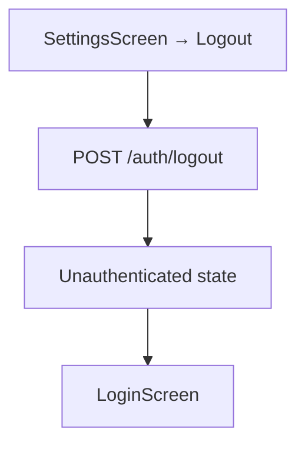

# User Flow — Mobile Role Strategy

## Primary Flow: Login → Role-Scoped Shell

```mermaid
flowchart TD
    A[App Launch] --> B[LoginScreen]
    B -->|email + password| C["POST /auth/login"]
    C -->|failure| D["LoginScreen + error message"]
    C -->|success + token| E["GET /auth/me"]
    E -->|failure| D
    E -->|success + roles[]| F{Filter to mobile-supported roles}

    F -->|0 supported roles| G["UnsupportedRoleScreen"]
    F -->|1 supported role| H["Auto-select → POST /auth/select-role"]
    F -->|2+ supported roles| I["RoleSelectorScreen"]

    I -->|user taps role| J["POST /auth/select-role"]
    H --> K["AuthShell (role-scoped)"]
    J --> K

    K --> L["Bottom Tab Bar (from RoleConfig)"]
    L --> M["Tab content (role-specific)"]
```

## Secondary Flow: Logout



## Edge Case Flows

### User has only unsupported roles
```
Login → auth/me → roles: ["FINANCE_CONTROLLER"] → 0 mobile-supported → UnsupportedRoleScreen
```

### User has "ALL" in role list
```
Login → auth/me → roles: ["DRIVER", "ALL"] → filter out "ALL" → 1 supported → auto-select DRIVER → AuthShell
```

### Select-role API fails
```
Login → auth/me → RoleSelectorScreen → select DRIVER → select-role fails → LoginScreen + "Failed to select role" error
```

## Implementation Divergences

> [!NOTE]
> **No divergences** — the implemented `AuthViewModel` state machine matches this flow exactly, including auto-select, ALL filtering, and unsupported-role handling.
