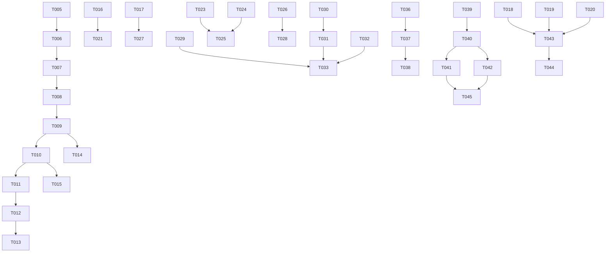

# Task Breakdown: Mobile Foundation

**Feature**: [spec.md](file:///Users/ankit/a/fleetly/axleops_code/specs/003-mobile-foundation/spec.md)
**Plan**: [plan.md](file:///Users/ankit/a/fleetly/axleops_code/specs/003-mobile-foundation/plan.md)
**Scope**: `/mobile/**`
**Total Tasks**: 48

---

## Phase 1: Project & Package Cleanup (Setup)

> Goal: Clean up dead code and prepare the package structure for foundation work. No behavioral changes.

- [x] T001 [P] Remove dead scaffold files `Greeting.kt`, `Platform.kt` from `mobile/shared/src/commonMain/kotlin/com/axleops/mobile/` (OI-10) — already removed in prior round
- [x] T002 [P] Create `mobile/shared/src/commonMain/kotlin/com/axleops/mobile/platform/` package with placeholder `package-info.kt` for expect/actual platform abstractions
- [x] T003 [P] Create `mobile/shared/src/commonMain/kotlin/com/axleops/mobile/upload/` package with placeholder `package-info.kt` for upload service
- [x] T004 [P] Create `mobile/shared/src/commonMain/kotlin/com/axleops/mobile/analytics/` package with placeholder `package-info.kt` for analytics service
- [x] T005 Add Decompose dependencies (`decompose`, `decompose-extensions-compose`) to `mobile/shared/build.gradle.kts` under `commonMain.dependencies`

**Acceptance**: Project compiles on both Android and iOS with new packages and Decompose dependency. Dead files removed. Zero behavioral change.

---

## Phase 2: Foundational — Navigation Framework (Blocking)

> Goal: Replace the flat `tabContent(selectedTabId)` lambda with Decompose component tree. This unblocks all feature screens that need push/pop navigation.
> Advances: FR-005, FR-006, FR-007, FR-008, FR-009, FR-001a (spec-003), OI-01 (spec-001)

- [x] T006 [US1] Create `NavConfig.kt` with sealed `AuthConfig`, `TabConfig`, `ScreenConfig` configuration classes in `mobile/shared/src/commonMain/kotlin/com/axleops/mobile/navigation/NavConfig.kt`
- [x] T007 [US1] Create `TabComponent.kt` — per-tab Decompose component with `ChildStack<ScreenConfig, ScreenChild>`, `push()`, `pop()`, `resetToRoot()`, exposed `title: Value<String>`, `canGoBack` in `mobile/shared/src/commonMain/kotlin/com/axleops/mobile/navigation/TabComponent.kt`
- [x] T008 [US1] Create `ShellComponent.kt` — tab manager with `ChildPages<TabConfig, TabComponent>`, `selectTab(index)`, role-driven tab initialization from `RoleConfig` in `mobile/shared/src/commonMain/kotlin/com/axleops/mobile/navigation/ShellComponent.kt`
- [x] T009 [US1] Create `RootComponent.kt` — entry point with auth vs. shell routing, owns `ChildStack<AuthConfig, AuthChild>` for unauthenticated flow and delegates to `ShellComponent` when authenticated in `mobile/shared/src/commonMain/kotlin/com/axleops/mobile/navigation/RootComponent.kt`
- [x] T010 [US1] Refactor `AuthShell.kt` into a thin `@Composable` rendering layer that observes `ShellComponent` — top bar title from `TabComponent.title`, back arrow from `TabComponent.canGoBack`, tab bar from `ChildPages` in `mobile/shared/src/commonMain/kotlin/com/axleops/mobile/navigation/AuthShell.kt`
- [x] T011 [US1] Refactor `AppNavHost.kt` to create `RootComponent` with a `DefaultComponentContext` and render via `RootComponent` instead of manual state-based conditional rendering in `mobile/shared/src/commonMain/kotlin/com/axleops/mobile/navigation/AppNavHost.kt`
- [x] T012 [US1] Update `RoleConfig.kt` to replace `tabContentFactory` lambda with a `tabConfigs: List<TabConfig>` and a `screenChildFactory` that maps `ScreenConfig → ScreenChild` for Decompose in `mobile/shared/src/commonMain/kotlin/com/axleops/mobile/role/model/RoleConfig.kt`
- [x] T013 [US1] Update `RoleRegistry.kt` and `DriverRoleModule` (driver registration) to provide `tabConfigs` and `screenChildFactory` compatible with the Decompose component tree in `mobile/shared/src/commonMain/kotlin/com/axleops/mobile/role/registry/RoleRegistry.kt` and `mobile/shared/src/commonMain/kotlin/com/axleops/mobile/navigation/driver/DriverScreens.kt`
- [x] T014 [US1] Wire system back button handling — Android hardware back and iOS swipe-back gesture via Decompose's `BackHandler` integration in `mobile/shared/src/commonMain/kotlin/com/axleops/mobile/navigation/RootComponent.kt`
- [x] T015 [US1] Implement re-tap-active-tab-resets-to-root behavior — when user taps the already-selected tab, call `TabComponent.resetToRoot()` in `mobile/shared/src/commonMain/kotlin/com/axleops/mobile/navigation/AuthShell.kt`

**Acceptance**: App launches, shows tab bar. Tapping tabs switches pages (preserves each tab's state). Back button pops within a tab. Re-tapping active tab resets to root. Top bar shows screen name, not role label. Compiles on Android + iOS.

---

## Phase 3: Platform Abstractions (Blocking)

> Goal: Create expect/actual interfaces for platform services that multiple features depend on.
> Advances: FR-004, FR-015, FR-060, FR-070

- [x] T016 [P] [US1] Create `ConnectivityObserver.kt` expect class in `mobile/shared/src/commonMain/kotlin/com/axleops/mobile/platform/ConnectivityObserver.kt` with `isOnline: StateFlow<Boolean>`. Implement actual in `androidMain` (ConnectivityManager) and `iosMain` (NWPathMonitor)
- [x] T017 [P] [US2] Create `SecureStorage.kt` expect class in `mobile/shared/src/commonMain/kotlin/com/axleops/mobile/platform/SecureStorage.kt` with `save(key, value)`, `read(key)`, `delete(key)`. Implement actual in `androidMain` (EncryptedSharedPreferences) and `iosMain` (Keychain)
- [x] T018 [P] [US6] Create `CameraCapture.kt` expect class in `mobile/shared/src/commonMain/kotlin/com/axleops/mobile/platform/CameraCapture.kt` with `capturePhoto(): ByteArray?`. Implement actual in `androidMain` (ActivityResultContracts.TakePicture) and `iosMain` (UIImagePickerController)
- [x] T019 [P] [US6] Create `GalleryPicker.kt` expect class in `mobile/shared/src/commonMain/kotlin/com/axleops/mobile/platform/GalleryPicker.kt` with `pickImage(): ByteArray?`. Implement actual in `androidMain` (ActivityResultContracts.GetContent) and `iosMain` (PHPickerViewController)
- [x] T020 [P] [US6] Create `PermissionHandler.kt` expect class in `mobile/shared/src/commonMain/kotlin/com/axleops/mobile/platform/PermissionHandler.kt` with `requestCameraPermission(): Boolean`, `requestGalleryPermission(): Boolean`. Implement actual in `androidMain` and `iosMain`

**Acceptance**: Each expect/actual compiles on both platforms. `ConnectivityObserver` emits online/offline state. `SecureStorage` round-trips a value. Camera/gallery/permission impls are platform-functional.

---

## Phase 4: Shell Refinements & Connectivity (US1 — App Shell)

> Goal: Wire offline banner to real connectivity, replace emoji tab icons.
> Advances: FR-001, FR-001a, FR-002, FR-003, FR-004

- [x] T021 [US1] Wire `ConnectivityObserver` into `RootComponent` or `ShellComponent` → expose `isOffline: Value<Boolean>` → `AuthShell` renders `OfflineBanner` reactively in `mobile/shared/src/commonMain/kotlin/com/axleops/mobile/navigation/ShellComponent.kt` and `AuthShell.kt`
- [x] T022 [US1] Replace emoji tab icons (OI-08) with Material `ImageVector` icons in all `TabDefinition` registrations in `mobile/shared/src/commonMain/kotlin/com/axleops/mobile/navigation/driver/DriverScreens.kt` and `opsexec/OpsExecPlaceholderScreens.kt`

**Acceptance**: Offline banner appears/disappears based on real device connectivity. Tab icons are proper Material vectors. Top bar shows screen name.

---

## Phase 5: Startup & Session Management (US2 — Auth/Session)

> Goal: Add session re-validation on app resume, MockAuthRepository, secure token persistence.
> Advances: FR-010, FR-011, FR-014a, FR-015, FR-016, FR-017

- [x] T023 [US2] Create `SessionManager.kt` in `mobile/shared/src/commonMain/kotlin/com/axleops/mobile/auth/session/SessionManager.kt` — tracks foreground/background time, triggers silent `GET /auth/me` re-validation after ≥ 30 min in background
- [x] T024 [US2] Create platform lifecycle observer (expect/actual) to call `SessionManager.onAppBackgrounded()` / `onAppForegrounded()` — Android `ProcessLifecycleOwner`, iOS `NotificationCenter` `willEnterForeground` in `mobile/shared/src/commonMain/kotlin/com/axleops/mobile/platform/AppLifecycleObserver.kt`
- [x] T025 [US2] Wire `SessionManager` into `RootComponent` — on foreground after 30 min: if 401 → clear session and navigate to Login; if network failure → do nothing, rely on 401 interceptor in `mobile/shared/src/commonMain/kotlin/com/axleops/mobile/navigation/RootComponent.kt`
- [x] T026 [US2] Create `MockAuthRepository.kt` in `mobile/shared/src/commonMain/kotlin/com/axleops/mobile/auth/repository/MockAuthRepository.kt` — returns canned responses from `auth-login.json`, `auth-me.json` fixtures with simulated 500ms latency
- [x] T027 [US2] Wire `SecureStorage` into `AuthRepository` — persist token on login, clear on logout, read on startup for session validation in `mobile/shared/src/commonMain/kotlin/com/axleops/mobile/auth/repository/RealAuthRepository.kt`
- [x] T028 [US2] Register `MockAuthRepository` in `DataSourceModule.kt` — wire `DataSourceConfig.authSource` toggle to select `RealAuthRepository` vs `MockAuthRepository` in `mobile/shared/src/commonMain/kotlin/com/axleops/mobile/di/DataSourceModule.kt`

**Acceptance**: App re-validates session after 30 min background. `MockAuthRepository` works with all-mock config. Token persists across cold launches via SecureStorage. Switching auth source via DataSourceConfig works.

---

## Phase 6: Network / API Layer Baseline (US3 — API Client)

> Goal: Configure HttpClient with base URL from build config, add request timeout, improve error mapping.
> Advances: FR-018, FR-019, FR-020, FR-021, FR-022, FR-023

- [x] T029 [US3] Add `baseUrl` parameter to `HttpClientFactory.create()` wired from a build config value (environment-specific). Add request/connect timeout configuration (30s default) in `mobile/shared/src/commonMain/kotlin/com/axleops/mobile/data/HttpClientFactory.kt`
- [x] T030 [US3] Create DTO package with `AuthLoginResponseDto.kt`, `AuthMeResponseDto.kt` as `@Serializable` data classes mirroring backend JSON shapes in `mobile/shared/src/commonMain/kotlin/com/axleops/mobile/data/dto/`
- [x] T031 [US3] Create mapper functions `AuthLoginResponseDto.toDomain()`, `AuthMeResponseDto.toDomain()` in `mobile/shared/src/commonMain/kotlin/com/axleops/mobile/data/mapper/AuthMapper.kt` — handle missing fields with sensible defaults
- [x] T032 [US3] Create `ApiError.kt` sealed class (NetworkError, ServerError, Unauthorized, ParseError, UnknownError) in `mobile/shared/src/commonMain/kotlin/com/axleops/mobile/data/ApiError.kt` — used by all repositories for error mapping
- [x] T033 [US3] Update `RealAuthRepository.kt` to use DTOs + mappers + `ApiError` mapping instead of direct deserialization in `mobile/shared/src/commonMain/kotlin/com/axleops/mobile/auth/repository/RealAuthRepository.kt`

**Acceptance**: HttpClient uses environment-specific base URL. DTOs are separate from domain models. Error mapping is centralized via `ApiError`. Auth requests use DTO → mapper → domain pattern.

---

## Phase 7: Contract Definition & Mock Layer (US4 — Mock/Real Switching)

> Goal: Define derived contracts, complete mock fixtures, make DataSourceConfig reactive.
> Advances: FR-033, FR-034, FR-035, FR-036, FR-037, FR-038

- [x] T034 [US4] Create `specs/003-mobile-foundation/derived-contracts.md` documenting the `POST /api/v1/files/upload` and `GET /api/v1/contacts/{id}` derived contract shapes, rationale, and backend source references
- [x] T035 [US4] Create mock fixtures: `auth-me.json` (enriched with contactId), `file-upload-success.json`, verify existing `auth-login.json` parses correctly under `mobile/shared/src/commonMain/composeResources/files/mocks/`
- [x] T036 [US4] Make `DataSourceConfig` reactive — change DI binding from `single { DataSourceConfig.DEFAULT }` to `single { MutableStateFlow(DataSourceConfig.DEFAULT) }` in `mobile/shared/src/commonMain/kotlin/com/axleops/mobile/di/AppModule.kt`
- [x] T037 [US4] Update `DataSourceModule.kt` — add `uploadSource` and `authSource` toggling. All repository bindings read from the reactive `MutableStateFlow<DataSourceConfig>` in `mobile/shared/src/commonMain/kotlin/com/axleops/mobile/di/DataSourceModule.kt`
- [x] T038 [US4] Update `SettingsScreen.kt` — wire debug panel toggles to write to the reactive `MutableStateFlow<DataSourceConfig>`. Toggles visible only in debug builds in `mobile/shared/src/commonMain/kotlin/com/axleops/mobile/ui/shared/SettingsScreen.kt`

**Acceptance**: QA can toggle any feature between mock and real via Settings. Mock fixtures parse without error. Derived contracts documented. Toggling takes effect on next fetch (no restart required).

---

## Phase 8: Upload Baseline (US6 — Upload Service)

> Goal: Deliver a fully working upload service with camera/gallery capture, preview, progress, retry, and mock mode.
> Advances: FR-056, FR-057, FR-058, FR-059, FR-060

- [x] T039 [US6] Create `UploadState.kt` sealed class (Idle, Capturing, Previewing, Uploading, Success, Failed) and `UploadJob.kt` domain model in `mobile/shared/src/commonMain/kotlin/com/axleops/mobile/upload/UploadState.kt`
- [x] T040 [US6] Create `UploadService.kt` interface with `capturePhoto()`, `pickFromGallery()`, `upload(bytes, config)`, `retry()` in `mobile/shared/src/commonMain/kotlin/com/axleops/mobile/upload/UploadService.kt`
- [x] T041 [US6] Create `MockUploadService.kt` — stores file locally on device, returns mock URL after 1500ms simulated delay in `mobile/shared/src/commonMain/kotlin/com/axleops/mobile/upload/MockUploadService.kt`
- [x] T042 [US6] Create `RealUploadService.kt` — Ktor multipart POST to `/api/v1/files/upload`, progress tracking via Ktor streaming, retry on transient failure in `mobile/shared/src/commonMain/kotlin/com/axleops/mobile/upload/RealUploadService.kt`
- [x] T043 [US6] Create `UploadViewModel.kt` — orchestrates capture → preview → upload → result flow, validates file size before upload in `mobile/shared/src/commonMain/kotlin/com/axleops/mobile/upload/UploadViewModel.kt`
- [x] T044 [US6] Create `UploadPreviewScreen.kt` and `UploadProgressIndicator.kt` composables — thumbnail preview with accept/retake/cancel, circular progress with percentage in `mobile/shared/src/commonMain/kotlin/com/axleops/mobile/ui/shared/UploadPreviewScreen.kt` and `UploadProgressIndicator.kt`
- [x] T045 [US6] Create `UploadModule.kt` — register `UploadService` DI binding with `DataSourceConfig.uploadSource` toggle (mock/real) in `mobile/shared/src/commonMain/kotlin/com/axleops/mobile/di/UploadModule.kt`

**Acceptance**: Developer triggers upload from a test screen → camera or gallery opens → photo preview shown → accept → progress indicator → success (mock URL returned). Retry works on failure. Mock/real toggle switches implementation.

---

## Phase 9: State Handling Refinements (US8)

> Goal: Wire real connectivity into state handling, add retry escalation pattern.
> Advances: FR-047, FR-049, FR-050

- [x] T046 [US8] Wire `ConnectivityObserver.isOnline` into `UiStateHandler` — when offline, any screen currently in Loading or Error transitions to Offline state with sticky banner. Add retry count tracking — after 3 retries show "If this continues, contact support" secondary text in `mobile/shared/src/commonMain/kotlin/com/axleops/mobile/ui/shared/StateScreens.kt`

**Acceptance**: Toggling airplane mode shows Offline state on all screens. After 3 retry taps, escalation text appears.

---

## Phase 10: Analytics & Logging Hooks (US7)

> Goal: Create analytics interface with local logger, instrument key insertion points.
> Advances: FR-061, FR-062, FR-063, FR-064

- [x] T047 [P] [US7] Create `AnalyticsService.kt` interface (`trackScreenView`, `trackAction`, `trackError`, `trackCustomEvent`) and `LocalAnalyticsService.kt` (logs to platform console) in `mobile/shared/src/commonMain/kotlin/com/axleops/mobile/analytics/AnalyticsService.kt` and `LocalAnalyticsService.kt`. Register in `AnalyticsModule.kt` DI binding

**Acceptance**: Analytics interface is injectable via Koin. `LocalAnalyticsService` outputs to Logcat/os_log. Screen view tracking callable from Components.

---

## Phase 11: Tests

> Goal: Add unit tests for new foundation components.
> Advances: Constitution VIII, SC-007, SC-010

- [x] T048 [P] Add unit tests: `NavConfigTest.kt` (sealed class serialization), `UploadStateTest.kt` (state transitions), `ApiErrorTest.kt` (error mapping), `AuthMapperTest.kt` (DTO → domain), fixture parsing tests (all JSON files parse without error) in `mobile/shared/src/commonTest/kotlin/com/axleops/mobile/`

**Acceptance**: `./gradlew :shared:allTests` passes. All fixture files parse. DTO mappers handle missing fields.

---

## Blocked / Backend Follow-Ups

> These tasks are tracked but cannot be completed until backend changes ship.

- [ ] T-BLOCKED-01 Wire `RealUploadService` to actual `POST /api/v1/files/upload` endpoint — **blocked by**: no upload endpoint exists on backend
- [ ] T-BLOCKED-02 Wire `contactId` from real `GET /auth/me` response into driver profile resolution — **blocked by**: G-17 (no User↔Contact FK in backend)
- [ ] T-BLOCKED-03 Configure staging and production `baseUrl` values in build config — **blocked by**: staging/prod URLs not yet provisioned

---

## Dependencies

## Parallel Execution Opportunities

| Parallel Group | Tasks | Condition |
|---------------|-------|-----------|
| **Setup** | T001, T002, T003, T004 | All independent file operations |
| **Platform abstractions** | T016, T017, T018, T019, T020 | Different files, no shared dependencies |
| **After nav framework** (T015 done) | T021, T022 (shell), T023–T028 (auth), T029–T033 (API) | Different packages, no overlap |
| **After mock layer** (T038 done) | T039–T045 (upload), T046 (state), T047 (analytics), T048 (tests) | Different packages |

## Implementation Strategy

1. **MVP** (Phase 1–2): Decompose navigation framework working with tabs + push/pop. This unblocks all feature epics.
2. **Core services** (Phase 3–7): Platform abstractions, session management, API layer, mock switching — completes the infrastructure.
3. **Upload + Polish** (Phase 8–11): Upload service, analytics, state handling refinements, tests — completes the foundation.

**Estimated total effort**: ~12 days (can be compressed to ~8 with parallelization)

---

## Fix Round 1

> Goal: Resolve 5 Major open issues from [open-issues.md](file:///Users/ankit/a/fleetly/axleops_code/specs/003-mobile-foundation/handoff/open-issues.md) before Driver Auth & Session epic.
> Source: Design Review Round 1 + QA Report Round 1.
> All fixes are engineer-only — no updated UX artifacts, spec, or plan required.

- [x] T-FIX-01 [OI-01] Wire reactive `DataSourceConfig` into `SettingsScreen` — collect `dataSourceConfigFlow` from Koin, forward live snapshot and `onConfigChanged` callback through `AuthShell` to `SettingsScreen`. Replace the hardcoded `DataSourceConfig.DEFAULT` at [AuthShell.kt:148](file:///Users/ankit/a/fleetly/axleops_code/mobile/shared/src/commonMain/kotlin/com/axleops/mobile/navigation/AuthShell.kt#L148).
  - **Prerequisite**: none
  - **Affects**: real-vs-mock switching, app shell
  - **Preserves mock switchability**: yes — this is the fix that MAKES switching functional

- [x] T-FIX-02 [OI-02] Add `retryCount: Int = 0` to `UiState.Error`, wire through `UiStateHandler` to `ErrorStateScreen`. Update `UiStateHandler` to pass `retryCount` from `UiState.Error` into `ErrorStateScreen(retryCount = ...)`.
  - **Prerequisite**: none
  - **Affects**: baseline loading/empty/error/blocked/offline behavior, future feature readiness
  - **Preserves mock switchability**: n/a — state handling only

- [x] T-FIX-03 [OI-03] Derive `isDebugBuild` from platform build configuration. Android: read `BuildConfig.DEBUG`. iOS: compile-time flag via `expect/actual`. Pass as parameter from `MainActivity` / iOS app delegate into `App()` → `AppNavHost()` → `AuthShell()` → `SettingsScreen()`. Remove hardcoded `true` at [AuthShell.kt:149](file:///Users/ankit/a/fleetly/axleops_code/mobile/shared/src/commonMain/kotlin/com/axleops/mobile/navigation/AuthShell.kt#L149).
  - **Prerequisite**: none
  - **Affects**: app shell, real-vs-mock switching (debug toggle visibility gating), future feature readiness
  - **Preserves mock switchability**: yes — debug toggles remain in debug builds, hidden in release

- [x] T-FIX-04 [OI-04] Add automatic screen-view tracking to navigation. Add a `Value.subscribe` observer on `TabComponent.childStack` (or `ShellComponent.tabPages`) that calls `AnalyticsService.trackScreenView(screenTitle)` on each stack change. Inject `AnalyticsService` via Koin into the component or the Compose rendering layer.
  - **Prerequisite**: none
  - **Affects**: analytics/logging, future feature readiness
  - **Preserves mock switchability**: n/a — analytics only

- [ ] T-FIX-05 [OI-05] Document startup error UX path — add a clarifying note to `spec.md` §FR-013 stating that `LoginScreen(error = ...)` serves as the cold-start error surface when backend is unreachable during session validation. No code change; spec documentation only.
  - **Prerequisite**: none (PM task, no code)
  - **Affects**: bootstrap
  - **Preserves mock switchability**: n/a — spec documentation only

**Acceptance**: (1) Debug toggles in Settings write and read from the live `DataSourceConfig` flow — toggling mock/real takes effect on next fetch. (2) After 3 error retries, escalation text appears. (3) Debug toggles are hidden in release builds and visible in debug builds. (4) Screen-view events are logged on every navigation transition. (5) Spec §FR-013 has a clarifying note.

**Estimated effort**: 4–6 hours engineering + 30 min PM (T-FIX-05)
