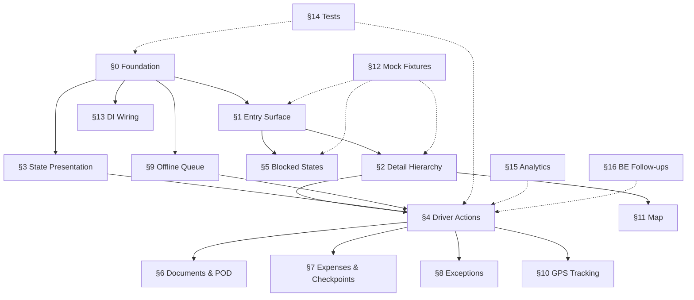

# Task Breakdown: Driver Active Trip

**Feature Branch**: `005-driver-active-trip`  
**Spec**: [spec.md](file:///Users/ankit/a/fleetly/axleops_code/specs/005-driver-active-trip/spec.md)  
**Plan**: [plan.md](file:///Users/ankit/a/fleetly/axleops_code/specs/005-driver-active-trip/plan.md)  
**UX**: [ux/](file:///Users/ankit/a/fleetly/axleops_code/specs/005-driver-active-trip/ux/)  
**Date**: 2026-03-29  
**Total Tasks**: 74

---

## §0 — Foundation: Domain Models & State Machine

> Goal: Build the shared domain layer that every downstream section depends on.  
> API type: **N/A (pure Kotlin models)**  
> Independent test: Run `TripStateMachineTest` — all transitions pass.

- [x] T001 [P] Expand `TripStatus` enum from 6 to 29 values (all sub-states + exceptions + UNKNOWN fallback) in `mobile/shared/src/commonMain/kotlin/com/axleops/mobile/domain/model/Trip.kt`
- [x] T002 [P] Create `TripSubState.kt` — driver-visible label, badge color token, and phase mapping per sub-state in `mobile/shared/src/commonMain/kotlin/com/axleops/mobile/domain/model/TripSubState.kt`
- [x] T003 [P] Create `Milestone.kt` domain model (type, sequence, status, timestamps, GPS, evidence) in `mobile/shared/src/commonMain/kotlin/com/axleops/mobile/domain/model/Milestone.kt`
- [x] T004 [P] Create `MilestoneType.kt` enum — 10 milestone types matching trip.md lifecycle in `mobile/shared/src/commonMain/kotlin/com/axleops/mobile/domain/model/MilestoneType.kt`
- [x] T005 [P] Create `TripDetail.kt` enriched model (trip + milestones + expenses + documents + exception + EWB) in `mobile/shared/src/commonMain/kotlin/com/axleops/mobile/domain/model/TripDetail.kt`
- [x] T006 [P] Create `TripExpense.kt` domain model (category, amount, receipt, timestamp, syncStatus) in `mobile/shared/src/commonMain/kotlin/com/axleops/mobile/domain/model/TripExpense.kt`
- [x] T007 [P] Create `TripDocument.kt` domain model (category, thumbnail, status, timestamp) in `mobile/shared/src/commonMain/kotlin/com/axleops/mobile/domain/model/TripDocument.kt`
- [x] T008 [P] Create `Pod.kt` domain model (consignee, signature, photos, condition, type, refusalReason) in `mobile/shared/src/commonMain/kotlin/com/axleops/mobile/domain/model/Pod.kt`
- [x] T009 [P] Create `TripException.kt` domain model (type enum, description, GPS, evidence, timestamp) in `mobile/shared/src/commonMain/kotlin/com/axleops/mobile/domain/model/TripException.kt`
- [x] T010 [P] Create `CheckpointEvent.kt` domain model (type, details, timestamp, amount) in `mobile/shared/src/commonMain/kotlin/com/axleops/mobile/domain/model/CheckpointEvent.kt`
- [x] T011 [P] Create `LocationLog.kt` domain model (lat, lng, timestamp, accuracy) in `mobile/shared/src/commonMain/kotlin/com/axleops/mobile/domain/model/LocationLog.kt`
- [x] T012 [P] Create `TransitionRequest.kt` model (event, data map, GPS) in `mobile/shared/src/commonMain/kotlin/com/axleops/mobile/domain/model/TransitionRequest.kt`
- [x] T013 [P] Create `DriverAction.kt` sealed class — all driver-permitted actions with payloads in `mobile/shared/src/commonMain/kotlin/com/axleops/mobile/domain/model/DriverAction.kt`
- [x] T014 Create `TripStateMachine.kt` — pure Kotlin state machine: nextState, allowedAction, isBlocked, isReadOnly, isException in `mobile/shared/src/commonMain/kotlin/com/axleops/mobile/trip/state/TripStateMachine.kt`
- [x] T015 Create `TripStateMachineTest.kt` — all valid transitions, all blocked states, all read-only states, exception overlay logic in `mobile/shared/src/commonTest/kotlin/com/axleops/mobile/trip/state/TripStateMachineTest.kt`

---

## §1 — Active Trip Entry Surface

> Goal: Driver opens Active Trip tab → sees trip card (or empty state) → can accept/reject.  
> API type: **Mock** (`GET /trips/driver/active`, `POST /trips/{id}/accept`, `POST /trips/{id}/reject`)  
> Independent test: Launch app in mock mode → Active Trip tab shows dispatched trip → Accept → state updates.

- [x] T016 Create `TripRepository` extensions: `getActiveTrip()`, `acceptTrip(id, reason)`, `rejectTrip(id, reason)` in `mobile/shared/src/commonMain/kotlin/com/axleops/mobile/domain/repository/TripRepository.kt`
- [x] T017 [P] Create `MockTripRepository` implementations for new methods (fixture-backed, in-memory state mutation on accept/reject) in `mobile/shared/src/commonMain/kotlin/com/axleops/mobile/data/repository/MockTripRepository.kt`
- [x] T018 [P] Create `RealTripRepository` stubs for new methods (API calls to derived endpoints) in `mobile/shared/src/commonMain/kotlin/com/axleops/mobile/data/repository/RealTripRepository.kt`
- [x] T019 [P] Create mock JSON fixture `active-trip-dispatched.json` in `mobile/shared/src/commonMain/composeResources/files/mocks/trip/`
- [x] T020 Create `TripDtos.kt` — `TripDetailResponse`, `MilestoneResponse` API DTOs in `mobile/shared/src/commonMain/kotlin/com/axleops/mobile/data/dto/TripDtos.kt`
- [x] T021 Create `TripMapper.kt` — DTO-to-domain mappers for TripDetail, Milestone in `mobile/shared/src/commonMain/kotlin/com/axleops/mobile/data/mapper/TripMapper.kt`
- [x] T022 Create `GetActiveTripUseCase.kt` — fetch + cache active trip in `mobile/shared/src/commonMain/kotlin/com/axleops/mobile/trip/usecase/GetActiveTripUseCase.kt`
- [x] T023 Create `TripUiState.kt` sealed hierarchy (Loading, NoTrip, Error, Active) in `mobile/shared/src/commonMain/kotlin/com/axleops/mobile/trip/state/TripUiState.kt`
- [x] T024 Create `CtaState.kt` sealed interface (Hidden, Enabled, Disabled, InProgress) in `mobile/shared/src/commonMain/kotlin/com/axleops/mobile/trip/state/CtaState.kt`
- [x] T025 Create `ActiveTripComponent.kt` Decompose component — tab landing, state management, accept/reject actions in `mobile/shared/src/commonMain/kotlin/com/axleops/mobile/trip/component/ActiveTripComponent.kt`
- [x] T026 Create `TripCardComposable.kt` — active trip card per design system §2.2 (trip number, route, client, vehicle, stepper) in `mobile/shared/src/commonMain/kotlin/com/axleops/mobile/ui/trip/components/TripCardComposable.kt`
- [x] T027 Create `MilestoneStepperComposable.kt` — horizontal stepper (step states: completed, current, future, blocked, skipped) in `mobile/shared/src/commonMain/kotlin/com/axleops/mobile/ui/trip/components/MilestoneStepperComposable.kt`
- [x] T028 Create `ActiveTripScreen.kt` — empty state, dispatched card (accept/reject), active card, read-only card in `mobile/shared/src/commonMain/kotlin/com/axleops/mobile/ui/trip/ActiveTripScreen.kt`
- [x] T029 Add `ScreenConfig.TripDetail` and `ScreenConfig.MilestoneAction` variants to `mobile/shared/src/commonMain/kotlin/com/axleops/mobile/navigation/NavConfig.kt`
- [x] T030 Wire `ActiveTripScreen` into `driverScreenFactory` in `mobile/shared/src/commonMain/kotlin/com/axleops/mobile/navigation/driver/DriverScreens.kt`
- [x] T031 Create `TripModule.kt` Koin module — bind ActiveTripComponent, GetActiveTripUseCase, new repositories in `mobile/shared/src/commonMain/kotlin/com/axleops/mobile/di/TripModule.kt`
- [x] T032 Update `DataSourceModule.kt` — add factory bindings for new feature repositories in `mobile/shared/src/commonMain/kotlin/com/axleops/mobile/di/DataSourceModule.kt`

---

## §2 — Trip Detail Hierarchy

> Goal: Tapping the trip card pushes to a scrollable detail screen with all sections.  
> API type: **Mock** (`GET /trips/{id}/milestones`)  
> Independent test: Accept trip → tap card → see detail with route, client, vehicle, cargo, stepper, map placeholder, documents, expenses sections.

- [x] T033 Create `MilestoneRepository.kt` interface — `getMilestones(tripId)`, `transition(tripId, request)` in `mobile/shared/src/commonMain/kotlin/com/axleops/mobile/domain/repository/MilestoneRepository.kt`
- [x] T034 [P] Create `MockMilestoneRepository.kt` — in-memory state machine, fixture-backed milestone list in `mobile/shared/src/commonMain/kotlin/com/axleops/mobile/data/repository/MockMilestoneRepository.kt`
- [x] T035 [P] Create `RealMilestoneRepository.kt` — API calls to `GET /trips/{id}/milestones`, `POST /trips/{id}/transition` in `mobile/shared/src/commonMain/kotlin/com/axleops/mobile/data/repository/RealMilestoneRepository.kt`
- [x] T036 Create `TripDetailComponent.kt` — Decompose component for detail screen (sections, CTA, overlay) in `mobile/shared/src/commonMain/kotlin/com/axleops/mobile/trip/component/TripDetailComponent.kt`
- [x] T037 Create `TripDetailScreen.kt` — scrollable detail with sections: info, map, milestones, documents, expenses in `mobile/shared/src/commonMain/kotlin/com/axleops/mobile/ui/trip/TripDetailScreen.kt`
- [x] T038 Create `MapSectionComposable.kt` — map placeholder with origin/destination pins (platform expect/actual later) in `mobile/shared/src/commonMain/kotlin/com/axleops/mobile/ui/trip/components/MapSectionPlaceholder.kt`

---

## §3 — Lifecycle State Presentation

> Goal: Trip card and detail screen correctly render all 15+ sub-states with correct labels, badge colors, and CTA.  
> API type: **N/A (UI + state mapping)**  
> Independent test: Swap mock fixtures for each sub-state → verify correct badge color, label, CTA label, and enabled/disabled state.

- [x] T039 Create `CtaStateDerivation.kt` — pure function mapping TripStatus → CtaState (label, action, enabled) per UX interaction-rules §1.1 in `mobile/shared/src/commonMain/kotlin/com/axleops/mobile/trip/state/CtaStateDerivation.kt`
- [x] T040 Create `ActionPermissions.kt` — pure functions: canAddExpense, canAddDocument, canReportException, canLogCheckpoint per state in `mobile/shared/src/commonMain/kotlin/com/axleops/mobile/trip/state/ActionPermissions.kt`
- [x] T041 Create `CtaStateDerivationTest.kt` — test CTA for all 15+ sub-states, exception overlay, accept timeout in `mobile/shared/src/commonTest/kotlin/com/axleops/mobile/trip/state/CtaStateDerivationTest.kt`
- [x] T042 Create `ActionPermissionTest.kt` — test all permission functions for every state in `mobile/shared/src/commonTest/kotlin/com/axleops/mobile/trip/state/ActionPermissionTest.kt`
- [x] T043 Create `PhaseBadgeComposable.kt` — trip phase badge using `color.phase.*` tokens in `mobile/shared/src/commonMain/kotlin/com/axleops/mobile/ui/trip/components/PhaseBadge.kt`

---

## §4 — Driver Actions (Milestone Progression)

> Goal: Driver can progress through milestones ACCEPTED → AT_ORIGIN → LOADING → LOADED → DEPARTED → IN_TRANSIT → AT_DESTINATION → UNLOADING → DELIVERED.  
> API type: **Mock** (`POST /trips/{id}/transition`)  
> Independent test: Progress through all milestones in mock mode → stepper updates at each step → forms capture required data.

- [x] T044 Create `TransitionMilestoneUseCase.kt` — validate via TripStateMachine → API call → queue if offline in `mobile/shared/src/commonMain/kotlin/com/axleops/mobile/trip/usecase/TransitionMilestoneUseCase.kt`
- [x] T045 Create `MilestoneActionComponent.kt` — Decompose component for milestone transition forms in `mobile/shared/src/commonMain/kotlin/com/axleops/mobile/trip/component/MilestoneActionComponent.kt`
- [x] T046 Create `MilestoneActionScreen.kt` — context-sensitive form (loading: weight/seal/photos, departure: GPS/odometer, arrival: GPS/odometer, delivery: weight/condition) in `mobile/shared/src/commonMain/kotlin/com/axleops/mobile/ui/trip/MilestoneActionScreen.kt`
- [x] T047 Wire primary CTA button on TripDetailScreen to push MilestoneActionScreen with correct context in `mobile/shared/src/commonMain/kotlin/com/axleops/mobile/ui/trip/TripDetailScreen.kt`
- [x] T048 Implement auto-capture of GPS coordinates + timestamp on each milestone submission (expect/actual GPS provider) in `mobile/shared/src/commonMain/kotlin/com/axleops/mobile/platform/LocationProvider.kt`

---

## §5 — Blocked-State Handling

> Goal: EWB rejection, accept timeout, active exception, and offline blocks render correctly with inline messaging.  
> API type: **Mock** (422 responses, fixture manipulation)  
> Independent test: Use mock fixture with EWB_PENDING → tap Depart → see inline block message. Report exception → see red banner + actions disabled.

- [x] T049 Create `TripOverlay.kt` sealed interface (Exception, Blocked, Offline) with precedence logic in `mobile/shared/src/commonMain/kotlin/com/axleops/mobile/trip/state/TripOverlay.kt`
- [x] T050 Create `BlockReason.kt` sealed class (ServerGuard, AcceptTimeout, ActiveException, OfflineRequired) in `mobile/shared/src/commonMain/kotlin/com/axleops/mobile/trip/state/BlockReason.kt`
- [x] T051 Create `ExceptionBannerComposable.kt` — red full-width banner with exception type, description, timestamp in `mobile/shared/src/commonMain/kotlin/com/axleops/mobile/ui/trip/components/ExceptionBanner.kt`
- [x] T052 Create `BlockedStateComposable.kt` — inline blocked explanation with resolution hint per UX interaction-rules §4 in `mobile/shared/src/commonMain/kotlin/com/axleops/mobile/ui/trip/components/BlockedStateCard.kt`
- [x] T053 Implement accept timeout logic — compute from `dispatchedAt` + 30 min, disable Accept button with message in `mobile/shared/src/commonMain/kotlin/com/axleops/mobile/trip/state/TripOverlay.kt`
- [x] T054 Create mock fixture `active-trip-ewb-pending.json` and `active-trip-exception.json` for blocked-state QA in `mobile/shared/src/commonMain/composeResources/files/mocks/trip/`

---

## §6 — Document / Evidence / POD Handling

> Goal: Driver can upload documents, capture POD (photos + signature + consignee), and view uploaded documents.  
> API type: **Mock** (`POST /trips/{id}/documents`, `GET /trips/{id}/documents`, `POST /trips/{id}/pod`)  
> Independent test: Upload a document → appears in list. Submit POD (2 photos + signature + consignee) → trip transitions to POD_SUBMITTED.

### §6.1 — Document Upload & Viewing

- [x] T055 Create `TripDocumentRepository.kt` interface — `getDocuments(tripId)`, `uploadDocument(tripId, bytes, category)`, `deleteDocument(tripId, docId)` in `mobile/shared/src/commonMain/kotlin/com/axleops/mobile/domain/repository/TripDocumentRepository.kt`
- [x] T056 [P] Create `MockTripDocumentRepository.kt` — in-memory list + simulated upload in `mobile/shared/src/commonMain/kotlin/com/axleops/mobile/data/repository/MockTripDocumentRepository.kt`
- [x] T057 [P] Create `RealTripDocumentRepository.kt` — multipart POST via UploadService in `mobile/shared/src/commonMain/kotlin/com/axleops/mobile/data/repository/RealTripDocumentRepository.kt`
- [x] T058 Create `UploadDocumentUseCase.kt` — category selection → capture → upload → add to list in `mobile/shared/src/commonMain/kotlin/com/axleops/mobile/trip/usecase/UploadDocumentUseCase.kt`
- [x] T059 Create `DocumentViewerScreen.kt` — full-screen photo viewer (pinch-zoom) / PDF viewer in `mobile/shared/src/commonMain/kotlin/com/axleops/mobile/ui/trip/DocumentViewerScreen.kt`

### §6.2 — POD Capture Flow

- [x] T060 Create `PodRepository.kt` interface — `submitPod(tripId, pod)` in `mobile/shared/src/commonMain/kotlin/com/axleops/mobile/domain/repository/PodRepository.kt`
- [x] T061 [P] Create `MockPodRepository.kt` — accept files, simulate upload delay, return success in `mobile/shared/src/commonMain/kotlin/com/axleops/mobile/data/repository/MockPodRepository.kt`
- [x] T062 [P] Create `RealPodRepository.kt` — multipart POST to `POST /trips/{id}/pod` in `mobile/shared/src/commonMain/kotlin/com/axleops/mobile/data/repository/RealPodRepository.kt`
- [x] T063 Create `SubmitPodUseCase.kt` — orchestrate photo uploads → signature upload → metadata submission in `mobile/shared/src/commonMain/kotlin/com/axleops/mobile/trip/usecase/SubmitPodUseCase.kt`
- [x] T064 Create `PodCaptureComponent.kt` — multi-step Decompose flow (photos → signature → consignee → review) in `mobile/shared/src/commonMain/kotlin/com/axleops/mobile/trip/component/PodCaptureComponent.kt`
- [x] T065 Create `PodCaptureScreen.kt` — 4-step flow UI: photo capture, signature pad, consignee form, review summary in `mobile/shared/src/commonMain/kotlin/com/axleops/mobile/ui/trip/PodCaptureScreen.kt`
- [x] T066 Create platform expect/actual `SignatureCapture.kt` — Android Canvas drawing, iOS PKCanvasView in `mobile/shared/src/commonMain/kotlin/com/axleops/mobile/platform/SignatureCapture.kt`
- [x] T067 Add `ScreenConfig.PodCapture` variant (tabs hidden) and wire into navigation in `mobile/shared/src/commonMain/kotlin/com/axleops/mobile/navigation/NavConfig.kt`

---

## §7 — Expense & Checkpoint Logging

> Goal: Driver can log, edit, and delete expenses. Driver can log checkpoint events. Both are independent records.  
> API type: **Mock** (`POST/GET /trips/{id}/expenses`, `POST /trips/{id}/checkpoints`)  
> Independent test: Log fuel expense with receipt → appears in list with ₹ total. Edit amount → total updates. Delete → soft-deleted.

- [x] T068 Create `TripExpenseRepository.kt` interface — CRUD for trip expenses in `mobile/shared/src/commonMain/kotlin/com/axleops/mobile/domain/repository/TripExpenseRepository.kt`
- [x] T069 [P] Create `MockTripExpenseRepository.kt` — in-memory list with edit/soft-delete in `mobile/shared/src/commonMain/kotlin/com/axleops/mobile/data/repository/MockTripExpenseRepository.kt`
- [x] T070 [P] Create `RealTripExpenseRepository.kt` — API calls to expense endpoints in `mobile/shared/src/commonMain/kotlin/com/axleops/mobile/data/repository/RealTripExpenseRepository.kt`
- [x] T071 Create `LogExpenseUseCase.kt` — create/edit/delete expense → queue if offline in `mobile/shared/src/commonMain/kotlin/com/axleops/mobile/trip/usecase/LogExpenseUseCase.kt`
- [x] T072 Create `ExpenseFormComponent.kt` — Decompose component for add/edit expense in `mobile/shared/src/commonMain/kotlin/com/axleops/mobile/trip/component/ExpenseFormComponent.kt`
- [x] T073 Create `ExpenseFormScreen.kt` — category picker (bottom sheet), amount, fuel-specific fields (litres, price/litre, odometer), receipt photo in `mobile/shared/src/commonMain/kotlin/com/axleops/mobile/ui/trip/ExpenseFormScreen.kt`
- [x] T074 Create `CheckpointRepository.kt` interface + `MockCheckpointRepository.kt` + `RealCheckpointRepository.kt` in `mobile/shared/src/commonMain/kotlin/com/axleops/mobile/domain/repository/CheckpointRepository.kt` and `mobile/shared/src/commonMain/kotlin/com/axleops/mobile/data/repository/`
- [x] T075 Create `CheckpointEventScreen.kt` — event type picker + contextual fields in `mobile/shared/src/commonMain/kotlin/com/axleops/mobile/ui/trip/CheckpointEventScreen.kt`

---

## §8 — Exception Reporting

> Goal: Driver can report exceptions (breakdown, accident, cargo damage, etc.). Exception banner suppresses normal actions.  
> API type: **Mock** (`POST /trips/{id}/exceptions`)  
> Independent test: Report Vehicle Breakdown → red banner appears → all CTAs disabled → ops resolves → banner clears.

- [x] T076 Create `TripExceptionRepository.kt` interface — `reportException(tripId, exception)` in `mobile/shared/src/commonMain/kotlin/com/axleops/mobile/domain/repository/TripExceptionRepository.kt`
- [x] T077 [P] Create `MockTripExceptionRepository.kt` — sets exception state on mock fixture in `mobile/shared/src/commonMain/kotlin/com/axleops/mobile/data/repository/MockTripExceptionRepository.kt`
- [x] T078 [P] Create `RealTripExceptionRepository.kt` — POST to exception endpoint in `mobile/shared/src/commonMain/kotlin/com/axleops/mobile/data/repository/RealTripExceptionRepository.kt`
- [x] T079 Create `ReportExceptionUseCase.kt` in `mobile/shared/src/commonMain/kotlin/com/axleops/mobile/trip/usecase/ReportExceptionUseCase.kt`
- [x] T080 Create `ExceptionReportComponent.kt` + `ExceptionReportScreen.kt` — type picker, description, GPS auto, evidence photos in `mobile/shared/src/commonMain/kotlin/com/axleops/mobile/trip/component/ExceptionReportComponent.kt` and `mobile/shared/src/commonMain/kotlin/com/axleops/mobile/ui/trip/ExceptionReportScreen.kt`

---

## §9 — Offline / Error / Retry Behavior

> Goal: Actions work offline, queue drains on reconnect, sync conflicts are handled.  
> API type: **N/A (infrastructure)**  
> Independent test: Enable airplane mode → complete milestone → see queue badge → disable airplane mode → queue drains automatically.

- [x] T081 Create `OfflineQueue.kt` — persistent ordered queue (kotlinx.serialization + multiplatform-settings) with enqueue, pending, markSynced, markFailed, pendingCount StateFlow in `mobile/shared/src/commonMain/kotlin/com/axleops/mobile/data/local/OfflineQueue.kt`
- [x] T082 Create `QueuedMutation.kt` — sealed class: QueuedTransition, QueuedExpense, QueuedDocument, QueuedException, QueuedCheckpoint in `mobile/shared/src/commonMain/kotlin/com/axleops/mobile/data/local/QueuedMutation.kt`
- [x] T083 Create `SyncOfflineQueueUseCase.kt` — drain in chronological order, halt on rejection, refresh from server in `mobile/shared/src/commonMain/kotlin/com/axleops/mobile/trip/usecase/SyncOfflineQueueUseCase.kt`
- [x] T084 Create `ConnectivityObserver.kt` expect/actual — Android ConnectivityManager, iOS NWPathMonitor in `mobile/shared/src/commonMain/kotlin/com/axleops/mobile/platform/ConnectivityObserver.kt`
- [x] T085 Create `OfflineBannerComposable.kt` — full-width warning banner + queue count badge in `mobile/shared/src/commonMain/kotlin/com/axleops/mobile/ui/trip/components/OfflineBannerComposable.kt`
- [x] T086 Create `TripLocalCache.kt` — cache last-fetched TripDetail for offline viewing in `mobile/shared/src/commonMain/kotlin/com/axleops/mobile/data/local/TripLocalCache.kt`
- [x] T087 Create `OfflineQueueTest.kt` — enqueue, dequeue, persist, replay order, halt-on-rejection in `mobile/shared/src/commonTest/kotlin/com/axleops/mobile/data/local/OfflineQueueTest.kt`

---

## §10 — GPS Tracking

> Goal: Background GPS tracking every 5 minutes during IN_TRANSIT. Continues when backgrounded/killed.  
> API type: **Mock** (`POST /location/log`)  
> Independent test: Depart → GPS tracking starts → indicator visible → app backgrounded → location still logged.

- [x] T088 Create `LocationRepository.kt` interface — `batchLog(tripId, points)` in `mobile/shared/src/commonMain/kotlin/com/axleops/mobile/domain/repository/LocationRepository.kt`
- [x] T089 [P] Create `MockLocationRepository.kt` — silent sink, logs to console in `mobile/shared/src/commonMain/kotlin/com/axleops/mobile/data/repository/MockLocationRepository.kt`
- [x] T090 [P] Create `RealLocationRepository.kt` — POST to `/location/log` in `mobile/shared/src/commonMain/kotlin/com/axleops/mobile/data/repository/RealLocationRepository.kt`
- [x] T091 Create `TrackingManager.kt` — start/stop/batch/persist-offline logic, uses LocationTracker in `mobile/shared/src/commonMain/kotlin/com/axleops/mobile/tracking/TrackingManager.kt`
- [x] T092 Create `LocationTracker.kt` expect/actual — Android foreground service, iOS CLLocationManager in `mobile/shared/src/commonMain/kotlin/com/axleops/mobile/tracking/LocationTracker.kt`
- [x] T093 Create `TrackingModule.kt` Koin module — bind TrackingManager, LocationRepository in `mobile/shared/src/commonMain/kotlin/com/axleops/mobile/di/TrackingModule.kt`
- [x] T094 Wire tracking start/stop to milestone transitions (DEPARTED → start, AT_DESTINATION → stop) in `mobile/shared/src/commonMain/kotlin/com/axleops/mobile/trip/usecase/TransitionMilestoneUseCase.kt`

---

## §11 — Map Integration

> Goal: Map section shows route (origin → destination) with driver position.  
> API type: **N/A (platform map SDK)**  
> Independent test: View trip detail → map section shows origin/destination pins + route line.

- [x] T095 Create `MapView.kt` expect/actual — Android Google Maps / iOS MapKit (or Mapbox) in `mobile/shared/src/commonMain/kotlin/com/axleops/mobile/platform/MapView.kt`
- [x] T096 Implement `MapSectionComposable.kt` with route line, origin/destination pins, driver position dot, GPS disabled banner in `mobile/shared/src/commonMain/kotlin/com/axleops/mobile/ui/trip/components/MapSectionComposable.kt`

---

## §12 — Mock State & Test Data Coverage

> Goal: QA can exercise the complete lifecycle in mock mode, test every state, edge case, and exception.  
> API type: **Mock fixtures**  
> Independent test: Swap fixtures → see each state rendered correctly.

- [x] T097 [P] Create mock fixture `active-trip-accepted.json` in `mobile/shared/src/commonMain/composeResources/files/mocks/trip/`
- [x] T098 [P] Create mock fixture `active-trip-in-transit.json` in `mobile/shared/src/commonMain/composeResources/files/mocks/trip/`
- [x] T099 [P] Create mock fixture `active-trip-delivered.json` in `mobile/shared/src/commonMain/composeResources/files/mocks/trip/`
- [x] T100 [P] Create mock fixture `active-trip-pod-submitted.json` (read-only) in `mobile/shared/src/commonMain/composeResources/files/mocks/trip/`
- [x] T101 [P] Create mock fixture `milestones-full-lifecycle.json` — 10 milestones at various states in `mobile/shared/src/commonMain/composeResources/files/mocks/trip/`
- [x] T102 [P] Create mock fixture `expenses-sample.json` and `documents-sample.json` in `mobile/shared/src/commonMain/composeResources/files/mocks/trip/`
- [x] T103 [P] Create mock fixture `active-trip-no-trip.json` (null response for empty state) in `mobile/shared/src/commonMain/composeResources/files/mocks/trip/`

---

## §13 — DataSourceConfig & DI Wiring

> Goal: All new repositories are wired with mock/real toggle. New DataSourceConfig fields exist.  
> API type: **Mixed (DI infrastructure)**  
> Independent test: Toggle document/expense/exception/checkpoint/location sources in Settings → repositories switch.

- [x] T104 Add `documentSource`, `expenseSource`, `exceptionSource`, `checkpointSource`, `locationSource` fields to `DataSourceConfig` in `mobile/shared/src/commonMain/kotlin/com/axleops/mobile/data/DataSourceMode.kt`
- [x] T105 Add factory bindings for all 8 new repositories in `DataSourceModule.kt` — each reads from DataSourceConfig in `mobile/shared/src/commonMain/kotlin/com/axleops/mobile/di/DataSourceModule.kt`
- [x] T106 Register `TripModule.kt` and `TrackingModule.kt` in application entry point in `mobile/shared/src/commonMain/kotlin/com/axleops/mobile/di/KoinInit.kt`

---

## §14 — Tests

> Goal: Core business logic has unit test coverage.  
> Run: `cd mobile && ./gradlew :shared:testDebugUnitTest`

- [x] T107 [P] Create `TripMapperTest.kt` — DTO → domain, null handling, unknown status in `mobile/shared/src/commonTest/kotlin/com/axleops/mobile/data/mapper/TripMapperTest.kt`
- [x] T108 [P] Create `TripStatusTest.kt` — all 29 enum values serialize/deserialize, UNKNOWN fallback in `mobile/shared/src/commonTest/kotlin/com/axleops/mobile/domain/model/TripStatusTest.kt`
- [x] T109 [P] Create `GetActiveTripUseCaseTest.kt` — happy path, no trip, network error, cache fallback in `mobile/shared/src/commonTest/kotlin/com/axleops/mobile/trip/usecase/GetActiveTripUseCaseTest.kt`
- [x] T110 [P] Create `TransitionMilestoneUseCaseTest.kt` — valid transition, invalid, offline queue, 422 rejection in `mobile/shared/src/commonTest/kotlin/com/axleops/mobile/trip/usecase/TransitionMilestoneUseCaseTest.kt`
- [x] T111 [P] Create `SubmitPodUseCaseTest.kt` — full upload, partial failure, retry in `mobile/shared/src/commonTest/kotlin/com/axleops/mobile/trip/usecase/SubmitPodUseCaseTest.kt`

---

## §15 — Analytics & Logging

> Goal: Key driver actions emit analytics events.  
> API type: **N/A (analytics infrastructure)**

- [x] T112 Add analytics events for trip_accepted, trip_rejected, milestone_completed, pod_submitted, expense_logged, document_uploaded, exception_reported in `mobile/shared/src/commonMain/kotlin/com/axleops/mobile/trip/component/` (across relevant components)
- [x] T113 Add diagnostic events for api_error, upload_failed, sync_conflict, gps_signal_lost in relevant use cases

---

## §16 — Backend Gap Follow-Ups

> These tasks are **blocked** until the backend implements the corresponding APIs. They are listed here for tracking. Each task converts a mock implementation to a real implementation.

- [ ] T114 🔒 [BLOCKED:G1/G8] Wire `RealTripRepository.getActiveTrip()` to real `GET /trips/driver/active` when backend adds driver-scoped query + contactId mapping
- [ ] T115 🔒 [BLOCKED:G2] Wire `RealMilestoneRepository.transition()` to real `POST /trips/{id}/transition` when backend adds state machine
- [ ] T116 🔒 [BLOCKED:G3] Wire `RealMilestoneRepository.getMilestones()` to real `GET /trips/{id}/milestones` when backend adds TripMilestone entity
- [ ] T117 🔒 [BLOCKED:G4] Wire `RealTripDocumentRepository` and `RealPodRepository` to real file upload API when backend adds file storage
- [ ] T118 🔒 [BLOCKED:G5] Wire `RealTripExpenseRepository` to real `POST /trips/{id}/expenses` when backend adds trip-expense entity
- [ ] T119 🔒 [BLOCKED:G6] Wire `RealLocationRepository` to real `POST /location/log` when backend adds GPS log endpoint
- [ ] T120 🔒 [BLOCKED:G7] Wire `RealTripExceptionRepository` to real `POST /trips/{id}/exceptions` when backend adds exception API
- [ ] T121 🔒 [BLOCKED:G9] Wire `RealPodRepository` to real `POST /trips/{id}/pod` when backend adds POD entity

---

## Dependencies

## Parallel Execution Opportunities

| Tasks | Can Run In Parallel Because |
|-------|---------------------------|
| T001–T013 | All domain models are independent files |
| T017, T018 | Mock and Real repo impls are separate files |
| T026, T027, T028 | UI composables are independent |
| T056, T057 | Mock and Real document repos |
| T061, T062 | Mock and Real POD repos |
| T069, T070 | Mock and Real expense repos |
| T077, T078 | Mock and Real exception repos |
| T089, T090 | Mock and Real location repos |
| T097–T103 | All mock fixtures are independent JSON files |
| T107–T111 | All test files are independent |

## Implementation Strategy

**MVP (Phase 1 + §0–§2)**: Foundation + Entry Surface + Detail = driver can see and accept a trip, view its details.

**Core (+ §3–§5)**: State presentation + milestone progression + blocked states = driver can execute the full trip lifecycle.

**Evidence (+ §6–§8)**: Documents + POD + expenses + exceptions = full trip execution with evidence capture.

**Infrastructure (+ §9–§11)**: Offline queue + GPS tracking + map = field-ready experience.

**Polish (+ §12–§15)**: Mock coverage + tests + analytics = QA-ready, production-grade feature.

---

## Summary

| Section | Task Count | API Type |
|---------|-----------|----------|
| §0 Foundation | 15 | Pure Kotlin |
| §1 Entry Surface | 17 | Mock |
| §2 Detail Hierarchy | 6 | Mock |
| §3 State Presentation | 5 | UI only |
| §4 Driver Actions | 5 | Mock |
| §5 Blocked States | 6 | Mock |
| §6 Documents & POD | 13 | Mock |
| §7 Expenses & Checkpoints | 8 | Mock |
| §8 Exception Reporting | 5 | Mock |
| §9 Offline Queue | 7 | Infrastructure |
| §10 GPS Tracking | 7 | Mock |
| §11 Map | 2 | Platform SDK |
| §12 Mock Fixtures | 7 | JSON |
| §13 DI Wiring | 3 | DI |
| §14 Tests | 5 | Tests |
| §15 Analytics | 2 | Analytics |
| §16 BE Follow-ups | 8 | 🔒 Blocked |
| §FX Fix Round 1–3 | 24 | Engineer fix |
| **Total** | **145** | |

---

## §FX — Fix Round 1 (Critical — Unlock QA Round 2)

> Goal: Resolve 3 critical + 3 high-priority issues that block all downstream QA.
> Prerequisites: No UX/spec/plan updates needed. All fixes are engineer-only.
> Dependency: FX-001 must land first (FX-002, FX-006, FX-019 depend on it).
> Re-verify after: Design review round 2, QA round 2.

- [x] FX-001 ⟵ OI-001 | Create `ActiveTripScreen.kt` — 4 layout variants (NoTrip → empty, DISPATCHED → card + Accept/Reject, Active → card summary, ReadOnly → info banner)
  - Prerequisite: None
  - Affects: **Active trip visibility**, **downstream readiness** (Past Trips reuses screen pattern, Settings needs Tab 1 root)
  - Test: Launch app → Active Trip tab renders correct variant for each mock fixture (no-trip, dispatched, accepted, pod-submitted)
  - File: `mobile/shared/src/commonMain/kotlin/com/axleops/mobile/ui/trip/ActiveTripScreen.kt`

- [x] FX-002 ⟵ OI-002 | Move CTA to sticky bottom bar — extract from `verticalScroll()` Column into `Scaffold` bottomBar
  - Prerequisite: FX-001 (ActiveTripScreen must exist as CTA container)
  - Affects: **Trip detail hierarchy**, **allowed vs blocked driver actions** (CTA must be visible for one-tap primary action)
  - Test: Scroll trip detail content fully → CTA button remains visible at bottom at all times
  - File: `mobile/shared/src/commonMain/kotlin/com/axleops/mobile/ui/trip/TripDetailScreen.kt`

- [x] FX-003 ⟵ OI-003 | Replace `CircularProgressIndicator` with `TripDetailSkeleton` composable matching card + stepper + section shapes
  - Prerequisite: None
  - Affects: **Active trip visibility**, **downstream readiness** (skeleton pattern reused in Past Trips list, Earnings summary)
  - Test: Toggle `DataSourceConfig` to add 2s delay → see skeleton, not spinner, during loading
  - Files: New `TripDetailSkeleton.kt`, modify `TripDetailScreen.kt` loading branch

- [x] FX-004 ⟵ OI-004 | Wire `ExceptionBanner` into `TripDetailScreen` — render at top when `trip.activeException != null`
  - Prerequisite: None
  - Affects: **Lifecycle-state presentation**, **allowed vs blocked driver actions** (🔴 HIGH TRUST — exception states must visually block driver)
  - Test: Use `active-trip-exception.json` fixture → red banner visible at top → CTA disabled with reason → driver cannot advance milestone
  - File: `mobile/shared/src/commonMain/kotlin/com/axleops/mobile/ui/trip/TripDetailScreen.kt`
  - ⚠️ Must preserve: `TripStateMachine.isBlockedByException()` returns true for all exceptions EXCEPT `GPS_LOST`

- [x] FX-005 ⟵ OI-006 + OI-022 | Add Accept/Reject confirmation modals with reject reason field
  - Prerequisite: None
  - Affects: **Allowed vs blocked driver actions**, **transition handling** (🔴 HIGH TRUST — irreversible actions must have confirmation)
  - Test: Tap Accept → modal with trip summary → Cancel closes → Confirm fires accept. Tap Reject → modal with required reason field → empty reason disables Submit → filled reason fires reject.
  - Files: Modify `ActiveTripComponent.kt` (add dialog state), modify `ActiveTripScreen.kt` (render modals)
  - Detail: Add `showAcceptDialog` and `showRejectDialog` boolean states. Reject modal must enforce non-empty reason string (min 10 chars per interaction-rules §2.1).

- [x] FX-006 ⟵ OI-011 | Fix OfflineBanner color token from `surfaceVariant` to `color.warning`
  - Prerequisite: None
  - Affects: **Offline/error/retry behavior** (design token alignment)
  - Test: Visual inspection — OfflineBanner background matches `MaterialTheme.colorScheme.tertiary` or custom warning color
  - File: `mobile/shared/src/commonMain/kotlin/com/axleops/mobile/ui/trip/components/OfflineBanner.kt` L35

---

## §FX — Fix Round 2 (Major — Before Feature Sign-Off)

> Goal: Complete interactive sections, wire banners, add feedback patterns.
> Prerequisites: Fix Round 1 complete (ActiveTripScreen exists, CTA is sticky).
> Re-verify after: QA round 3.

- [ ] FX-007 ⟵ OI-005 | Wire `OfflineBanner` into `TripDetailScreen` — observe `ConnectivityObserver.isOnline`, show banner + `OfflineQueue.pendingCount`
  - Prerequisite: FX-006 (color must be fixed first)
  - Affects: **Offline/error/retry behavior**, **downstream readiness** (OfflineBanner pattern reused globally)
  - Test: Disable network → OfflineBanner appears sticky below top bar. Perform action → pending count increments. Re-enable → banner disappears, count clears.
  - Files: Modify `TripDetailScreen.kt`, inject `ConnectivityObserver` + `OfflineQueue`

- [ ] FX-008 ⟵ OI-007 | Wire Documents section with interactive list — list items with category icon + filename + status badge + "+ Add Document" FAB
  - Prerequisite: None
  - Affects: **Document/evidence/POD handling**, **downstream readiness** (Past Trips reuses read-only view)
  - Test: Mock with `expenses-documents-sample.json` → document list renders with 3 items → tap "+ Add" → category picker → upload flow
  - File: Modify `TripDetailScreen.kt` documents section, create `DocumentListSection.kt`

- [ ] FX-009 ⟵ OI-008 | Wire Expenses section with interactive list — list items with category icon + amount + running total + "+ Add Expense" button
  - Prerequisite: None
  - Affects: **Document/evidence/POD handling**, **downstream readiness** (Earnings feature reuses expense list + total)
  - Test: Mock with `expenses-documents-sample.json` → expense list renders → running total matches sum → tap "+ Add" → expense form → new item appears
  - File: Modify `TripDetailScreen.kt` expenses section, create `ExpenseListSection.kt`

- [ ] FX-010 ⟵ OI-009 | Create dedicated `ErrorScreen` composable per design system §2.6 (error icon 48dp, `color.error`, message, "Retry" button)
  - Prerequisite: None
  - Affects: **Offline/error/retry behavior**, **downstream readiness** (ErrorScreen shared by Past Trips, Earnings)
  - Test: Force API error in mock → `ErrorScreen` renders (not `EmptyStateScreen`) → tap Retry → re-fetches
  - Files: New `ErrorScreen.kt`, modify `TripDetailScreen.kt` error branch

- [ ] FX-011 ⟵ OI-010 | Add success snackbar after milestone transitions — "✓ [Milestone name] completed" for 3 seconds
  - Prerequisite: None
  - Affects: **Transition handling**
  - Test: Complete a milestone → green snackbar with milestone name appears → auto-dismisses after 3s
  - File: Modify `TripDetailScreen.kt` + `TripDetailComponent.kt` (emit success event)

---

## §FX — Fix Round 3 (Minor — Polish + QA Infrastructure)

> Goal: Design token alignment, UX polish, QA tooling.
> Prerequisites: Fix Rounds 1–2 complete.
> Re-verify after: Final sign-off QA.

- [ ] FX-012 ⟵ OI-012 | Add pull-to-refresh to `ActiveTripScreen` and `TripDetailScreen` using `PullToRefreshBox`
  - Prerequisite: None
  - Affects: **Active trip visibility**
  - Test: Pull down on either screen → refresh indicator → data reloads

- [ ] FX-013 ⟵ OI-013 | Fix section header tokens — change `titleSmall` + `color.primary` to `subtitleSmall` + `onSurfaceVariant` + `Spacing.xl` top margin
  - Prerequisite: None
  - Affects: **Trip detail hierarchy** (design token alignment)
  - Test: Visual inspection against design system §3.2

- [ ] FX-014 ⟵ OI-014 | Fix `PhaseBadge` corner radius from 8dp to 4dp (`radius.sm`)
  - Prerequisite: None
  - Affects: **Lifecycle-state presentation** (design token alignment)
  - Test: Visual inspection — badge uses 4dp corners

- [ ] FX-015 ⟵ OI-015 | Add GPS tracking indicator `[📍]` in top bar when `TrackingManager.isTracking` is true
  - Prerequisite: None
  - Affects: **Lifecycle-state presentation** (spec FR-057)
  - Test: Depart in mock → icon appears → arrive at destination → icon disappears

- [ ] FX-016 ⟵ OI-016 | Fix RouteInfoSection card color from `primaryContainer` to `surface` with `elevation.low`
  - Prerequisite: None
  - Affects: **Trip detail hierarchy** (design token alignment)
  - Test: Visual inspection against design system §2.2

- [ ] FX-017 ⟵ OI-017 | Refactor POD flow from single screen to 4-step sequence (Photos → Signature → Consignee → Review)
  - Prerequisite: None
  - Affects: **Document/evidence/POD handling**
  - Test: Submit POD → step indicator with 4 steps → each step is separate → tab bar hidden → back navigates to previous step

- [ ] FX-018 ⟵ OI-018 | Create mock fixture `active-trip-accept-timeout.json` with `dispatchedAt` > 30 minutes ago
  - Prerequisite: None
  - Affects: **Mock-vs-real switching**
  - Test: Load fixture → Accept button disabled → timeout message visible

- [ ] FX-019 ⟵ OI-019 | Implement horizontal milestone stepper for `ActiveTripScreen` card summary (compact summary showing progress dots)
  - Prerequisite: FX-001 (ActiveTripScreen must exist)
  - Affects: **Active trip visibility**, **lifecycle-state presentation**
  - Test: ActiveTripScreen card → horizontal stepper shows completed/current/upcoming dots

- [ ] FX-020 ⟵ OI-020 | Wire `OfflineQueue.pendingCount` to visible badge on trip screen (e.g., "2 pending" chip near offline banner)
  - Prerequisite: FX-007 (OfflineBanner must be wired)
  - Affects: **Offline/error/retry behavior**
  - Test: Queue 3 offline mutations → badge shows "3 pending" → sync → badge disappears

- [ ] FX-021 ⟵ OI-021 | Defer to future Settings feature (no task here — tracked for completeness)
  - Prerequisite: Settings feature spec
  - Affects: **Mock-vs-real switching**, **downstream readiness** (Settings)
  - Note: `DataSourceConfig` infrastructure is ready. This task creates the runtime toggle UI in Settings debug panel.

- [ ] FX-022 ⟵ OI-022 | (Covered by FX-005 — confirmation dialog state added there)
  - Note: Not a separate task. `TripUiState` or `ActiveTripComponent` state extension happens as part of FX-005.

- [ ] FX-023 ⟵ OI-023 | Create 2 additional mock fixtures: `active-trip-loading.json` (LOADING state with form pre-fill data), `active-trip-at-destination.json` (AT_DESTINATION with pre-existing documents)
  - Prerequisite: None
  - Affects: **Mock-vs-real switching**
  - Test: Load each fixture → correct state renders with expected data

- [ ] FX-024 ⟵ OI-024 | Add debounce protection on CTA button — prevent double-tap within 500ms
  - Prerequisite: None
  - Affects: **Transition handling**, **allowed vs blocked driver actions**
  - Test: Rapid double-tap CTA → only one API call fires (verify via log or mock call count)
