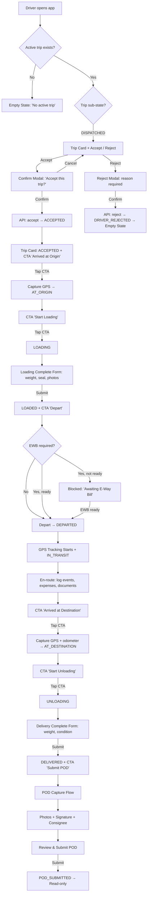
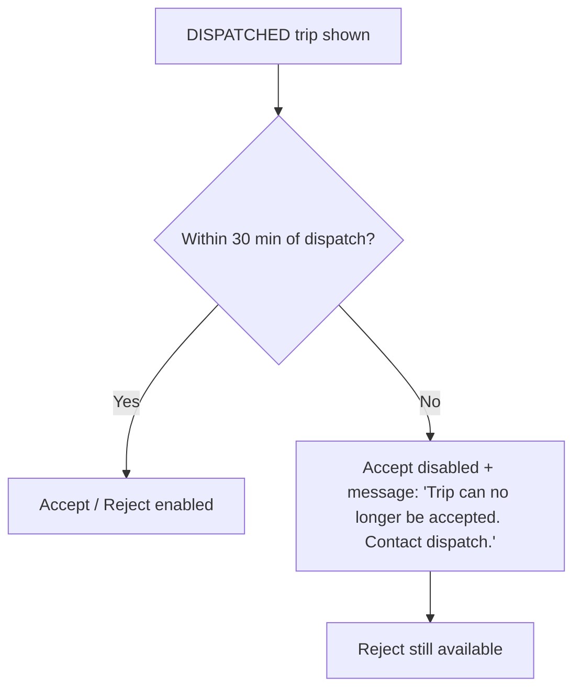
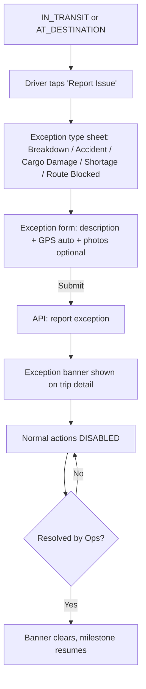
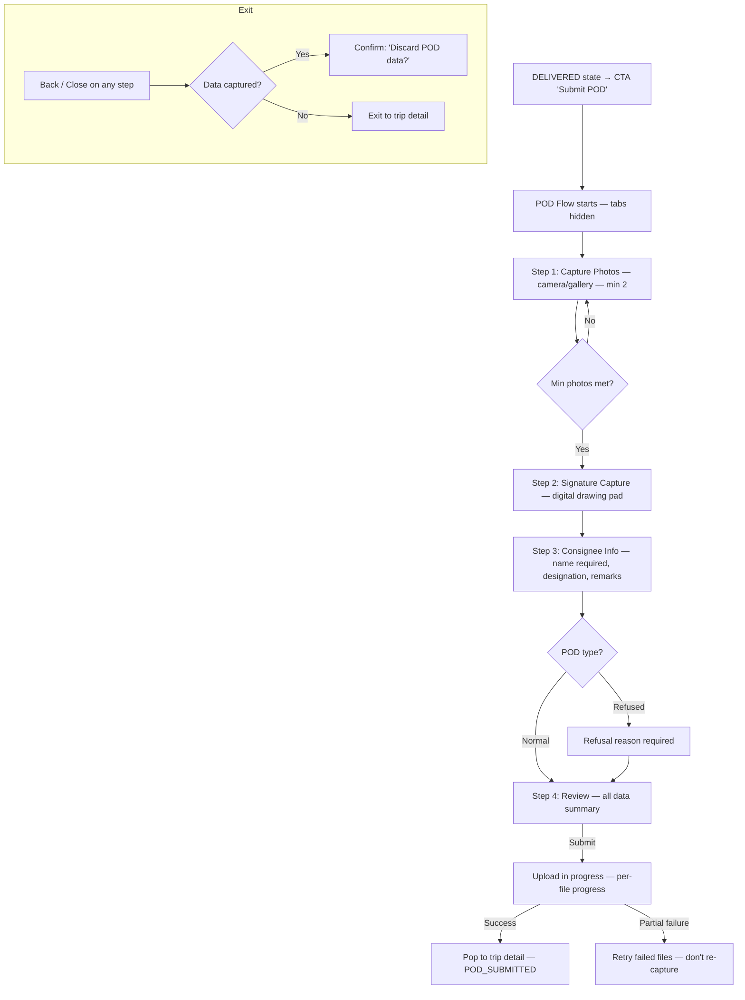
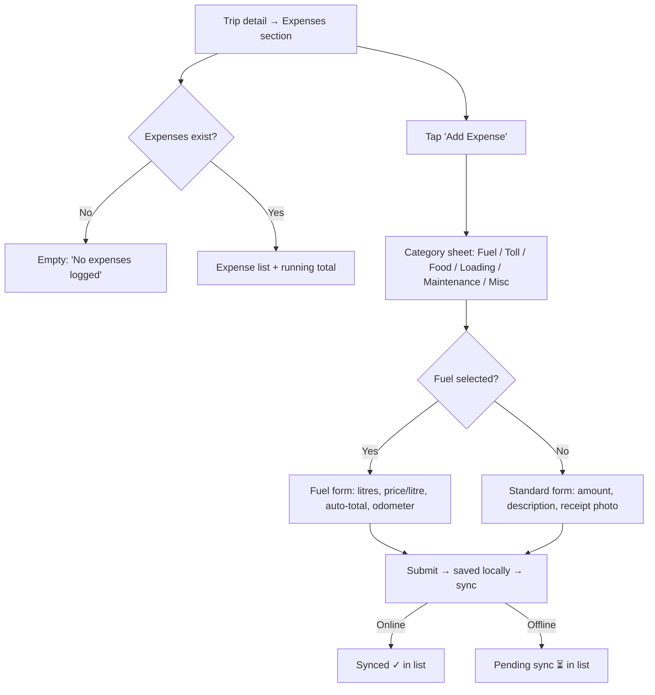
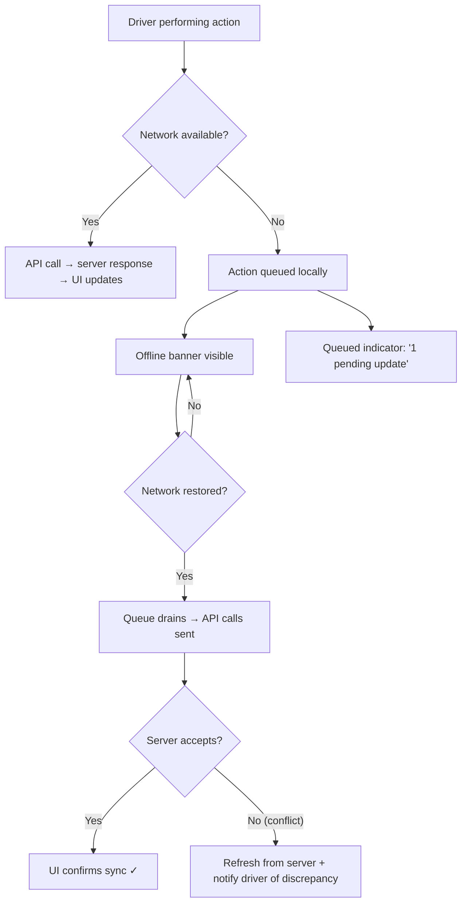
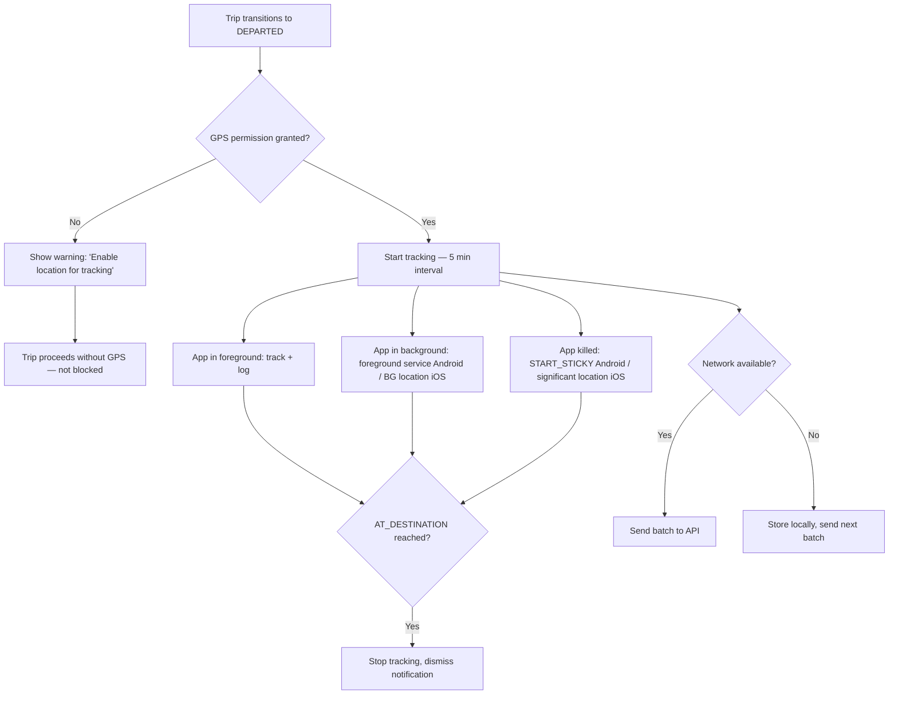

# User Flow — Driver Active Trip

> **Feature**: 005-driver-active-trip  
> **Date**: 2026-03-29

---

## 1. Primary Flow — Happy Path (Dispatched → POD Submitted)

---

## 2. Accept Timeout Flow

---

## 3. Exception Flow

---

## 4. POD Capture Flow (Multi-Step, Tabs Hidden)

---

## 5. Document Upload Flow

```mermaid
flowchart TD
    A[Trip detail → Documents section] --> B{Documents exist?}
    B -- No --> C[Empty: 'No documents yet']
    B -- Yes --> D[Document list with thumbnails + status]
    
    A --> E[Tap 'Add Document']
    E --> F[Category sheet: Invoice / Weighbridge / Permit / Cargo Photo / Receipt / Other]
    F --> G[Camera capture or gallery pick]
    G --> H{Upload succeeds?}
    H -- Yes --> I[Document in list with ✓]
    H -- No (network) --> J[Document in list with ⏳ 'Pending' + Retry]
    H -- No (error) --> K[Document in list with ❌ + Retry]
    
    D --> L[Tap document → Full-screen viewer — photos: pinch-zoom; PDFs: in-app]
```

---

## 6. Expense Logging Flow

---

## 7. Offline Flow

---

## 8. GPS Tracking Flow

