# Task Breakdown: Driver Trip Location Tracking & Background Telemetry

**Feature**: `006-driver-trip-location-tracking`  
**Spec**: [spec.md](file:///Users/ankit/a/fleetly/axleops_code/specs/006-driver-trip-location-tracking/spec.md)  
**Plan**: [plan.md](file:///Users/ankit/a/fleetly/axleops_code/specs/006-driver-trip-location-tracking/plan.md)  
**UX**: [ux/](file:///Users/ankit/a/fleetly/axleops_code/specs/006-driver-trip-location-tracking/ux/)  
**Date**: 2026-03-29  
**Scope**: `/mobile/**` only  
**Total Tasks**: 52  
**All tasks are MVP** unless explicitly marked `[LATER]` or `[BLOCKED]`.

---

## Phase 1 — Setup & Foundational Models

> Domain models, enums, and state types that all subsequent tasks depend on. No platform-specific code. No UI.

- [x] T001 **[Shared]** Expand `LocationPoint` domain model — add `clientId` (UUID), `altitude`, `provider`, `batteryLevel` fields to `mobile/shared/src/commonMain/kotlin/com/axleops/mobile/domain/repository/LocationPoint.kt`. Add `speed` and `bearing` as required (currently optional). Add `clientId` generation via `uuid` utility.
  - **AC**: `LocationPoint` has all 9 spec fields + `clientId`. Existing `TrackingManager` and `LocationRepository` references compile.
  - **Spec**: §7.1

- [x] T002 **[P] [Shared]** Create `TrackingState` enum in `mobile/shared/src/commonMain/kotlin/com/axleops/mobile/tracking/model/TrackingState.kt` — 7 states: `INACTIVE`, `AWAITING_PERMISSION`, `ACTIVE`, `ACTIVE_DEGRADED`, `SIGNAL_LOST`, `PERMISSION_DENIED`, `STOPPED`.
  - **AC**: Enum compiles. Each state has a `displayLabel` and `isActive` property.
  - **Spec**: §5.1, UX state-inventory

- [x] T003 **[P] [Shared]** Create `LocationPermissionState` sealed class in `mobile/shared/src/commonMain/kotlin/com/axleops/mobile/tracking/model/LocationPermissionState.kt` — states: `NotDetermined`, `ForegroundOnly`, `ForegroundAndBackground`, `Denied`, `PermanentlyDenied`, `ReducedAccuracy`.
  - **AC**: Sealed class compiles. Each state has `canTrackForeground` and `canTrackBackground` computed properties.
  - **Spec**: §4.1, §4.2

- [x] T004 **[P] [Shared]** Create `TrackingEvent` sealed class in `mobile/shared/src/commonMain/kotlin/com/axleops/mobile/tracking/model/TrackingEvent.kt` — event types: `TRACKING_STARTED`, `TRACKING_STOPPED`, `TRACKING_RESUMED`, `GPS_SIGNAL_LOST`, `GPS_SIGNAL_RESTORED`, `BATCH_SYNCED`, `BATCH_FAILED`. Each carries relevant metadata (tripId, reason, gap duration, etc.).
  - **AC**: Sealed class compiles. All 7 event types from spec §7.3 represented.
  - **Spec**: §7.3

- [x] T005 **[Shared]** Create `TrackingStateMachine` in `mobile/shared/src/commonMain/kotlin/com/axleops/mobile/tracking/TrackingStateMachine.kt` — pure state machine with `StateFlow<TrackingState>`. Transition methods: `onTripDeparted()`, `onPermissionGranted(full)`, `onPermissionDenied()`, `onPermissionRevoked()`, `onBackgroundRestricted()`, `onBackgroundRestored()`, `onGpsSignalLost()`, `onGpsSignalRestored()`, `onTripArrived()`, `onTripReset()`. Invalid transitions logged but do not crash.
  - **AC**: All valid transitions produce correct state. Invalid transitions are no-op with log. State is observable via `StateFlow`.
  - **Spec**: UX tracking-state-inventory transitions
  - **Depends on**: T002

---

## Phase 2 — Permission-State Modeling & Platform Handlers

> Location permission expect/actual classes. Separate from existing `PermissionHandler` (which covers camera/gallery only).

- [x] T006 **[Shared]** Create `LocationPermissionHandler` expect class in `mobile/shared/src/commonMain/kotlin/com/axleops/mobile/platform/LocationPermissionHandler.kt` — methods: `checkCurrentState(): LocationPermissionState`, `requestForegroundPermission(): LocationPermissionState`, `requestBackgroundPermission(): LocationPermissionState`, `openAppSettings()`, `isDeviceLocationEnabled(): Boolean`.
  - **AC**: Expect class compiles. Does NOT modify existing `PermissionHandler.kt`.
  - **Spec**: §4.3
  - **Depends on**: T003

- [x] T007 **[Android]** Create `LocationPermissionHandler` actual in `mobile/shared/src/androidMain/kotlin/com/axleops/mobile/platform/LocationPermissionHandler.android.kt` — implements foreground (`ACCESS_FINE_LOCATION`) and background (`ACCESS_BACKGROUND_LOCATION`) permission requests via `ActivityResultContracts`. Handles `shouldShowRequestPermissionRationale()` for permanent denial detection. Implements `openAppSettings()` via `ACTION_APPLICATION_DETAILS_SETTINGS` intent. Implements `isDeviceLocationEnabled()` via `LocationManager`.
  - **AC**: Foreground + background permission requests work on Android 10+ emulator. Denied/permanently-denied states correctly detected.
  - **Spec**: §4.1
  - **Depends on**: T006

- [x] T008 **[iOS]** Create `LocationPermissionHandler` actual in `mobile/shared/src/iosMain/kotlin/com/axleops/mobile/platform/LocationPermissionHandler.ios.kt` — implements `requestWhenInUseAuthorization()` and `requestAlwaysAuthorization()` via `CLLocationManager`. Detects `accuracyAuthorization` for `ReducedAccuracy` state. Implements `openAppSettings()` via `UIApplication.openSettingsURLString`. Implements `isDeviceLocationEnabled()` via `CLLocationManager.locationServicesEnabled()`.
  - **AC**: WhenInUse + Always authorization requests work on iOS 15+ simulator. Reduced accuracy state correctly detected.
  - **Spec**: §4.2
  - **Depends on**: T006

---

## Phase 3 — Permission UX / Rationale Integration

> Pre-prompt bottom sheet, permission-state-driven banners. No tracking logic yet — purely UX.

- [x] T009 **[Shared]** Create permission pre-prompt bottom sheet composable in `mobile/shared/src/commonMain/kotlin/com/axleops/mobile/tracking/ui/LocationPermissionRationale.kt` — bottom sheet with GPS icon, explanatory text (spec §11.1), "Continue" and "Not Now" buttons. Uses existing `BottomSheet` pattern from design system. Shown once per install at departure.
  - **AC**: Bottom sheet renders with correct copy from UX `status-copy-and-messaging.md`. "Continue" triggers OS permission dialog. "Not Now" dismisses and proceeds with trip (permission denied state).
  - **Spec**: §4.3 principle 3, UX permission-flow
  - **Depends on**: T003

- [x] T010 **[Shared]** Create `LocationPermissionBanner` composable in `mobile/shared/src/commonMain/kotlin/com/axleops/mobile/tracking/ui/LocationPermissionBanner.kt` — renders 7 banner variants based on `LocationPermissionState` and device location state. Follows existing `OfflineBanner` pattern. Variants: foreground denied, background denied, permanently denied (with "Go to Settings" button), device location off (with "Turn On" button), reduced accuracy, permission revoked, battery optimization active.
  - **AC**: All 7 banner variants render with exact copy from UX `status-copy-and-messaging.md`. "Go to Settings" calls `LocationPermissionHandler.openAppSettings()`. Banners are dismissible per UX rules.
  - **Spec**: §5.2, UX status-copy-and-messaging
  - **Depends on**: T003, T006

---

## Phase 4 — Offline Buffering & SQLDelight Schema

> Local persistence layer. No network, no GPS — purely data storage.

- [x] T011 **[Shared]** Add SQLDelight dependency and database driver configuration to `mobile/shared/build.gradle.kts` — add `app.cash.sqldelight` plugin, configure `AxleOpsDatabase` with `locationBuffer` schema. Add platform-specific driver dependencies (`android-driver`, `native-driver`).
  - **AC**: `./gradlew :shared:generateSqlDelightInterface` succeeds. Database instance can be created in tests.
  - **Plan**: §6

- [x] T012 **[Shared]** Create SQLDelight schema `LocationBuffer.sq` in `mobile/shared/src/commonMain/sqldelight/com/axleops/mobile/tracking/` — table `BufferedLocationPoint` with all fields from plan §6 (id, clientId, tripId, lat, lng, accuracy, timestamp, speed, bearing, altitude, provider, batteryLevel, syncStatus, capturedAt, syncAttempts). Named queries: `getPendingByTrip`, `pendingCount`, `markSynced`, `insert` (OR IGNORE for dedup), `deleteSynced`.
  - **AC**: Schema compiles. Generated Kotlin code is accessible in `commonMain`. Insert + query round-trip works in test.
  - **Plan**: §6
  - **Depends on**: T011

- [x] T013 **[Shared]** Create `LocationBufferRepository` in `mobile/shared/src/commonMain/kotlin/com/axleops/mobile/tracking/data/LocationBufferRepository.kt` — wraps SQLDelight DAO. Methods: `insert(point: LocationPoint, tripId: Long)`, `getPending(tripId: Long, limit: Int): List<BufferedLocationPoint>`, `pendingCount(): Flow<Long>`, `markSynced(clientIds: List<String>)`, `deleteSynced()`, `totalBufferedHours(): Double` (for 24h threshold diagnostic).
  - **AC**: All methods work correctly against in-memory SQLDelight driver. `pendingCount()` is reactive (Flow).
  - **Plan**: §6
  - **Depends on**: T012

- [x] T014 **[Shared]** Create platform-specific SQLDelight database driver factories — `mobile/shared/src/androidMain/.../DatabaseDriverFactory.android.kt` and `mobile/shared/src/iosMain/.../DatabaseDriverFactory.ios.kt`. Android uses `AndroidSqliteDriver`. iOS uses `NativeSqliteDriver`.
  - **AC**: Database can be instantiated on both platforms. Data persists across process restarts.
  - **Depends on**: T011

---

## Phase 5 — Foreground Tracking Implementation

> Real GPS capture in foreground. No background service yet.

- [x] T015 **[Shared]** Refactor `LocationTracker` interface in `mobile/shared/src/commonMain/kotlin/com/axleops/mobile/tracking/LocationTracker.kt` — expand interface: add `startTracking(intervalMs: Long)` (parameterized interval), `lastLocation: Flow<GpsLocation?>` (keep), add `isTracking: StateFlow<Boolean>`. Keep `MockLocationTracker` updated to match new interface. Remove the old `startTracking()` no-arg method.
  - **AC**: Interface compiles. `MockLocationTracker` emits a fixed location every `intervalMs` milliseconds when started. `isTracking` flow reflects current state.
  - **Spec**: §3.1
  - **Depends on**: T001

- [x] T016 **[Android]** Create `AndroidLocationTracker` actual in `mobile/shared/src/androidMain/kotlin/com/axleops/mobile/tracking/AndroidLocationTracker.kt` — implements `LocationTracker` using `FusedLocationProviderClient`. `startTracking(intervalMs)` creates a `LocationRequest` with `setPriority(PRIORITY_HIGH_ACCURACY)`, `setInterval(intervalMs)`, `setFastestInterval(intervalMs - 60_000)`. Receives location updates via `LocationCallback` and emits to `lastLocation` flow. `stopTracking()` removes updates.
  - **AC**: On Android emulator with mock location provider, location updates are received at the configured interval. `lastLocation` flow emits updates. `isTracking` correctly reflects state.
  - **Spec**: §3.1, §9.1
  - **Depends on**: T015

- [x] T017 **[iOS]** Create `IOSLocationTracker` actual in `mobile/shared/src/iosMain/kotlin/com/axleops/mobile/tracking/IOSLocationTracker.kt` — implements `LocationTracker` using `CLLocationManager`. `startTracking()` configures: `desiredAccuracy = kCLLocationAccuracyBest`, `distanceFilter = 50.0`, `startUpdatingLocation()`. Receives updates via `CLLocationManagerDelegate` and emits to `lastLocation` flow. Uses internal timer to throttle emissions to `intervalMs` cadence.
  - **AC**: On iOS simulator, location updates are received. `lastLocation` flow emits updates. `isTracking` correctly reflects state.
  - **Spec**: §3.1, §9.2
  - **Depends on**: T015

---

## Phase 6 — Shared Orchestration (TrackingManager Refactor)

> Refactor TrackingManager from simple coroutine loop to state-machine-aware orchestrator with SQLDelight buffer.

- [x] T018 **[Shared]** Refactor `TrackingManager` in `mobile/shared/src/commonMain/kotlin/com/axleops/mobile/tracking/TrackingManager.kt` — replace in-memory buffer with `LocationBufferRepository`. Replace simple start/stop with state-machine-aware orchestration. New flow: `start(tripId)` → check permission via `LocationPermissionHandler` → transition state machine → start `LocationTracker` → capture loop writes to `LocationBufferRepository`. `stop()` → stop tracker → flush remaining → transition to STOPPED. Expose `trackingState: StateFlow<TrackingState>` (delegated from `TrackingStateMachine`).
  - **AC**: `TrackingManager.start()` triggers permission check, starts tracking on grant, writes points to SQLDelight buffer. `stop()` halts capture and transitions to STOPPED. State exposed via `trackingState` flow.
  - **Spec**: §3.3, Plan §2
  - **Depends on**: T005, T013, T015

- [x] T019 **[Shared]** Implement GPS signal lost/restored detection in `TrackingManager` — if no GPS fix is received for ≥ 2 consecutive intervals (10 minutes), transition to `SIGNAL_LOST`. When fix is re-acquired, transition to `ACTIVE` and emit `GPS_SIGNAL_RESTORED` event. Track `lastFixTimestamp` to compute gap.
  - **AC**: After 10 minutes without a fix, state transitions to `SIGNAL_LOST`. On next fix, state restores to `ACTIVE`. `TrackingEvent.GPS_SIGNAL_LOST` and `GPS_SIGNAL_RESTORED` are emitted.
  - **Spec**: §5.2 (GPS signal lost > 10 min), §7.3
  - **Depends on**: T018

- [x] T020 **[Shared]** Implement 48-hour auto-stop safety net in `TrackingManager` — if tracking has been active for > 48 hours continuously, automatically call `stop()` and log a `TrackingEvent.TRACKING_STOPPED` with reason `SAFETY_NET_48H`. Emit a diagnostic log entry.
  - **AC**: After 48 hours of continuous tracking, tracking stops automatically. Diagnostic log entry recorded.
  - **Spec**: §11.4 (over-collection prevention)
  - **Depends on**: T018

---

## Phase 7 — Background Tracking (Platform-Specific)

> Android ForegroundService and iOS background mode. This is the core platform complexity.

### Android

- [x] T021 **[Android]** Add Android manifest declarations — in `mobile/androidApp/src/main/AndroidManifest.xml`: add permissions `ACCESS_FINE_LOCATION`, `ACCESS_BACKGROUND_LOCATION`, `FOREGROUND_SERVICE`, `FOREGROUND_SERVICE_LOCATION`, `RECEIVE_BOOT_COMPLETED`, `WAKE_LOCK`, `SCHEDULE_EXACT_ALARM`. Declare `<service android:name=".service.LocationTrackingService" android:foregroundServiceType="location" android:exported="false" />`. Declare `<receiver>` for boot completed.
  - **AC**: Manifest compiles. No merge conflicts with existing declarations. Service and receiver are registered.
  - **Spec**: §9.1

- [x] T022 **[Android]** Create notification channel in `mobile/androidApp/src/main/kotlin/.../AxleOpsApplication.kt` — create "Trip Tracking" channel with `IMPORTANCE_LOW`. Channel ID: `trip_tracking_channel`. Created in `Application.onCreate()`.
  - **AC**: Notification channel is visible in Android Settings > App > Notifications after app launch.
  - **Spec**: §9.1
  - **Depends on**: T021

- [x] T023 **[Android]** Create `LocationTrackingService` ForegroundService in `mobile/androidApp/src/main/kotlin/.../service/LocationTrackingService.kt` — extends `Service()`. `onStartCommand()` starts foreground with persistent notification (trip number + "Location tracking active"). Delegates to `AndroidLocationTracker`. `onDestroy()` stops tracking. Acquires `PARTIAL_WAKE_LOCK`. Notification content updates for each tracking state (active, degraded, signal lost). Service is started by `TrackingManager` via platform-specific bridge and stopped when tracking ends.
  - **AC**: Service starts with persistent notification. Notification shows trip number. Notification dismissed when service stops. Service survives backgrounding. Location updates continue in background.
  - **Spec**: §9.1, §6.2
  - **Depends on**: T016, T022

- [x] T024 **[Android]** Wire `AndroidLocationTracker` to `LocationTrackingService` — `AndroidLocationTracker.startTracking()` starts the `LocationTrackingService`. `stopTracking()` stops the service. The service holds the `FusedLocationProviderClient` lifecycle. `AndroidLocationTracker` communicates with service via bound service or shared Koin scope.
  - **AC**: Starting tracking launches foreground service. Stopping tracking stops service. Location updates flow from service through `AndroidLocationTracker.lastLocation`.
  - **Depends on**: T023

### iOS

- [x] T025 **[iOS]** Configure iOS background location mode — in `mobile/iosApp/iosApp/Info.plist`: add `UIBackgroundModes: location`. Add `NSLocationWhenInUseUsageDescription` and `NSLocationAlwaysAndWhenInUseUsageDescription` with exact copy from spec §4.2.
  - **AC**: Info.plist contains required keys. Xcode project builds without warnings about missing usage descriptions.
  - **Spec**: §9.2

- [x] T026 **[iOS]** Enable background location updates in `IOSLocationTracker` — set `allowsBackgroundLocationUpdates = true`, `pausesLocationUpdatesAutomatically = false`, `showsBackgroundLocationIndicator = true`. Location updates continue when app moves to background.
  - **AC**: On iOS device, location arrow persists in status bar when app is backgrounded. Location updates continue (verify via log or buffer count).
  - **Spec**: §9.2
  - **Depends on**: T017, T025

---

## Phase 8 — Resilience & Auto-Restart

> OEM battery optimization, auto-restart after OS kill, boot recovery.

### Android Resilience

- [x] T027 **[Android]** Create `TrackingAlarmReceiver` in `mobile/androidApp/src/main/kotlin/.../receiver/TrackingAlarmReceiver.kt` — `BroadcastReceiver` triggered by `AlarmManager.setExactAndAllowWhileIdle()`. On receive: check if active trip exists and is in transit → if yes, restart `LocationTrackingService`. Alarm is set when `LocationTrackingService` starts and cancelled when it stops normally. Used as safety net for OS kill recovery.
  - **AC**: If service is force-stopped, alarm triggers within 15 minutes and restarts service (if trip is still in transit).
  - **Spec**: §6.5 (auto-restart after OS kill)
  - **Plan**: §3 (resilience)

- [x] T028 **[Android]** Create `BootCompletedReceiver` in `mobile/androidApp/src/main/kotlin/.../receiver/BootCompletedReceiver.kt` — `BroadcastReceiver` for `BOOT_COMPLETED`. On receive: check if active trip exists and is in transit → if yes, start `LocationTrackingService`.
  - **AC**: After device reboot with an active in-transit trip, tracking service restarts automatically.
  - **Spec**: §9.1

- [x] T029 **[Android]** Create `AndroidBatteryHelper` in `mobile/shared/src/androidMain/kotlin/com/axleops/mobile/tracking/AndroidBatteryHelper.kt` — methods: `isIgnoringBatteryOptimizations(): Boolean` (via `PowerManager`), `requestBatteryOptimizationExemption()` (via `ACTION_REQUEST_IGNORE_BATTERY_OPTIMIZATIONS`), `getDeviceManufacturer(): String` (for OEM detection), `getBatteryLevel(): Int` (via `BatteryManager`).
  - **AC**: Correctly reports battery optimization status. Exemption request opens system dialog. Manufacturer detection works for top-5 OEMs.
  - **Spec**: §9.1 (battery optimization)
  - **Depends on**: T021

### iOS Resilience

- [x] T030 **[iOS]** Enable significant location change monitoring in `IOSLocationTracker` — call `startMonitoringSignificantLocationChanges()` alongside `startUpdatingLocation()`. On `didUpdateLocations` callback from significant change: check if this is an app relaunch (location-triggered) → if yes, restart full tracking.
  - **AC**: If iOS terminates the app, significant location change (~500m) relaunches it and tracking resumes.
  - **Spec**: §9.2 (significant location change)
  - **Depends on**: T026

- [x] T031 **[iOS]** Handle location-triggered app relaunch in `mobile/iosApp/iosApp/AppDelegate.swift` — in `application(_:didFinishLaunchingWithOptions:)`, check for `UIApplication.LaunchOptionsKey.location`. If present: initialize Koin, check active trip state, restart `TrackingManager` if trip is in transit.
  - **AC**: On iOS, if app was terminated and relaunched via significant location change, tracking resumes without user interaction.
  - **Spec**: §9.2
  - **Depends on**: T030

---

## Phase 9 — Batch Sync & Retry Logic

> Network sync of buffered location points. Uses existing `ConnectivityObserver`.

- [x] T032 **[Shared]** Update `LocationRepository` interface — add method `batchLog(tripId: Long, points: List<LocationPoint>): BatchLogResult`. Create `BatchLogResult` data class with `accepted: Int`, `duplicates: Int`. Update existing `MockLocationRepository` and `RealLocationRepository` to match.
  - **AC**: Interface compiles. Mock returns `BatchLogResult(accepted = points.size, duplicates = 0)`. Real repo remains functional.
  - **Depends on**: T001

- [x] T033 **[Shared]** Update `RealLocationRepository` endpoint — change from `POST /location/log` to `POST /trips/{tripId}/location/batch`. Update request body to include `clientId` and all expanded `LocationPoint` fields. Parse `BatchLogResult` from response.
  - **AC**: Repository sends correctly shaped request to the new trip-scoped endpoint. Works with mock backend returning `202 Accepted`.
  - **Spec**: §8.3 (derived contract)
  - **Depends on**: T032

- [x] T034 **[Shared]** Create `BatchSyncWorker` in `mobile/shared/src/commonMain/kotlin/com/axleops/mobile/tracking/sync/BatchSyncWorker.kt` — periodic sync orchestrator. Triggered by: (a) pending count ≥ 3, (b) batch interval timer (15 min), (c) connectivity restored event from `ConnectivityObserver`. Queries `LocationBufferRepository.getPending(limit = 50)`, submits via `LocationRepository.batchLog()`, marks synced on success, retries with exponential backoff on failure (30s → 1m → 2m → 5m → 10m cap). Stops retrying on 401 (auth expired).
  - **AC**: Points are batched and synced when connected. Failed batches retry with backoff. 401 stops sync. Points remain in buffer until successfully synced.
  - **Spec**: §7.2 (batch interval), §7.5 (retry behavior)
  - **Depends on**: T013, T032

- [x] T035 **[Shared]** Wire `BatchSyncWorker` into `TrackingManager` — start sync worker when tracking starts, stop when tracking stops. On reconnect (via `ConnectivityObserver`), immediately trigger a flush. On tracking stop, perform a final flush attempt.
  - **AC**: Sync worker runs alongside tracking. Points sync in background. Final flush on stop captures remaining points.
  - **Depends on**: T018, T034

---

## Phase 10 — Tracking Status & UI Integration

> Tracking indicator, warning banners, pending sync badge in ActiveTripScreen.

- [x] T036 **[Shared]** Create `TrackingIndicator` composable in `mobile/shared/src/commonMain/kotlin/com/axleops/mobile/tracking/ui/TrackingIndicator.kt` — GPS icon + label in trip detail header. States: active (pulsing green + "Tracking"), inactive ("GPS Off" gray), permission denied (yellow warning + "No GPS Permission"), degraded (yellow + "Limited GPS"), signal lost (red + "No Signal"). Uses existing icon and color tokens from design system.
  - **AC**: All 5 visual states render correctly with exact copy from UX `status-copy-and-messaging.md`. Icon pulses when active.
  - **Spec**: §5.1, UX status-copy-and-messaging
  - **Depends on**: T002

- [x] T037 **[Shared]** Create `PendingSyncBadge` composable in `mobile/shared/src/commonMain/kotlin/com/axleops/mobile/tracking/ui/PendingSyncBadge.kt` — small badge near tracking indicator showing count of pending-sync locations. Observes `LocationBufferRepository.pendingCount()` flow. Hidden when count is 0.
  - **AC**: Badge shows count. Updates reactively. Hidden when all synced.
  - **Spec**: §5.2 (location data pending sync)
  - **Depends on**: T013

- [x] T038 **[Shared]** Integrate tracking UI into `ActiveTripScreen` — in `mobile/shared/src/commonMain/kotlin/com/axleops/mobile/trip/ui/ActiveTripScreen.kt`: (a) add `TrackingIndicator` to trip detail header (Layer 1). (b) Add `LocationPermissionBanner` below exception/offline banners (per state precedence: Exception > EWB > Offline > Tracking Warning). (c) Add `PendingSyncBadge` near tracking indicator. Observe `TrackingManager.trackingState` and `LocationPermissionHandler.checkCurrentState()`.
  - **AC**: Tracking indicator visible in trip header. Banners appear in correct precedence. Pending badge shows when points are buffered.
  - **Spec**: UX ux-brief (Layer 1 integration), UX tracking-behavior-rules (R23-R26)
  - **Depends on**: T009, T010, T036, T037

---

## Phase 11 — Trip Lifecycle Wiring

> Connect tracking start/stop to actual trip state transitions. This is the integration glue.

- [x] T039 **[Shared]** Wire trip departure to tracking start — in `mobile/shared/src/commonMain/kotlin/com/axleops/mobile/trip/viewmodel/ActiveTripViewModel.kt`: after LOADED → DEPARTED transition succeeds, call `TrackingManager.start(tripId)`. If permission pre-prompt hasn't been shown this install, show `LocationPermissionRationale` bottom sheet first. Store "pre-prompt shown" flag in `DataStore` or equivalent preferences.
  - **AC**: On departure, permission pre-prompt appears (first time only). After user acknowledges, OS permission dialog appears. Tracking starts on grant. Trip proceeds regardless of permission outcome.
  - **Spec**: §3.3 (start trigger), §4.3 (never block trip)
  - **Depends on**: T009, T018

- [x] T040 **[Shared]** Wire trip arrival to tracking stop — in `ActiveTripViewModel.kt`: when trip transitions to AT_DESTINATION (or any post-transit state), call `TrackingManager.stop()`. Final buffer flush triggered.
  - **AC**: On arrival, tracking stops. Indicator transitions to STOPPED. No further GPS capture.
  - **Spec**: §3.3 (stop trigger)
  - **Depends on**: T018

- [x] T041 **[Shared]** Wire app relaunch to tracking resume — in `ActiveTripViewModel.init {}`: on ViewModel initialization, check if active trip is in a transit-family state (DEPARTED, IN_TRANSIT, AT_CHECKPOINT, or exception during transit). If yes, check permissions and resume tracking via `TrackingManager.start(tripId)`. Skip pre-prompt (already shown). Resume within 30 seconds of app launch.
  - **AC**: If app is killed and relaunched with trip in transit, tracking resumes automatically. No driver action required.
  - **Spec**: §3.3 (resume on relaunch), §6.2 (resume within 30 seconds)
  - **Depends on**: T018

- [x] T042 **[Shared]** Handle permission revocation during active tracking — observe permission state changes in `TrackingManager`. If permission is revoked (via system Settings) while tracking is active: stop GPS capture, transition to `PERMISSION_DENIED`, show revocation banner. If permission is re-granted: resume tracking.
  - **AC**: Revoking location permission via Settings stops tracking and shows banner. Re-granting resumes tracking.
  - **Spec**: §4.1 (permission revoked), §4.2 (iOS permission set to "While Using")
  - **Depends on**: T018, T006

---

## Phase 12 — Tracking Diagnostics

> Local health logging for field debugging. No backend diagnostic endpoints.

- [x] T043 **[Shared]** Create `TrackingDiagnostics` in `mobile/shared/src/commonMain/kotlin/com/axleops/mobile/tracking/diagnostics/TrackingDiagnostics.kt` — structured local logger. Metrics: capture success rate (successful/attempted), gap count (gaps > 10 min), longest gap, battery level trend (logged every 30 min and at start/stop), OS kill events, permission state changes. Stores as structured log entries in a local file or SQLDelight table. Capped at 7 days of logs.
  - **AC**: Diagnostics capture all 6 metric types from spec §7.6. Logs are readable in debug panel. Older than 7 days are purged.
  - **Spec**: §7.6 (tracking health diagnostics)
  - **Depends on**: T012

- [x] T044 **[Shared]** Integrate diagnostics into `TrackingManager` — log `TrackingEvent`s to `TrackingDiagnostics`. Log battery level at start, every 30 min, and at stop. Log gap events. On `TRACKING_RESUMED` (after OS kill), log gap duration.
  - **AC**: During a tracking session, diagnostic entries are recorded for all relevant events. Battery trend captured.
  - **Spec**: §7.6
  - **Depends on**: T018, T043

- [x] T045 **[Shared]** Add diagnostics export to QA/debug panel — in existing debug settings screen, add "Export Tracking Diagnostics" option that writes log entries to a shareable text file.
  - **AC**: QA can tap export button, receive a text file with structured tracking health data.
  - **Spec**: §7.6 (export mechanism)
  - **Depends on**: T043

---

## Phase 13 — DI & Real-vs-Mock Wiring

> Update Koin module. DataSourceConfig-driven switching.

- [x] T046 **[Shared]** Refactor `TrackingModule` in `mobile/shared/src/commonMain/kotlin/com/axleops/mobile/di/TrackingModule.kt` — add bindings for: `TrackingStateMachine` (singleton), `LocationBufferRepository` (singleton), `LocationPermissionHandler` (expect/actual resolution), `BatchSyncWorker` (singleton), `TrackingDiagnostics` (singleton). Switch `LocationTracker` binding: if `DataSourceConfig.useRealLocation` → platform actual (`AndroidLocationTracker` / `IOSLocationTracker`), else → `MockLocationTracker`. Switch `LocationRepository`: if `useRealLocation` → `RealLocationRepository`, else → `MockLocationRepository`.
  - **AC**: Koin module compiles. In mock mode: mock tracker + mock repo. In real mode: platform tracker + real repo. `LocationBufferRepository` always uses real SQLDelight (even in mock mode). App starts without Koin resolution errors.
  - **Plan**: §7 (real-vs-mock), §9 (DI)
  - **Depends on**: T005, T013, T015, T018, T034, T043

- [x] T047 **[Shared]** Block data source switching during active tracking — in debug settings panel, disable the `useRealLocation` toggle when `TrackingManager.trackingState` is `ACTIVE` or `ACTIVE_DEGRADED`. Show tooltip: "Cannot switch data source while tracking is active."
  - **AC**: Toggle is grayed out during tracking. Re-enabled when tracking stops.
  - **Plan**: §15 (risk register — mock/real switching edge cases)
  - **Depends on**: T046

---

## Phase 14 — Derived Contract Documentation

- [x] T048 **[Docs]** Create `specs/006-driver-trip-location-tracking/derived-contracts.md` — document the canonical `POST /trips/{id}/location/batch` contract: request shape, response shape, status codes, dedup behavior, auth requirements. Link to backend entity derivation source (`Trip.java`). Mark as mock-backed with TODO for backend implementation.
  - **AC**: Document exists with complete contract shape. References spec §8.3.
  - **Constitution**: Principle III (Closest-Contract API Strategy)

---

## Phase 15 — Tests

> Unit tests for all shared logic. Platform tests are manual (see plan §13).

- [x] T049 **[Shared] [Test]** Create `TrackingStateMachineTest` in `mobile/shared/src/commonTest/kotlin/com/axleops/mobile/tracking/TrackingStateMachineTest.kt` — test all valid transitions (departure → permission → active, arrival → stopped, signal lost → restored, etc.). Test invalid transitions are no-ops. Test state flow emissions.
  - **AC**: All 10 transition methods tested. Invalid transitions do not change state. At least 15 test cases covering happy path, edge cases, and invalid inputs.
  - **Depends on**: T005

- [x] T050 **[Shared] [Test]** Create `LocationBufferRepositoryTest` in `mobile/shared/src/commonTest/kotlin/com/axleops/mobile/tracking/data/LocationBufferRepositoryTest.kt` — test insert, getPending (chronological order), markSynced, deleteSynced, pendingCount flow reactivity, dedup (insert same clientId twice → no crash, no duplicate). Use in-memory SQLDelight driver.
  - **AC**: All 6 repository methods tested. Dedup verified. At least 10 test cases.
  - **Depends on**: T013

- [x] T051 **[Shared] [Test]** Create `BatchSyncWorkerTest` in `mobile/shared/src/commonTest/kotlin/com/axleops/mobile/tracking/sync/BatchSyncWorkerTest.kt` — test batch formation (max 50 points), chronological order, retry with backoff on 5xx, stop on 401, re-buffer on failure, success clears buffer. Uses mock `LocationRepository` and mock `LocationBufferRepository`.
  - **AC**: All retry/backoff/auth-failure scenarios tested. At least 8 test cases.
  - **Depends on**: T034

- [x] T052 **[Shared] [Test]** Create `TrackingManagerTest` in `mobile/shared/src/commonTest/kotlin/com/axleops/mobile/tracking/TrackingManagerTest.kt` — test start/stop lifecycle, state transitions through state machine, buffer writes on GPS fix, flush on stop, 48h safety net, signal lost detection. Uses mock `LocationTracker`, mock `LocationPermissionHandler`, and in-memory `LocationBufferRepository`.
  - **AC**: Full lifecycle tested. GPS capture → buffer → state transitions. At least 12 test cases.
  - **Depends on**: T018

---

## Phase 16 — Backend & Platform Follow-Ups

> Items that are NOT implementable in `/mobile` and require external work. Tracked here for completeness.

- [ ] T-BE1 `[BLOCKED]` **[Backend]** Create `TripLocationPoint` JPA entity — `tripId` FK, lat, lng, accuracy, timestamp, clientId (unique per trip), speed, bearing, altitude, provider. Composite unique constraint on `(tripId, clientId)` for dedup.
  - **Blocks**: Real location sync (currently mock-backed).
  - **Gap**: LT-G2

- [ ] T-BE2 `[BLOCKED]` **[Backend]** Create `POST /trips/{id}/location/batch` controller — accepts array of GPS points, validates driver owns trip (via JWT), persists to `TripLocationPoint`, returns `{ accepted, duplicates }`. Dedup on `(tripId, clientId)`.
  - **Blocks**: Real location sync (currently mock-backed).
  - **Gap**: LT-G1

- [ ] T-BE3 `[BLOCKED]` **[Backend]** Server-side deduplication — implement `(tripId, clientId)` unique constraint enforcement so retried batches don't create duplicate records.
  - **Blocks**: Safe retry behavior in production.
  - **Gap**: LT-G5

- [ ] T-BE4 `[LATER]` **[Backend]** Create `GET /trips/{id}/location` query API — for ops dashboard. Not needed for driver feature.
  - **Gap**: LT-G3

- [ ] T-BE5 `[LATER]` **[Backend]** Heartbeat / liveness detection — backend detects missing pings and alerts operations. Future enhancement.
  - **Gap**: LT-G4

---

## Dependencies & Execution Order

```mermaid
graph TD
    T001[T001 LocationPoint model] --> T015[T015 LocationTracker refactor]
    T001 --> T032[T032 LocationRepository update]
    
    T002[T002 TrackingState enum] --> T005[T005 StateMachine]
    T003[T003 PermissionState] --> T006[T006 PermissionHandler expect]
    T003 --> T009[T009 Permission pre-prompt]
    T003 --> T010[T010 Permission banner]
    
    T005 --> T018[T018 TrackingManager refactor]
    T006 --> T007[T007 Android PermHandler]
    T006 --> T008[T008 iOS PermHandler]
    T006 --> T010
    
    T011[T011 SQLDelight setup] --> T012[T012 Schema]
    T012 --> T013[T013 LocationBufferRepo]
    T012 --> T014[T014 DB driver factories]
    T013 --> T018
    T015 --> T018
    T015 --> T016[T016 AndroidLocationTracker]
    T015 --> T017[T017 IOSLocationTracker]
    
    T018 --> T019[T019 Signal lost detection]
    T018 --> T020[T020 48h safety net]
    T018 --> T035[T035 Wire sync worker]
    T018 --> T039[T039 Wire departure]
    T018 --> T040[T040 Wire arrival]
    T018 --> T041[T041 Wire relaunch]
    T018 --> T042[T042 Permission revocation]
    T018 --> T044[T044 Diagnostics integration]
    
    T016 --> T024[T024 Wire to ForegroundService]
    T021[T021 Manifest] --> T022[T022 Notification channel]
    T022 --> T023[T023 ForegroundService]
    T023 --> T024
    T021 --> T029[T029 BatteryHelper]
    
    T017 --> T026[T026 iOS background mode]
    T025[T025 iOS Info.plist] --> T026
    T026 --> T030[T030 Significant location change]
    T030 --> T031[T031 iOS app delegate relaunch]
    
    T032 --> T033[T033 Real repo endpoint update]
    T032 --> T034[T034 BatchSyncWorker]
    T013 --> T034
    T034 --> T035
    
    T036[T036 TrackingIndicator] --> T038[T038 ActiveTrip UI integration]
    T037[T037 PendingSyncBadge] --> T038
    T009 --> T038
    T010 --> T038
    
    T043[T043 TrackingDiagnostics] --> T044
    T043 --> T045[T045 Diagnostics export]
    
    T005 --> T046[T046 DI module refactor]
    T013 --> T046
    T015 --> T046
    T018 --> T046
    T034 --> T046
    T043 --> T046
    T046 --> T047[T047 Block toggle during tracking]
```

## Parallel Execution Opportunities

| Parallel Group | Tasks | Reason |
|---------------|-------|--------|
| **Models** (after T001) | T002, T003, T004 | Independent enums/sealed classes, no shared state |
| **Platform Permission Handlers** (after T006) | T007, T008 | Android/iOS actuals are independent |
| **Platform GPS Trackers** (after T015) | T016, T017 | Android/iOS actuals are independent |
| **Android Manifest + iOS Plist** | T021, T025 | Platform-specific config, no dependency |
| **Android Resilience** (after T023) | T027, T028, T029 | Independent receivers/helpers |
| **UI Components** (after T002, T003) | T036, T037 | Independent composables |
| **Tests** (after their dependencies) | T049, T050, T051, T052 | Independent test files |
| **Sync + UI** (after T018) | T034+T035, T038 | Sync and UI are independent concerns |

## Implementation Strategy

**All tasks are MVP** — there is no phased rollout (per clarification C1). Backend follow-ups (T-BE1–BE3) are required for production but do not block mobile implementation, which uses mock fallback.

**Suggested implementation ordering**:
1. Phase 1 → Phase 4 (foundation: models + SQLDelight) — pure shared, testable independently
2. Phase 5 + Phase 6 (foreground tracking + orchestration) — shared + foreground GPS
3. Phase 14 + Phase 15 (tests + docs) — validate shared logic before platform work
4. Phase 7 (background tracking) — platform-specific, most complex
5. Phase 8 (resilience) — depends on background tracking
6. Phase 9 (batch sync) — networking, depends on buffer
7. Phase 10 + Phase 11 (UI + trip wiring) — integration layer
8. Phase 12 + Phase 13 (diagnostics + DI) — polish and finalization

---

## Fix Round 1 — Driver-Facing Messaging & Logic Fixes

> Addresses all 15 open issues from [open-issues.md](file:///Users/ankit/a/fleetly/axleops_code/specs/006-driver-trip-location-tracking/handoff/open-issues.md). Sources: design-review-round-1.md, qa-report-round-1.md. All tasks are engineer-fixable with no prerequisite on spec, UX, or plan updates — the approved specs are correct.

### Priority 1 — Must Fix (Behavioral / Safety)

- [x] FX-001 **[Shared]** Fix `SIGNAL_LOST.isActive` to `true` — in `TrackingState.kt`, change `SIGNAL_LOST(displayLabel = "No Signal", isActive = false)` to `isActive = true`. Then verify cascade: (a) `ActiveTripComponent.updateTrackingForTrip()` re-entry guard still correct — `isActive = true` prevents duplicate `start()` during signal loss. (b) `DataSourceToggleGuard` already includes SIGNAL_LOST in its check — verify. (c) Android ForegroundService + notification persist during SIGNAL_LOST — verify.
  - **Issue**: OI-001
  - **Prerequisite**: No prerequisite
  - **Affects**: Background tracking, Active Trip integration, tracking status visibility
  - **Files**: `tracking/model/TrackingState.kt`, `trip/component/ActiveTripComponent.kt`, `tracking/ui/DataSourceToggleGuard.kt`
  - **AC**: `SIGNAL_LOST.isActive == true`. `ActiveTripComponent` does NOT call `start()` when state is SIGNAL_LOST. Toggle guard blocks switching during SIGNAL_LOST. Existing unit tests in `TrackingStateMachineTest` still pass.

- [x] FX-002 **[Shared]** Implement banner dismiss-state tracking — create `BannerDismissTracker` (new file) with 3 scopes: (a) per-session — `MutableStateFlow<Set<String>>` in memory, cleared on app restart. For: permission denied banner. (b) per-trip — `SharedPreferences`/`NSUserDefaults` keyed by `tripId`. For: background limited, reduced accuracy, battery optimization banners. (c) per-install — `SharedPreferences`/`NSUserDefaults` single flag. For: pre-prompt shown flag. Wire into `LocationPermissionBanner` composable — check dismiss state before rendering, add `onDismiss` callback that updates the tracker.
  - **Issue**: OI-002
  - **Prerequisite**: No prerequisite
  - **Affects**: Permission messaging, tracking status visibility
  - **Files**: `tracking/ui/BannerDismissTracker.kt` [NEW], `tracking/ui/LocationPermissionBanner.kt`, `di/TrackingModule.kt`
  - **AC**: Permission denied banner reappears on app restart but not after dismiss within same session. Background limited banner does not reappear for the same `tripId` after dismiss. Pre-prompt bottom sheet only shown on first departure after install.

### Priority 2 — Must Fix (Driver Messaging)

- [x] FX-003 **[Shared]** Fix pre-prompt copy — in `LocationPermissionRationale.kt`: (a) Change title from `"Enable Location Tracking"` to `"Trip Location Tracking"`. (b) Replace body paragraph with exact spec copy: `"AxleOps tracks your vehicle location during transit to help fleet operations monitor delivery progress and maintain compliance."`. (c) Add 3 bullet points: `"• Tracking starts when you depart"`, `"• Tracking stops when you arrive at the destination"`, `"• Location is only recorded during this trip"`. (d) Remove the second paragraph about "Allow 'Always'".
  - **Issue**: OI-003
  - **Prerequisite**: No prerequisite
  - **Affects**: Permission messaging
  - **Files**: `tracking/ui/LocationPermissionRationale.kt`
  - **AC**: Title, body, and bullet points match status-copy-and-messaging.md §2 exactly. No mention of ETA, route tracking, or "real-time visibility".

- [x] FX-004 **[Shared]** Fix all banner copy — in `LocationPermissionBanner.kt`, update 6 banner texts to match status-copy-and-messaging.md §3 exactly: (a) `ForegroundDeniedBanner`: message → `"Location tracking is off"`, subtext → `"Trip can continue without GPS."`. (b) `BackgroundDeniedBanner`: message → `"Background tracking is limited"`, subtext → `"Location may not be recorded when you switch apps."`. (c) `PermanentlyDeniedBanner`: message → `"Location tracking is off"`, subtext → `"Go to Settings to enable location access."`. (d) `DeviceLocationOffBanner`: message → `"Your device location is turned off"`, subtext → `"Turn on Location in your device settings."`. (e) `ReducedAccuracyBanner`: message → `"Approximate location only"`, subtext → `"Trip tracking may be less accurate."`. (f) `SignalLostBanner`: verify → `"GPS signal lost"`, subtext → `"Location tracking will resume when signal is available."`.
  - **Issue**: OI-004
  - **Prerequisite**: No prerequisite
  - **Affects**: Permission messaging, tracking status visibility
  - **Files**: `tracking/ui/LocationPermissionBanner.kt`
  - **AC**: All 6 banner texts match spec exactly. No blame language ("denied", "blocked", "not enabled").

- [x] FX-005 **[Shared]** Add "Turn On Location" action to DeviceLocationOffBanner — in `LocationPermissionBanner.kt`, change `DeviceLocationOffBanner` to accept `onGoToSettings: () -> Unit` parameter. Set `actionLabel = "Turn On Location"` and `onAction = onGoToSettings`. Wire to platform-specific location settings intent (Android: `Settings.ACTION_LOCATION_SOURCE_SETTINGS`, iOS: `UIApplication.openSettingsURLString`).
  - **Issue**: OI-005
  - **Prerequisite**: No prerequisite
  - **Affects**: Permission messaging, platform-specific behavior
  - **Files**: `tracking/ui/LocationPermissionBanner.kt`
  - **AC**: "Turn On Location" action button visible on banner. Tapping opens device location settings.

- [x] FX-006 **[Shared]** Add permission revocation banner — in `LocationPermissionBanner.kt`, add a new `PermissionRevokedBanner` composable: message → `"Location permission was removed"`, subtext → `"Tracking has stopped."`, actionLabel → `"Go to Settings"`. In `LocationPermissionBanner` dispatch logic, detect revocation state (needs a new `wasRevoked: Boolean` parameter or state check) and show this banner instead of the generic denied banner.
  - **Issue**: OI-006
  - **Prerequisite**: No prerequisite
  - **Affects**: Permission messaging, permissions
  - **Files**: `tracking/ui/LocationPermissionBanner.kt`, `tracking/TrackingManager.kt`
  - **AC**: When permission is revoked during active tracking, distinct revocation message shown. When permission was never granted (initial denial), generic denial banner shown.

- [x] FX-007 **[Android]** Add battery optimization banner — create `BatteryOptimizationBanner` composable in `LocationPermissionBanner.kt` (or standalone): message → `"Battery optimization may affect location tracking"`, subtext → `"Some device settings can prevent background tracking."`, actionLabel → `"Learn More"`. Wire to `AndroidBatteryHelper.isIgnoringBatteryOptimizations()` — show when `false` and tracking is active. Dismiss scope: per-trip.
  - **Issue**: OI-007
  - **Prerequisite**: No prerequisite
  - **Affects**: Background tracking, platform-specific behavior
  - **Files**: `tracking/ui/LocationPermissionBanner.kt`, `tracking/AndroidBatteryHelper.kt`
  - **AC**: On Android devices where battery optimization is not exempted, amber banner appears during tracking. Dismissed once per trip.

- [x] FX-008 **[iOS]** Fix Info.plist usage descriptions — in `iosApp/iosApp/Info.plist`, update: (a) `NSLocationWhenInUseUsageDescription` → `"AxleOps uses your location to track trip progress during active deliveries."`. (b) `NSLocationAlwaysAndWhenInUseUsageDescription` → `"AxleOps needs background location access to continue tracking trip progress when the app is minimized."`. Remove references to "ETA updates" and "route tracking".
  - **Issue**: OI-015
  - **Prerequisite**: No prerequisite
  - **Affects**: Permission messaging, platform-specific behavior
  - **Files**: `iosApp/iosApp/Info.plist`
  - **AC**: No mention of ETA, route tracking, or real-time visibility in Info.plist. Both descriptions match spec §4.2 intent.

### Priority 3 — Should Fix (UX Polish)

- [x] FX-009 **[Shared]** Replace emoji with Material icons in banners — in `LocationPermissionBanner.kt`, replace the `emoji: String` parameter in `TrackingBanner` with `icon: ImageVector`. Map: warning banners → `Icons.Filled.Warning`, info banners → `Icons.Filled.Info`, signal lost → `Icons.Filled.GpsOff`, device off → `Icons.Filled.LocationOff`. Size: 24dp. Remove emoji text rendering, add `Icon` composable.
  - **Issue**: OI-008
  - **Prerequisite**: No prerequisite
  - **Affects**: Tracking status visibility
  - **Files**: `tracking/ui/LocationPermissionBanner.kt`
  - **AC**: All banners render Material icons instead of emoji. Icons are 24dp, tinted with banner text color.

- [x] FX-010 **[Shared]** Replace hardcoded banner colors with theme tokens — in `LocationPermissionBanner.kt`, replace `Color(0xFFFEF3C7)` with `MaterialTheme.colorScheme.errorContainer.copy(alpha = 0.1f)` (or equivalent semantic token) for warning, `Color(0xFFFEE2E2)` with error token for error. Apply consistent opacity per spec: `color.{warning|error|info} at 10% opacity`.
  - **Issue**: OI-009
  - **Prerequisite**: No prerequisite
  - **Affects**: Tracking status visibility
  - **Files**: `tracking/ui/LocationPermissionBanner.kt`
  - **AC**: Colors adapt to theme. No hardcoded hex values in banner background or text.

- [x] FX-011 **[Shared]** Fix SIGNAL_LOST icon in TrackingIndicator — in `TrackingIndicator.kt`, change `TrackingState.SIGNAL_LOST -> Triple(Icons.Filled.SignalWifiOff, ...)` to `Icons.Filled.GpsNotFixed`.
  - **Issue**: OI-010
  - **Prerequisite**: No prerequisite
  - **Affects**: Tracking status visibility
  - **Files**: `tracking/ui/TrackingIndicator.kt`
  - **AC**: SIGNAL_LOST state renders `GpsNotFixed` icon (GPS with slash), not WiFi icon.

- [x] FX-012 **[Shared]** Fix tracking indicator pulse animation — in `TrackingIndicator.kt`, change `tween(durationMillis = 1200)` to `tween(durationMillis = 1500)` and adjust for a 3s full cycle. Use `targetValue = 0.6f` and adjust `RepeatMode.Reverse` timing to achieve the spec's "once every 3 seconds, 150ms fade" behavior.
  - **Issue**: OI-011
  - **Prerequisite**: No prerequisite
  - **Affects**: Tracking status visibility
  - **Files**: `tracking/ui/TrackingIndicator.kt`
  - **AC**: Green pulsing dot blinks once every ~3 seconds with a brief 150ms fade. Visually distinct from the current slow sinusoidal pulse.

- [x] FX-013 **[Shared]** Fix "Not Now" button style — in `LocationPermissionRationale.kt`, change `OutlinedButton` to `TextButton`. Remove border styling. Keep the same click handler.
  - **Issue**: OI-012
  - **Prerequisite**: No prerequisite
  - **Affects**: Permission messaging
  - **Files**: `tracking/ui/LocationPermissionRationale.kt`
  - **AC**: "Not Now" is a flat text link, visually lighter than "Continue".

- [x] FX-014 **[Shared]** Fix AWAITING_PERMISSION display label — in `TrackingState.kt`, change `AWAITING_PERMISSION(displayLabel = "Requesting…", ...)` to `displayLabel = "GPS Off"`. This makes the transient state render identically to INACTIVE from the driver's perspective.
  - **Issue**: OI-013
  - **Prerequisite**: No prerequisite
  - **Affects**: Tracking status visibility
  - **Files**: `tracking/model/TrackingState.kt`
  - **AC**: During permission request, indicator shows "GPS Off" (gray) — driver does not see "Requesting…".

- [x] FX-015 **[Android]** Wire notification content updates per tracking state — in `TrackingManager` or `AndroidLocationTracker`, observe `trackingState` changes and call `LocationTrackingService.updateNotification(text)` with state-appropriate text: ACTIVE → `"Location tracking active"`, ACTIVE_DEGRADED → `"Location tracking limited"`, SIGNAL_LOST → `"GPS signal lost — tracking will resume"`. Requires passing a `Context` or service reference through the bridge pattern.
  - **Issue**: OI-014
  - **Prerequisite**: No prerequisite
  - **Affects**: Background tracking, platform-specific behavior
  - **Files**: `tracking/AndroidLocationTracker.kt`, `service/LocationTrackingService.kt`
  - **AC**: Android notification text changes when tracking state transitions. Notification shows "limited" during ACTIVE_DEGRADED and "signal lost" during SIGNAL_LOST.
